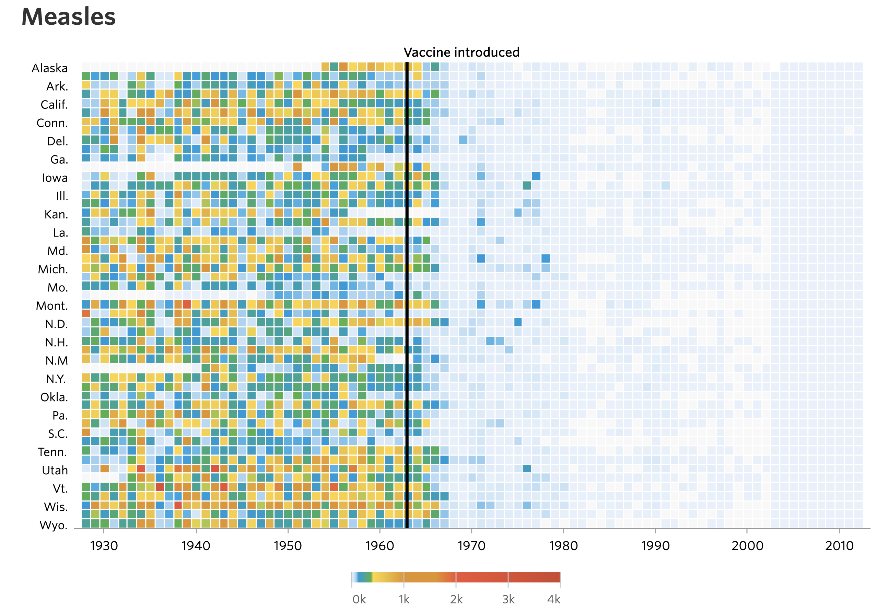
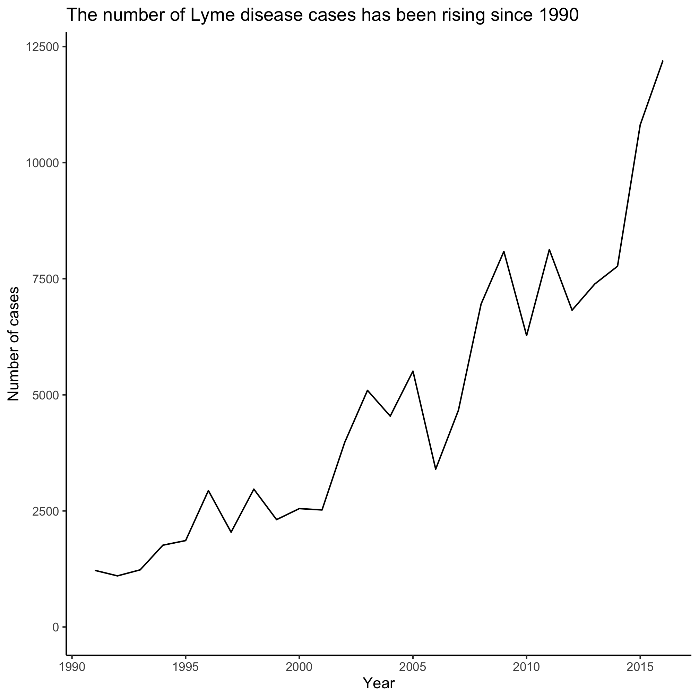
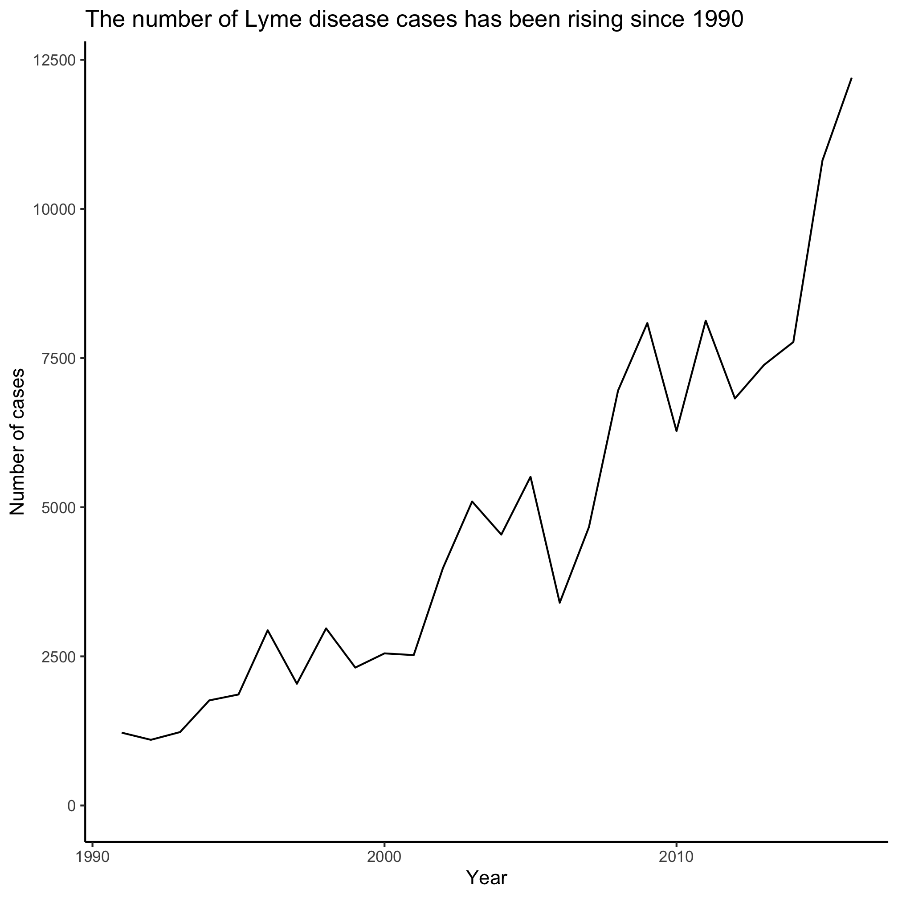
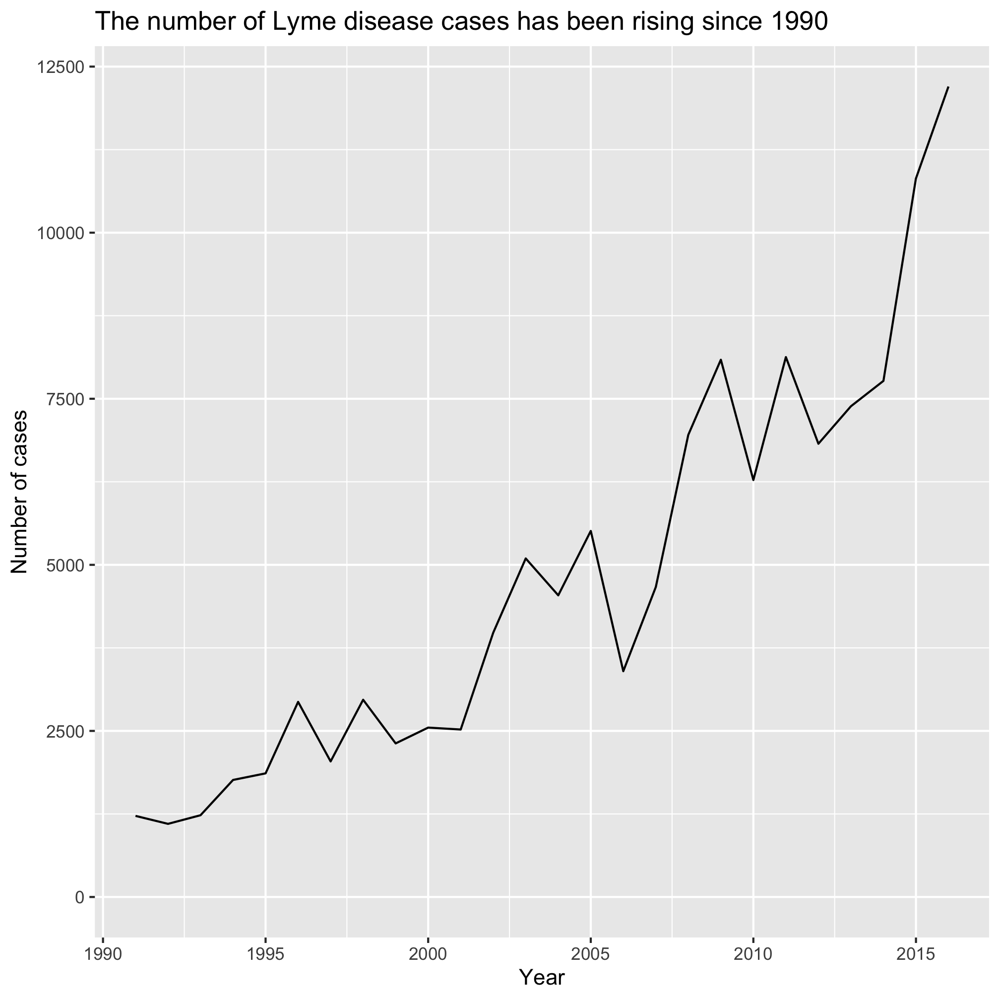
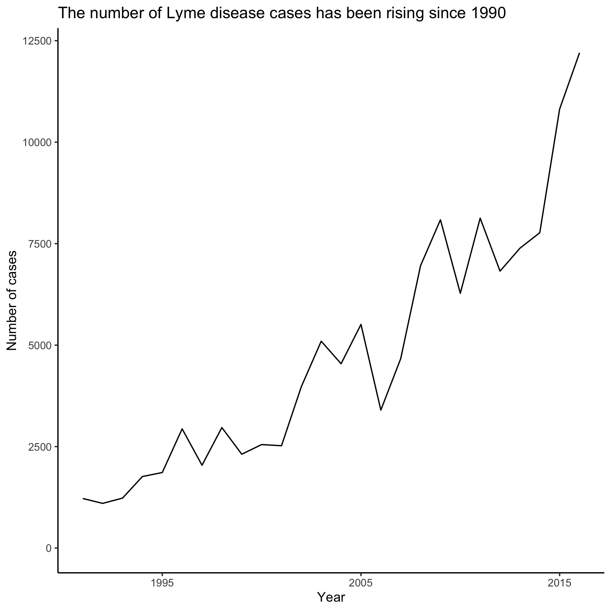
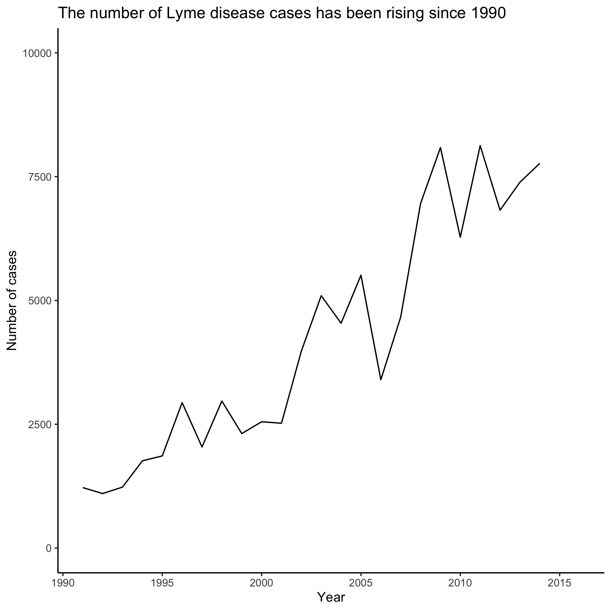

## Topics
* Learning to analyze data is empowering
* R is expressive
* R isn't just for statistics
* Figuring things out


## Learning to analyze data is empowering

If you're like me, your jaw dropped the first time you saw the [stunning heat maps](http://web.archive.org/web/20181106110235/http://graphics.wsj.com/infectious-diseases-and-vaccines/) published by the Wall Street Journal showing the incidence of various diseases, including Measles and Polio, over the past 100 years.



Quickly after these images were posted there were a series of tutorials generated showing people how to generate the images using a variety of tools. This approach teaches people how to make a visual and how to use a tool (e.g. R). The other benefit is that it empowers people to personalize the data. Can I get better data on my adopted home state of Michigan? Are there other diseases that might be of interest to Michiganders?

Another reaction was to critique the visualization. Who cares how many people in each state had Measles. How about the entire country? The legend is an [infamous rainbow](https://eagereyes.org/basics/rainbow-color-map), which makes it nearly impossible to know how many people were affected based on color alone. What if we made the colors a monochromatic gradient? The labels on the y-axis aren't consistent or easy to interpret. Which row is Nevada? These critiques cry out for people to analyze the data themselves. At least that was my reaction.

I was able to track the data down at [Project Tycho](https://www.tycho.pitt.edu). Project Tycho aggregates disease data over time and geography. It is largely based on US data, but does contain international data for Dengue. I was surprised by the variety of diseases that the researchers have aggregated over a long period of time. Looking through the website and data they had available, I was intrigued by the Lyme disease data. I live in Michigan and frequently find ticks on myself, my kids, and animals throughout the summer. I know that Lyme disease is common in the Northeast US and is growing in Wisconsin, but doesn't seem to be taking off in Michigan. Why? Is it growing in prevalence? Is Lyme disease actually spreading west? As a Michigander should I be worried? Should my in laws in Missouri be worried? To start answering these types of questions, I downloaded the data (see `/project_tycho/US.23502006.csv`) and started analyzing.

We will use this dataset over the next five sessions to achieve a couple of goals:
* understand a common data analysis pipeline in R
* modify the pipeline to plot the data by state
* modify the pipeline to plot other diseases and other datasets

Let's get going...


```r
library(tidyverse)
library(lubridate)

annual_counts <- read_csv("project_tycho/US.23502006.csv",
					col_type=cols(PartOfCumulativeCountSeries = col_logical())) %>%
	filter(PartOfCumulativeCountSeries) %>%
	mutate(year = year(PeriodStartDate+7)) %>%
	group_by(year) %>%
	summarize(count = max(CountValue))

ggplot(annual_counts, aes(x=year, y=count)) +
	geom_line() +
	scale_y_continuous(limits=c(0,NA)) +
	scale_x_continuous(breaks=c(1990, 1995, 2000, 2005, 2010, 2015)) +
	labs(x="Year",
			y="Number of cases",
			title="The number of Lyme disease cases has been rising since 1990") +
	theme_classic()

ggsave("lyme_disease_annual_counts.pdf", width=6, height=4)
```




## R is expressive
I suspect that when you read the above code chunk, you got a pretty good sense of what it is doing. Even if you don't know the details and couldn't write it yourself, you can tell that it reads in data, does some data manipulation to summarize the counts, and then plots the data with the year on the x-axis and the counts on the y-axis. If you wanted to change the axis labels or title, I bet you would have a good guess of what to try first. This is all possible because R is a very expressive language and well written code fosters this expressiveness. Words that precede an opening parenthesis (i.e. `(`) are *functions* (e.g. `read_csv`). The best function names are verbs - or action words. The stuff in between the opening and closing parentheses are the arguments or things you want the function to do it's magic with. For example, `read_csv` reads in a CSV (comma-separated values) file and `project_tycho/US.23502006.csv` is the file that we want it to read. We can also define variables to hold information. For example, `annual_counts` holds the output of the first lines of code. The best variable names are nouns and are descriptive of the data they contain. Like any language, R has idioms that are ways of writing or saying something that probably has a good reason, but no one really remembers. If you use the idiom wrong, you'll stick out as a non-native speaker. Just as you want to be careful how you use "break a leg!", in R, you want to be careful of how you use `<-` or `=`. They typically mean the same thing (i.e. take the stuff on the right and assign it to the variable name on the left), but `<-` is the preferred "assignment operator". If you were to use `=` in that position people would notice. At the same time, if you use `<-` in `ggplot(annual_counts, aes(x<-year, y<-count)) +`, you would get an error.

Throughout this set of tutorials we will use a special "dialect" of R called the "tidyverse". This is a set of packages that have a common interface that is generally accepted to be easier to use than standard R functions (i.e. "base R"). We will certainly learn some of these standard functions, but we will be focusing on the tidyverse "way" of doing things. Down the road, it would be worth your time to try to learn some of the analogous functions that are available in base R. One of the features that we will make use of throughout these sessions is the `%>%` "character". This is known as the pipe character and indicates that output from one line should be "piped" to the next. For example, in the chunk above, the data is read in using `read_csv` and piped to the `filter` function. A similar idiom, used with `ggplot` is to use `+` as a way of adding layers onto a plot. For example, `scale_x_continuous(breaks=c(1990, 1995, 2000, 2005, 2010, 2015)) +` adds a specification for how the x-axis should be represented in our plot. This is "added" onto the plot that we already had generated.

With practice, you will get used to the idioms and techniques that allow you to maximize the expressiveness of your code.


## R isn't just for statistics
If you tell people that you are learning R, they may assume that you are going to use it to do statistics. That may be a fair assumption, but it is a limited view of what R can do. We will use a lot of R's functionality in this series of sessions, but we won't use any of its statistical tools. R is great for generating high quality visuals, building interactive websites, cleaning data, scraping websites, summarizing data, and more. One of the awesome things about R is that because its source code is open and it is free, anyone can add to the set of functions that can be used in R. That means people in ecology can use tools developed by people in psychology and vice versa. It also means that it is a living language that is constantly changing and improving. As an example, the code chunk I gave you above has a number of functions. None of them are part of base R, those R functions that are built into R. They all come from a set of packages that are within the tidyverse. We will be using the tidyverse throughout these sessions. If we have time, we might even explain what the tidyverse is!


## Figuring things out
I could write a 10,000 page R book and you would still ask, "How do I do X?". A key goal of mine is to help you learn to figure things out. We'll learn various strategies as we go. The first one I want to show you is the use of `#`. This symbol - hashtag, pound, number sign, octothorp, sharp, etc - tells R to ignore anything to the right of it. We often use it to write comments in code to tell us what we are trying to do with the code. By putting a `#` at the beginning of a line, we effectively delete that line of code. This is useful for trying to figure out what a line of code does. You could either delete the line or put a `#` at the beginning of the line. For example...


```r
ggplot(annual_counts, aes(x=year, y=count)) +
	geom_line() +
	scale_y_continuous(limits=c(0,NA)) +
#	scale_x_continuous(breaks=c(1990, 1995, 2000, 2005, 2010, 2015)) +
	labs(x="Year",
			y="Number of cases",
			title="The number of Lyme disease cases has been rising since 1990") +
	theme_classic()
```



Notice a difference? Try this with other lines in the code chunk and see if you can figure out what each line does. Feel free to play with the code by changing argument values. That is how many people, including me, have learned to program in R! You can keep copies of code that works to go back to. You aren't going to break anything by experimenting.


## Exercises:
1\. What line of code is responsible for generating the line in the plot?

<input type="button" class="hideshow">
<div markdown="1" style="display:none;">
```
geom_line()
```
</div>

2\. How can you remove the `theme_classic()` function call without deleting any code?

<input type="button" class="hideshow">
<div markdown="1" style="display:none;">
The key is to remove the `theme_classic()` and the `+` at the end of the preceding line


```r
ggplot(annual_counts, aes(x=year, y=count)) +
	geom_line() +
	scale_y_continuous(limits=c(0,NA)) +
	scale_x_continuous(breaks=c(1990, 1995, 2000, 2005, 2010, 2015)) +
	labs(x="Year",
			y="Number of cases",
			title="The number of Lyme disease cases has been rising since 1990")
```



</div>

3\. Can you get the plot to show data for 1995, 2005, and 2015?

<input type="button" class="hideshow">
<div markdown="1" style="display:none;">


```r
ggplot(annual_counts, aes(x=year, y=count)) +
	geom_line() +
	scale_y_continuous(limits=c(0,NA)) +
	scale_x_continuous(breaks=c(1995, 2005, 2015)) +
	labs(x="Year",
			y="Number of cases",
			title="The number of Lyme disease cases has been rising since 1990") +
	theme_classic()
```


</div>

4\. What will happen if you change the `limits` argument value for `scale_y_continuous` to `c(0, 10000)`?

<input type="button" class="hideshow">
<div markdown="1" style="display:none;">

```r
ggplot(annual_counts, aes(x=year, y=count)) +
	geom_line() +
	scale_y_continuous(limits=c(0,10000)) +
	scale_x_continuous(breaks=c(1990, 1995, 2000, 2005, 2010, 2015)) +
	labs(x="Year",
			y="Number of cases",
			title="The number of Lyme disease cases has been rising since 1990") +
	theme_classic()
```



It removes the years that go above 10000 cases. For this example, you will get a warning that it removed two rows of data.
</div>

5\. We won't get to discuss much about the options for themes. The `theme()` function is what allows you to change all the little things in the plot like font, font size, spacing, etc. There are a variety of preset theme options that have their own function name. We used `theme_classic()`. Others include `theme_bw`, `theme_dark`, `theme_gray`, `theme_light`, `theme_linedraw`, and `theme_minimal`. Other R users have developed their own themes that they have made available for others to you. You can find some in the [`ggthemes` package](https://jrnold.github.io/ggthemes/index.html). Which of the built in themes provides a plot that looks like the plot when you removed the `theme_classic` line? Which theme do you like the most?

<input type="button" class="hideshow">
<div markdown="1" style="display:none;">

```r
ggplot(annual_counts, aes(x=year, y=count)) +
	geom_line() +
	scale_y_continuous(limits=c(0, NA)) +
	scale_x_continuous(breaks=c(1990, 1995, 2000, 2005, 2010, 2015)) +
	labs(x="Year",
			y="Number of cases",
			title="The number of Lyme disease cases has been rising since 1990") +
	theme_gray()
```


The default theme for ggplot is `theme_gray()`
</div>
