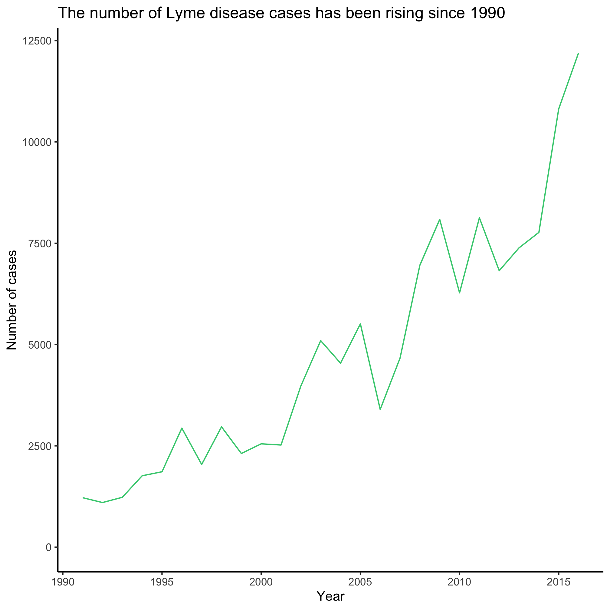
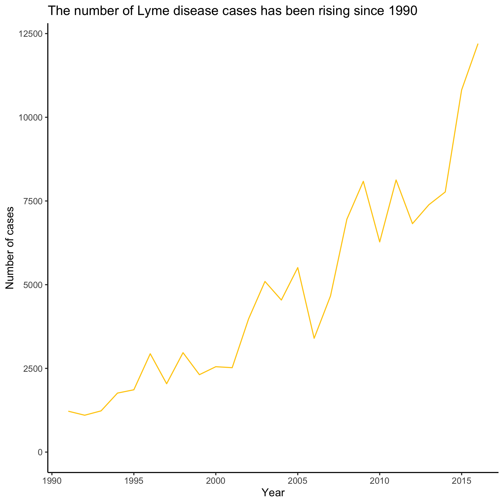
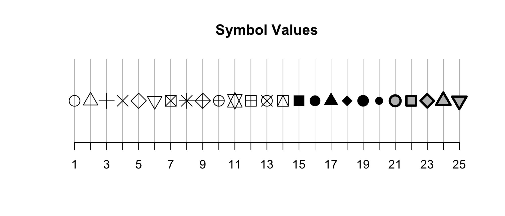
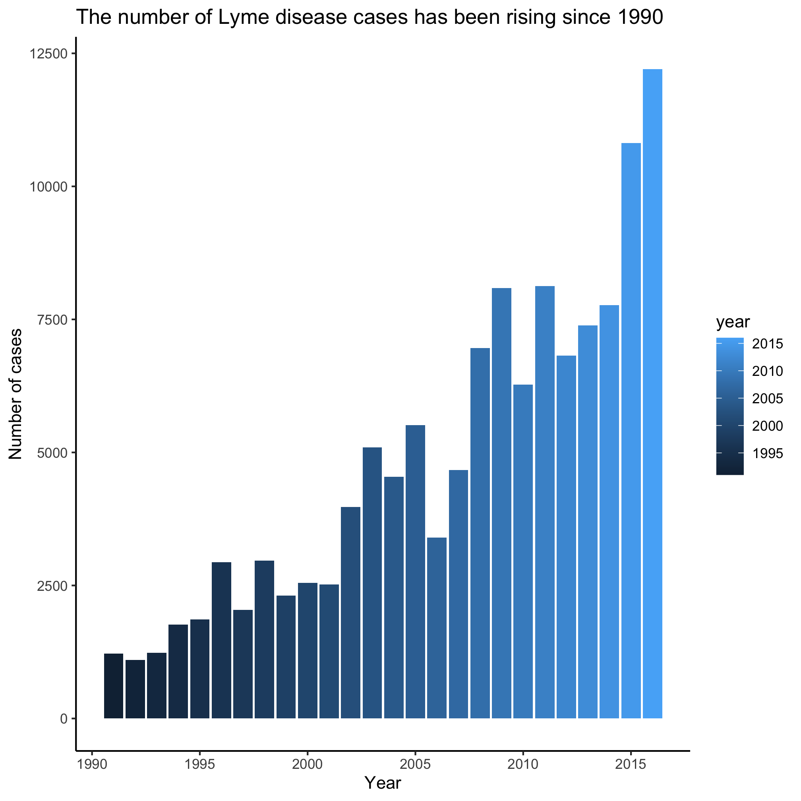

## Topics
* Plotting continuous data vs continuous data
* Manipulating aesthetics
* Mapping data to aesthetics


## Plotting continuous data vs continuous data

Now let's see how we can manipulate various aesthetics about the line we are plotting with the `geom_line` and see if we can make a different type of plot. There are many geom's available to us for making different types of plots. We've seen `geom_line`. Let's try two others to make a scatter plot and a barchart


```r
library(tidyverse)
library(lubridate)

annual_counts <- read_csv("project_tycho/US.23502006.csv",
			col_type=cols(PartOfCumulativeCountSeries = col_logical())) %>%
	filter(PartOfCumulativeCountSeries) %>%
	mutate(year = year(PeriodStartDate+7)) %>%
	group_by(year) %>%
	summarize(count = max(CountValue))


ggplot(annual_counts, aes(x=year, y=count)) +
	geom_point() +
	scale_y_continuous(limits=c(0,NA)) +
	scale_x_continuous(breaks=c(1990, 1995, 2000, 2005, 2010, 2015)) +
	labs(x="Year",
		y="Number of cases",
		title="The number of Lyme disease cases has been rising since 1990") +
	theme_classic()
```


```r
ggplot(annual_counts, aes(x=year, y=count)) +
	geom_col() +
	scale_y_continuous(limits=c(0,NA)) +
	scale_x_continuous(breaks=c(1990, 1995, 2000, 2005, 2010, 2015)) +
	labs(x="Year",
		y="Number of cases",
		title="The number of Lyme disease cases has been rising since 1990") +
	theme_classic()
```


Of the three types of plots we've made, which do you like better? Most professional data visualization practitioners would prefer the line plot. The line connecting the points indicates continuity and it has a fairly elegant and minimalist presentation compared to a bar plot.


## Aesthetics
Each `geom` has its own set of aesthetics that can be manipulated when we plot the data. For example, `geom_line` has `color`, `linetype`, `size`. I know this because if I use the RStudio help menu to search for `geom_line` or if I run `?geom_line` from the R prompt, I get the help page for the function. The first thing I learn is that there are three types of line plots that I can use within the ggplot framework - `geom_path`, `geom_line`, and `geom_step`. These all have very similar syntax, but do slightly different things. As you scan through this help page, you will find a section called "Aesthetics" that tells you what thing can be manipulated for these commands.

```
Aesthetics:

     ‘geom_path()’ understands the following aesthetics (required
     aesthetics are in bold):
        • *‘x’*
        • *‘y’*
        • ‘alpha’
        • ‘colour’
        • ‘group’
        • ‘linetype’
        • ‘size’

     Learn more about setting these aesthetics in
     ‘vignette("ggplot2-specs")’.
```

Clearly `x` and `y` are going to be required. We'll talk about it in a bit, but we set those in the line `ggplot(annual_counts, aes(x=year, y=count))`.


Let's see how we can manipulate these aesthetics.

### `color`

The `colors()` function will give you a listing of the "named" colors that are available in R. Enter `colors()` at the prompt in the console. Modify the code chunk below to plug in your favorite colors


```r
ggplot(annual_counts, aes(x=year, y=count)) +
	geom_line(color="seagreen3") +
	scale_y_continuous(limits=c(0,NA)) +
	scale_x_continuous(breaks=c(1990, 1995, 2000, 2005, 2010, 2015)) +
	labs(x="Year",
		y="Number of cases",
		title="The number of Lyme disease cases has been rising since 1990") +
	theme_classic()
```



An alternative to using named colors like `seagreen3` is to use the hexidecimal code for the colors you like. There are [browser plugins](https://chrome.google.com/webstore/detail/eye-dropper/hmdcmlfkchdmnmnmheododdhjedfccka?hl=en) that you can use to find the hexidecimal codes for colors on your favorite websites. For example, the maize "M" on the [University of Michigan website](https://www.umich.edu) has a hexidecimal code of `#ffcb0a`.


```r
ggplot(annual_counts, aes(x=year, y=count)) +
	geom_line(color="#ffcb0a") +
	scale_y_continuous(limits=c(0,NA)) +
	scale_x_continuous(breaks=c(1990, 1995, 2000, 2005, 2010, 2015)) +
	labs(x="Year",
		y="Number of cases",
		title="The number of Lyme disease cases has been rising since 1990") +
	theme_classic()
```



### `size`

You can change the size of the plotting point or thickness of the line by setting the `size` aesthetic.


```r
ggplot(annual_counts, aes(x=year, y=count)) +
	geom_line(size=2) +
	scale_y_continuous(limits=c(0,NA)) +
	scale_x_continuous(breaks=c(1990, 1995, 2000, 2005, 2010, 2015)) +
	labs(x="Year",
		y="Number of cases",
		title="The number of Lyme disease cases has been rising since 1990") +
	theme_classic()
```


### `linetype`

There are six different types of lines that you can use that vary in the number of dots or dashes. The default (`linetype=1`) is a solid line. You can try different values to get the desired hashing of the line


```r
ggplot(annual_counts, aes(x=year, y=count)) +
	geom_line(linetype=4) +
	scale_y_continuous(limits=c(0,NA)) +
	scale_x_continuous(breaks=c(1990, 1995, 2000, 2005, 2010, 2015)) +
	labs(x="Year",
		y="Number of cases",
		title="The number of Lyme disease cases has been rising since 1990") +
	theme_classic()
```


### `symbol`

There are 25 different plotting symbols in R that can be set by giving the `shape` argument a value from 1 to 25. I tend to limit myself to a handful of these: open and closed squares, circles, or triangles. To keep myself from hunting for the right shape value, I made a cheat sheet:



Among these 25 symbols, symbols 21 to 25 are unique. The color of these symbol is taken from the value of `fill` and the color of the border comes from the value of `color`. The width of the border can be set with the `stroke` aesthetic.


```r
ggplot(annual_counts, aes(x=year, y=count)) +
	geom_point(shape=8, size=2) +
	scale_y_continuous(limits=c(0,NA)) +
	scale_x_continuous(breaks=c(1990, 1995, 2000, 2005, 2010, 2015)) +
	labs(x="Year",
		y="Number of cases",
		title="The number of Lyme disease cases has been rising since 1990") +
	theme_classic()
```


### `fill`

The `fill` aesthetic allows you to set the color of the interior of bars in a bar/column plot. I frequently accidentally use `color` when generating a column plot.


```r
ggplot(annual_counts, aes(x=year, y=count)) +
	geom_col(fill="blue") +
	scale_y_continuous(limits=c(0,NA)) +
	scale_x_continuous(breaks=c(1990, 1995, 2000, 2005, 2010, 2015)) +
	labs(x="Year",
		y="Number of cases",
		title="The number of Lyme disease cases has been rising since 1990") +
	theme_classic()
```


## Mapping aesthetics to our data
We have been putting the aesthetic and its value in the parentheses for the `geom_` function. When we do that, the value is applied to all of the points. For example, in the last example showing `fill`, all of the bars were the same color. Often, we want the aesthetic value to vary by something in our data frame. Recall that `x` and `y` are aesthetics. Can you see how we might make each year's bar a different color?


```r
ggplot(annual_counts, aes(x=year, y=count, fill=year)) +
	geom_col() +
	scale_y_continuous(limits=c(0,NA)) +
	scale_x_continuous(breaks=c(1990, 1995, 2000, 2005, 2010, 2015)) +
	labs(x="Year",
		y="Number of cases",
		title="The number of Lyme disease cases has been rising since 1990") +
	theme_classic()
```



You'll note that we removed `fill="blue"` from `geom_col()` and put `fill=year` into the `aes` function within the `ggplot` function call. In this example, year is a *continuous* variable so we get a gradient of blues. Later we'll see how this changes when the variable is a *categorical* variable.


## Exercises
1\. What aesthetic values are available for use with `geom_point` and `geom_col`?

<input type="button" class="hideshow">
<div markdown="1" style="display:none;">
`geom_point` and `geom_col` both use:
* `x`
* `y`
* `alpha`
* `colour` / `color`
* `fill`
* `group`
* `linetype`
* `size`

`geom_point` also can use:
* `shape`
* `stroke`

`geom_col` also can use:
* `linetype`

`x` and `y` are required for both
</div>

2\. Can you see a difference between `geom_line`, `geom_path`, and `geom_step`? Why might you not see a difference between the output for `geom_line` and `geom_path`?

<input type="button" class="hideshow">
<div markdown="1" style="display:none;">
* `geom_path` connects the points in the order they are provided while `geom_line` plots them in the order of the x-axis variable. If data are already in the "correct" order then the two `geom`'s might provide the same output
* `geom_step` plots the data as stair steps instead of with straight lines
</div>

3\. What does alpha do? Can you imagine a time that it might be useful to use?

<input type="button" class="hideshow">
<div markdown="1" style="display:none;">
* It controls the transparency of the plotting object. If you have `alpha=0.25` then it will be its full color if 4 points with the same alpha overlap.
* It is useful when there is a concern with over plotting like in a dense scatter plot
</div>

4\. What happens if we use `color="blue"` rather than `fill="blue"` as a `geom_col` argument? Try using both arguments, but so that `color` and `fill` have different values

<input type="button" class="hideshow">
It will make the outline of the bar blue rather than the interior of the column
<div markdown="1" style="display:none;">
</div>

5\. What happens when you try to map the year to the `shape` aesthetic when using `geom_point`? Can you find another aesthetic to map to the year that will work?

<input type="button" class="hideshow">
<div markdown="1" style="display:none;">

```r
ggplot(annual_counts, aes(x=year, y=count, shape=year)) +
	geom_point() +
	scale_y_continuous(limits=c(0,NA)) +
	scale_x_continuous(breaks=c(1990, 1995, 2000, 2005, 2010, 2015)) +
	labs(x="Year",
		y="Number of cases",
		title="The number of Lyme disease cases has been rising since 1990") +
	theme_classic()
```

```
## Error: A continuous variable can not be mapped to shape
```


It gives an error: **Error: A continuous variable can not be mapped to shape**. Try mapping year to color


```r
ggplot(annual_counts, aes(x=year, y=count, color=year)) +
	geom_point() +
	scale_y_continuous(limits=c(0,NA)) +
	scale_x_continuous(breaks=c(1990, 1995, 2000, 2005, 2010, 2015)) +
	labs(x="Year",
		y="Number of cases",
		title="The number of Lyme disease cases has been rising since 1990") +
	theme_classic()
```


</div>
