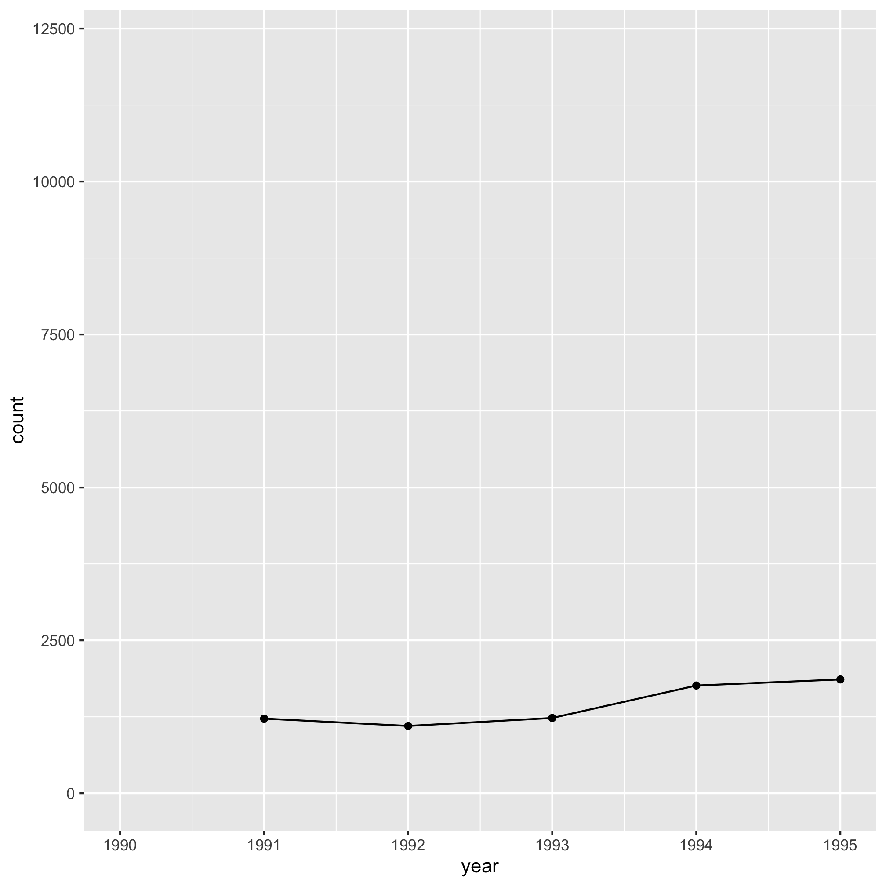

## Topics
* The `+` operator
* Tracking down the source of errors


## The `+` operator

Within the code chunk we are using to make plots, we are using the `+` sign to add various elements to a plot. As we go through this series, we will find other things that we can add to vary the look of a plot. Perhaps you've already considered this, but what if we'd like to have a line that shows the points? We can use both the `geom_line` and `geom_point` function calls


```r
library(tidyverse)
library(lubridate)

annual_counts <- read_csv("project_tycho/US.23502006.csv",
			col_type=cols(PartOfCumulativeCountSeries = col_logical())) %>%
	filter(PartOfCumulativeCountSeries) %>%
	mutate(year = year(PeriodStartDate+7)) %>%
	group_by(year) %>%
	summarize(count = max(CountValue))

ggplot(annual_counts, aes(x=year, y=count)) +
	geom_line() +
	geom_point() +
	scale_y_continuous(limits=c(0,NA)) +
	scale_x_continuous(breaks=c(1990, 1995, 2000, 2005, 2010, 2015)) +
	labs(x="Year",
		y="Number of cases",
		title="The number of Lyme disease cases has been rising since 1990") +
	theme_classic()
```


## Tracking down errors

This can also come in handy for debugging. It's important to remember that we don't have to run the entire code chunk at once. Let's assume that I have the following code chunk that produces an error.


```r
ggplot(annual_counts, aes(x=year, y=count)) +
	geom_line() +
	geom_point() +
	scale_y_continuous(limits=c(0,NA)) +
	scale_x_continuous(limits=c(1990, 1995, 2000, 2005, 2010, 2015)) +
	labs(x="Year",
		y="Number of cases",
		title="The number of Lyme disease cases has been rising since 1990") +
	theme_classic()
```

```
## Warning: Removed 21 row(s) containing missing values (geom_path).
```

```
## Warning: Removed 21 rows containing missing values (geom_point).
```


I've been programming in R for awhile and I really have no idea what these warning messages mean! What strategies could I use to resolve the error? If I just added one line and then got an error, I might look back at that line to see where I messed up the syntax. But if that doesn't work, I could stare intently at the code chunk looking for the error. I could ask a friend to look at it for me. I could complain and say, "R sucks!", toss my laptop and give up. Ok, none of those are particularly productive approaches. One strategy that I find works very well is to slowly build up my code block to see when I get the error message. For example, if I do the following, I get a plot that resembles what I'm going after.


```r
ggplot(annual_counts, aes(x=year, y=count)) +
	geom_line()
```


Note that I can do this by highlighting the code (without the final `+` on the second line!) and then telling Rstudio to run, or by copy and pasting the highlighted code into the R prompt. Let's add another line.


```r
ggplot(annual_counts, aes(x=year, y=count)) +
	geom_line() +
	geom_point()
```


Looks good. Are you also getting the sense that you can use this approach to figure out what each line does? Good! Let's add another line


```r
ggplot(annual_counts, aes(x=year, y=count)) +
	geom_line() +
	geom_point() +
	scale_y_continuous(limits=c(0,NA))
```


And another


```r
ggplot(annual_counts, aes(x=year, y=count)) +
	geom_line() +
	geom_point() +
	scale_y_continuous(limits=c(0,NA)) +
	scale_x_continuous(limits=c(1990, 1995, 2000, 2005, 2010, 2015))
```

```
## Warning: Removed 21 row(s) containing missing values (geom_path).
```

```
## Warning: Removed 21 rows containing missing values (geom_point).
```



Aha, there's the error! What did I do wrong? From firsthand experience, I know that after I look at a lot of code, it starts to get hard to see my errors. Let's look at `?scale_x_continuous` and see whether we're using `limits` correctly. There I notice under the limits sub-section the following text, "A numeric vector of length two providing limits of the scale". That seems to align with the error message. The `limits` argument wants one or two values, not six. Now that I think about it, I don't really want to set limits to the x-axis, like I do for the y-axis. Rather, I want to tell R where to put the x-axis labels. Looking back through the help page, I see that the argument I really want is `breaks`, "A numeric vector of positions". Let's try that


```r
ggplot(annual_counts, aes(x=year, y=count)) +
	geom_line() +
	geom_point() +
	scale_y_continuous(limits=c(0,NA)) +
	scale_x_continuous(breaks=c(1990, 1995, 2000, 2005, 2010, 2015))
```


The error goes away. Let's go ahead and add the rest of the code and see if we get the desired output.


```r
ggplot(annual_counts, aes(x=year, y=count)) +
	geom_line() +
	geom_point() +
	scale_y_continuous(limits=c(0,NA)) +
	scale_x_continuous(breaks=c(1990, 1995, 2000, 2005, 2010, 2015)) +
	labs(x="Year",
		y="Number of cases",
		title="The number of Lyme disease cases has been rising since 1990") +
	theme_classic()
```


Wonderful, it works! At this point, if we got another error, then we would continue with the strategy of adding lines until we hit the error and proceeding. Something else you may notice if you are using Rstudio is that a red circle with an "x" in it will appear to the left of your code to let you know there is a problem. Sometimes if you highlight over the circle you will get a meaningful message. In general, starting from the top of the offending code block and working to the bottom will result in the best outcome.

One final note about running your code and debugging is that if your prompt ever turns from a `>` to a `+` then you've probably left out a parentheses, bracket, brace, or quote mark. To get back to the correct prompt, simultaneously press the `Control` and `c` keys. In Rstudio you can also press the escape key.

## Exercises
1\. Make the color of the line red and the color of the plotting symbols blue. What do you notice if you switch the order of the `geom_line` and `geom_point` functions?

<input type="button" class="hideshow">
<div markdown="1" style="display:none;">
`geom_line` then `geom_point`...


```r
ggplot(annual_counts, aes(x=year, y=count)) +
	geom_line(color="red", size=2) +
	geom_point(color="blue", size=3) +
	scale_y_continuous(limits=c(0,NA)) +
	scale_x_continuous(breaks=c(1990, 1995, 2000, 2005, 2010, 2015)) +
	labs(x="Year",
		y="Number of cases",
		title="The number of Lyme disease cases has been rising since 1990") +
	theme_classic()
```


`geom_point` then `geom_line`...


```r
ggplot(annual_counts, aes(x=year, y=count)) +
	geom_point(color="blue", size=3) +
	geom_line(color="red", size=2) +
	scale_y_continuous(limits=c(0,NA)) +
	scale_x_continuous(breaks=c(1990, 1995, 2000, 2005, 2010, 2015)) +
	labs(x="Year",
		y="Number of cases",
		title="The number of Lyme disease cases has been rising since 1990") +
	theme_classic()
```


The order of the function calls determines the order of the plotting objects.
</div>

2\. Without looking at the other code chunks we've run, see if you can debug the following code chunk using the strategy we outlined above. You should find four typographical errors.

<input type="button" class="hideshow">
<div markdown="1" style="display:none;">

```r
ggplot(annual_counts, aes(x=year, y=count)) +
	geom_line(fill="blue") +
	geom_point() +
	scale_y_continuous(limits=c(0,NA))
	scale_x_continuous(breaks=c(1990, 1995, 2000, 2005, 2010, 2015) +
	labs(x="Year",
		y="Number of cases,
		title="The number of Lyme disease cases has been rising since 1990") +
	theme_classic()
```

</div>

3\. At [this link](https://raw.githubusercontent.com/riffomonas/generalR_data/master/project_tycho/US.430397002.csv) are data from Project Tycho for West Nile Virus. I saved it for you in the `project_tycho` directory as `US.430397002.csv`. Use those data to generate a line plot showing the number of WNV infections in the US over time.

<input type="button" class="hideshow">
<div markdown="1" style="display:none;">

```r
library(tidyverse)
library(lubridate)

annual_counts <- read_csv("project_tycho/US.430397002.csv",
			col_type=cols(PartOfCumulativeCountSeries = col_logical())) %>%
	filter(PartOfCumulativeCountSeries) %>%
	mutate(year = year(PeriodStartDate+7)) %>%
	group_by(year) %>%
	summarize(count = max(CountValue))

ggplot(annual_counts, aes(x=year, y=count)) +
	geom_line() +
	geom_point() +
	scale_y_continuous(limits=c(0,NA)) +
	scale_x_continuous(breaks=c(1990, 1995, 2000, 2005, 2010, 2015)) +
	labs(x="Year",
		y="Number of cases",
		title="The number of West Nile Virus cases has been rising since 2003") +
	theme_classic()
```


</div>
