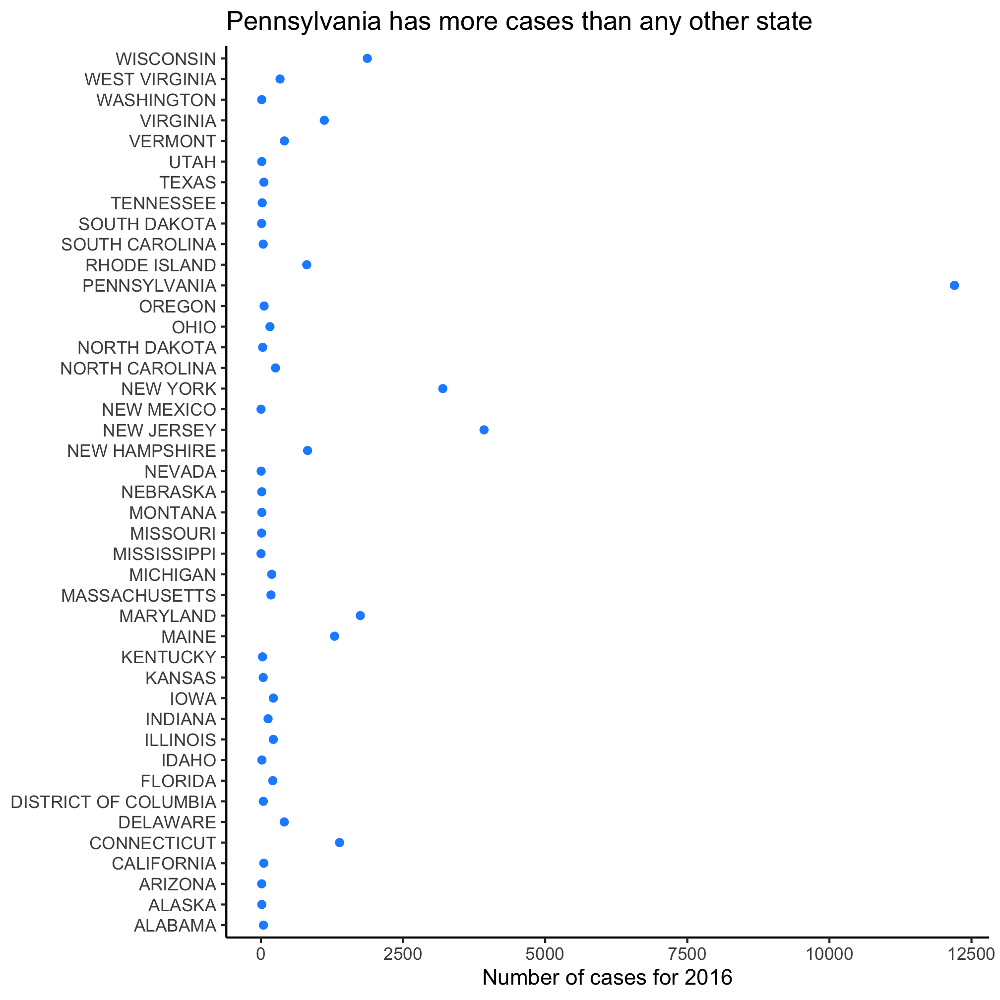

## Topics
* Raw data should stay raw
* Heat maps
* Simplifying our data frame with `filter`
* Map maps
* Taking stock


## Raw data should stay raw

One of the biggest hangups I see in people that are learning to code and do data analysis is that they're afraid they might "break" the data. You won't! As long as you still have the original raw data, you can always go back to what you had before. If you save all of your processing steps in an R script, you will always be able to show how you went from raw data to a final result. Keeping this in mind, let's return to our goal of looking at state-level trends in Lyme disease. Because it seems like a good idea, let's add `Admin1Name` to our `group_by` function arguments to group by both year and state. We'll also alter the name of the data frame to indicate that it contains state data.


```r
library(tidyverse)
library(lubridate)

annual_state_counts <- read_csv("project_tycho/US.23502006.csv",
					col_type=cols(PartOfCumulativeCountSeries = col_logical())) %>%
	filter(PartOfCumulativeCountSeries) %>%
	mutate(year = year(PeriodStartDate+7)) %>%
	group_by(year, Admin1Name) %>%
	summarize(count = max(CountValue))
```

If you now run


```r
annual_state_counts
```

```
## # A tibble: 1,145 x 3
## # Groups:   year [26]
##     year Admin1Name           count
##    <dbl> <chr>                <dbl>
##  1  1991 ALABAMA                 18
##  2  1991 ARIZONA                  1
##  3  1991 ARKANSAS                29
##  4  1991 CALIFORNIA             323
##  5  1991 CONNECTICUT           1221
##  6  1991 DELAWARE                72
##  7  1991 DISTRICT OF COLUMBIA     5
##  8  1991 FLORIDA                 23
##  9  1991 GEORGIA                 31
## 10  1991 IDAHO                    2
## # … with 1,135 more rows
```

You'll see that we have three variable columns, `year`, `Admin1Name`, `count`. `group_by` took our data and grouped it by the `year` and `Admin1Name` variables. Again, R is a pretty expressive language! Its syntax gives you a good hint of what is going on. Don't be afraid to experiment and try different things.


## Viewing large datasets - messy line plots and heat maps

Let's use `geom_line` to look at the temporal trends of Lyme Disease over time for each state


```r
ggplot(annual_state_counts, aes(x=year, y=count, color=Admin1Name)) +
	geom_line()
```


Epic. Fail. It looks like a handful of states really exploded over time, but because there's so many colors and lines, it's impossible to figure out which shade of purple represents the state with the highest levels of Lyme Disease. Is that Pennsylvania? Rhode Island? South Dakota? I have my suspicions, but I'm not 100%. Returning to our motivation, we were blown away by the temporal trends depicted by a heat map. Let's make a heat map using the `geom_tile` function. As before, we can use `?geom_tile` to learn about the various aesthetics. The basics are `x`, `y`, and `fill`. Can you figure out what columns in `annual_state_counts` should correspond to each aesthetic? As before, we want `year` mapped to `x`. Now we're going to "flip" `y` and `fill` to represent `Admin1Name` and `count`, respectively


```r
ggplot(annual_state_counts, aes(x=year, y=Admin1Name, fill=count)) +
	geom_tile()
```


There's a lot to like about this way of viewing the data over the previous line plot. It's clear that Pennsylvania was the state that exploded with cases. But there's a lot to not like about this approach. If I try to find Michigan, it's hard (for me) to track the row for Michigan across without worrying that I'm looking at Massachusetts or Maryland. Because we suspect that the spread is driven, in part, by geography, we might want to group the states in a more interesting way. It's also hard to visually interpolate the color gradient to know how many cases there are in Michigan, Missouri, or Pennsylvania.


## Simplifying our data frame with `filter`

I'd like to return to a line plot to represent these data, but I only want to depict a handful of states. To do this, we'll need to learn more about the `filter` function. As the name suggests, this function filters the dataset to retain those rows that satisfy values of interest. We've already been using `filter` to retain those rows that are `PartOfCumulativeCountSeries`. This means that the value in `CountValue` column for that row are for the year rather than for a shorter time period (because states vary in how they report the data, I chose to go with these annual data). I can modify the existing `filter` function arguments or call the function again with different arguments. These both give me data for Michigan


```r
read_csv("project_tycho/US.23502006.csv",
					col_type=cols(PartOfCumulativeCountSeries = col_logical())) %>%
	filter(PartOfCumulativeCountSeries, Admin1Name=="MICHIGAN")
```

```
## # A tibble: 980 x 20
##    ConditionName ConditionSNOMED PathogenName PathogenTaxonID Fatalities
##    <chr>                   <dbl> <chr>                  <dbl>      <dbl>
##  1 Lyme disease         23502006 Borrelia                 138          0
##  2 Lyme disease         23502006 Borrelia                 138          0
##  3 Lyme disease         23502006 Borrelia                 138          0
##  4 Lyme disease         23502006 Borrelia                 138          0
##  5 Lyme disease         23502006 Borrelia                 138          0
##  6 Lyme disease         23502006 Borrelia                 138          0
##  7 Lyme disease         23502006 Borrelia                 138          0
##  8 Lyme disease         23502006 Borrelia                 138          0
##  9 Lyme disease         23502006 Borrelia                 138          0
## 10 Lyme disease         23502006 Borrelia                 138          0
## # … with 970 more rows, and 15 more variables: CountryName <chr>,
## #   CountryISO <chr>, Admin1Name <chr>, Admin1ISO <chr>, Admin2Name <lgl>,
## #   CityName <lgl>, PeriodStartDate <date>, PeriodEndDate <date>,
## #   PartOfCumulativeCountSeries <lgl>, AgeRange <chr>, Subpopulation <chr>,
## #   PlaceOfAcquisition <lgl>, DiagnosisCertainty <lgl>, SourceName <chr>,
## #   CountValue <dbl>
```


```r
read_csv("project_tycho/US.23502006.csv",
					col_type=cols(PartOfCumulativeCountSeries = col_logical())) %>%
	filter(PartOfCumulativeCountSeries) %>%
	filter(Admin1Name=="MICHIGAN")
```

```
## # A tibble: 980 x 20
##    ConditionName ConditionSNOMED PathogenName PathogenTaxonID Fatalities
##    <chr>                   <dbl> <chr>                  <dbl>      <dbl>
##  1 Lyme disease         23502006 Borrelia                 138          0
##  2 Lyme disease         23502006 Borrelia                 138          0
##  3 Lyme disease         23502006 Borrelia                 138          0
##  4 Lyme disease         23502006 Borrelia                 138          0
##  5 Lyme disease         23502006 Borrelia                 138          0
##  6 Lyme disease         23502006 Borrelia                 138          0
##  7 Lyme disease         23502006 Borrelia                 138          0
##  8 Lyme disease         23502006 Borrelia                 138          0
##  9 Lyme disease         23502006 Borrelia                 138          0
## 10 Lyme disease         23502006 Borrelia                 138          0
## # … with 970 more rows, and 15 more variables: CountryName <chr>,
## #   CountryISO <chr>, Admin1Name <chr>, Admin1ISO <chr>, Admin2Name <lgl>,
## #   CityName <lgl>, PeriodStartDate <date>, PeriodEndDate <date>,
## #   PartOfCumulativeCountSeries <lgl>, AgeRange <chr>, Subpopulation <chr>,
## #   PlaceOfAcquisition <lgl>, DiagnosisCertainty <lgl>, SourceName <chr>,
## #   CountValue <dbl>
```

Can you figure out how to know that these commands did what we hoped? If you were thinking about the `glimpse` or `View` functions, good work! An easier way would be to use the `count` function


```r
read_csv("project_tycho/US.23502006.csv",
					col_type=cols(PartOfCumulativeCountSeries = col_logical())) %>%
	filter(PartOfCumulativeCountSeries, Admin1Name=="MICHIGAN") %>%
	count(Admin1Name)
```

```
## # A tibble: 1 x 2
##   Admin1Name     n
##   <chr>      <int>
## 1 MICHIGAN     980
```

In the first example we ask for those rows where `PartOfCumulativeCountSeries` is `TRUE` and where `Admin1Name` has the value of `"MICHIGAN"`. Alternatively stated, we are asking where `PartOfCumulativeCountSeries` is `TRUE` and where `Admin1Name=="MICHIGAN"` is `TRUE`. The comma in that first example can be spoken as "and" when you read the syntax. To make this more clear, I prefer to use the `&` symbol, which means "and".


```r
read_csv("project_tycho/US.23502006.csv",
					col_type=cols(PartOfCumulativeCountSeries = col_logical())) %>%
	filter(PartOfCumulativeCountSeries & Admin1Name=="MICHIGAN") %>%
	count(Admin1Name)
```

```
## # A tibble: 1 x 2
##   Admin1Name     n
##   <chr>      <int>
## 1 MICHIGAN     980
```

We also often want to ask "or" type questions. For example, "Does this row contain data from Michigan, Missouri, or Pennsylvania?" To illustrate how to do this, we'll start by writing two `filter` functions and then show how we can consolidate them into one. Just as `&` represents "and", in R, `|` represents "or"


```r
read_csv("project_tycho/US.23502006.csv",
					col_type=cols(PartOfCumulativeCountSeries = col_logical())) %>%
	filter(PartOfCumulativeCountSeries) %>%
	filter(Admin1Name=="PENNSYLVANIA" | Admin1Name=="MICHIGAN" | Admin1Name=="MISSOURI" ) %>%
	count(Admin1Name)
```

```
## # A tibble: 3 x 2
##   Admin1Name       n
##   <chr>        <int>
## 1 MICHIGAN       980
## 2 MISSOURI       918
## 3 PENNSYLVANIA  1326
```

It is perfectly acceptable to have two filter lines as we do here. Perhaps you'd rather only have one. Keeping in mind [order of operations in math](https://stat.ethz.ch/R-manual/R-devel/library/base/html/Syntax.html) does what's in parentheses before the `==`, we can use parentheses to bracket our query


```r
read_csv("project_tycho/US.23502006.csv",
					col_type=cols(PartOfCumulativeCountSeries = col_logical())) %>%
	filter(PartOfCumulativeCountSeries & (Admin1Name=="PENNSYLVANIA" | Admin1Name=="MICHIGAN" | Admin1Name=="MISSOURI")) %>%
	count(Admin1Name)
```

```
## # A tibble: 3 x 2
##   Admin1Name       n
##   <chr>        <int>
## 1 MICHIGAN       980
## 2 MISSOURI       918
## 3 PENNSYLVANIA  1326
```

There is a tradeoff between readability and code efficiency, but the key is that the syntax gives the right answer. Let's see about making this a line plot, by revisiting our code from the beginning of this session.


```r
annual_state_counts <- read_csv("project_tycho/US.23502006.csv",
					col_type=cols(PartOfCumulativeCountSeries = col_logical())) %>%
	filter(PartOfCumulativeCountSeries & (Admin1Name=="PENNSYLVANIA" | Admin1Name=="MICHIGAN" | Admin1Name=="MISSOURI")) %>%
	mutate(year = year(PeriodStartDate+7)) %>%
	group_by(year, Admin1Name) %>%
	summarize(count = max(CountValue))

ggplot(annual_state_counts, aes(x=year, y=count, color=Admin1Name)) +
	geom_line() +
	scale_y_continuous(limits=c(0,NA)) +
	scale_x_continuous(breaks=c(1990, 1995, 2000, 2005, 2010, 2015)) +
	labs(x="Year",
			y="Annual number of cases",
			title="The number of Lyme disease cases continues to increase each year") +
	theme_classic()
```


Slick, eh? Michigan and Missouri clearly don't have anywhere the number of cases as Pennsylvania. Let's focus on Michigan and ask about the number of cases in the states that are around it - Ohio, Indiana, Illinios, and Wisconsin. Now we want to build filter the data to match one of five states. That's going to get a little long. Let's learn a new approach!

Remember that `filter` is looking for values that evaluate to `TRUE` or `FALSE` - these are "logicals". We can use an R function to test whether the values in a variable are in a set of values. This function, `%in%`, has a weird syntax


```r
favorite_letters <- c("p", "d", "s")

letters %in% favorite_letters
```

```
##  [1] FALSE FALSE FALSE  TRUE FALSE FALSE FALSE FALSE FALSE FALSE FALSE FALSE
## [13] FALSE FALSE FALSE  TRUE FALSE FALSE  TRUE FALSE FALSE FALSE FALSE FALSE
## [25] FALSE FALSE
```

First, `letters` is a variable built into R that contains the 26 lowercase letters in the Roman alphabet (`LETTERS` has the uppercase version). We can read the last statement as "are the values in `letters` also in `favorite_letters`?" Let's apply this to our problem using two calls to `filter`


```r
upper_midwest_states <- c("MICHIGAN", "OHIO", "INDIANA", "WISCONSIN")

annual_state_counts <- read_csv("project_tycho/US.23502006.csv",
					col_type=cols(PartOfCumulativeCountSeries = col_logical())) %>%
	filter(PartOfCumulativeCountSeries) %>%
 	filter(Admin1Name %in% upper_midwest_states) %>%
	mutate(year = year(PeriodStartDate+7)) %>%
	group_by(year, Admin1Name) %>%
	summarize(count = max(CountValue))

ggplot(annual_state_counts, aes(x=year, y=count, color=Admin1Name)) +
	geom_line() +
	scale_y_continuous(limits=c(0,NA)) +
	scale_x_continuous(breaks=c(1990, 1995, 2000, 2005, 2010, 2015)) +
	labs(x="Year",
			y="Annual number of cases",
			title="The number of Lyme disease cases in Wisconsin has been higher\nthan other states in the upper midwest") +
	theme_classic()
```


## Viewing large datasets - maps

We're going to move on to a different dataset in the next section. Before we do, let's make a map of the data! Below is a code chunk to generate a map of the US with each state color coded by the number of cases reported in 2015.


```r
states_map <- map_data("state")

read_csv("project_tycho/US.23502006.csv",
					col_type=cols(PartOfCumulativeCountSeries = col_logical())) %>%
	filter(PartOfCumulativeCountSeries) %>%
	mutate(year = year(PeriodStartDate+7)) %>%
	group_by(year, Admin1Name) %>%
	summarize(count = max(CountValue)) %>%
	filter(year == 2010) %>%
	ggplot(aes(map_id = tolower(Admin1Name), fill=count)) +
		geom_map(map=states_map) +
		expand_limits(x = states_map$long, y = states_map$lat) + #gets the boundaries for lat and long
		coord_fixed() # makes sure that 10 deg lat == 10 deg long
```


Take a moment and make a make a list of...
* Critiques of this map
* Questions this map raises for you

Here are some of my critiques...
* Most of the data for the US is uninteresting, could we tighten the limits to look at the the most interesting states?
* There is missing data that are probably important - where is New York state?
* Only one year's worth of data (2010)
* The color gradient leaves a bit to be desired

Here are some of my questions...
* The data are total counts, it would be better to have a per capita rate for each state
* What would a map look like for West Nile Virus?
* Could I generate an animation of the area east of Wisconsin and north of the Mason-Dixon line?


## Taking stock of where we are
Before we leave this session, look at the last code chunk we used to generate a map. See if you can make a list of things in the code chunk that you understand, have a good guess at, and are lost on.

<input type="button" class="hideshow">
<div markdown="1" style="display:none;">

Things we've seen already and discussed...
* `library`, `<-`, `filter`, `group_by`, `summarize`, `%>%`, `ggplot`, `aes`, `fill`, `+`, `col_logical`

Things you can probably guess at...
* `map_data`, `tolower`, `geom_map`, `map`

Things that still might look foreign...
* `$`, `expand_limits`, `mutate`

</div>

## Exercises
1\. New England traditionally consists of Maine, Vermont, New Hampshire, Massachusetts, Rhode Island, and Connecticut. Lyme, Connecticut is the namesake of the disease. Can you modify our code to make a line plot for these states?

<input type="button" class="hideshow">
<div markdown="1" style="display:none;">

```r
new_england <- c("MAINE", "VERMONT", "NEW HAMPSHIRE", "MASSACHUSETTS", "RHODE ISLAND", "CONNECTICUT")

annual_state_counts <- read_csv("project_tycho/US.23502006.csv",
					col_type=cols(PartOfCumulativeCountSeries = col_logical())) %>%
	filter(PartOfCumulativeCountSeries) %>%
 	filter(Admin1Name %in% new_england) %>%
	mutate(year = year(PeriodStartDate+7)) %>%
	group_by(year, Admin1Name) %>%
	summarize(count = max(CountValue))

ggplot(annual_state_counts, aes(x=year, y=count, color=Admin1Name)) +
	geom_line() +
	scale_y_continuous(limits=c(0,NA)) +
	scale_x_continuous(breaks=c(1990, 1995, 2000, 2005, 2010, 2015)) +
	labs(x="Year",
			y="Annual number of cases",
			title="Connecticut continues to have a significant number of Lyme Disease cases") +
	theme_classic()
```


</div>

2\. 2016 was the last year that we have data for in this dataset. Can you make a dot plot with all of the possible `Admin1Name` values on the y-axis, the `count` values on the x-axis for 2016? Give the bars a color that you like.

<input type="button" class="hideshow">
<div markdown="1" style="display:none;">

```r
state_counts <- read_csv("project_tycho/US.23502006.csv",
					col_type=cols(PartOfCumulativeCountSeries = col_logical())) %>%
	filter(PartOfCumulativeCountSeries) %>%
	mutate(year = year(PeriodStartDate+7)) %>%
	filter(year == 2016) %>%
	group_by(Admin1Name) %>%
	summarize(count = max(CountValue))

ggplot(state_counts, aes(y=Admin1Name, x=count)) +
	geom_point() +
	scale_x_continuous(limits=c(0,NA)) +
	labs(x="Number of cases for 2016",
			y="",
			title="Pennsylvania has more cases than any other state") +
	theme_classic()
```


</div>


3\. Can you use `?tolower` to confirm your intuition for what this function does? If you want a string to be in all caps, what function would you use? From the documentation for `tolower`, can you figure out how you might convert the sequence "ATGCCTTG" to "TACGGAAC"?

<input type="button" class="hideshow">
<div markdown="1" style="display:none;">

```r
quiet <- "hello, i don't like to yell"
toupper(quiet)

dna <- "ATGCCTTG"
chartr("ATGC", "TACG", dna)
```

```
## [1] "HELLO, I DON'T LIKE TO YELL"
## [1] "TACGGAAC"
```
</div>

4\. Most of the data for the US is uninteresting, could we tighten the limits to look at the the most interesting states? To do this we will modify the arguments for `expand_limits`. Instead of using `x = states_map$long, y = states_map$lat`, we will want to use something like `x = c(?, ?), y = c(?, ?)`. See if you can pick the best values to focus on those states from Wisconsin to Maine and from the Mason-Dixon line north.

<input type="button" class="hideshow">
<div markdown="1" style="display:none;">

```r
states_map <- map_data("state")

read_csv("project_tycho/US.23502006.csv",
					col_type=cols(PartOfCumulativeCountSeries = col_logical())) %>%
	filter(PartOfCumulativeCountSeries) %>%
	mutate(year = year(PeriodStartDate+7)) %>%
	group_by(year, Admin1Name) %>%
	summarize(count = max(CountValue)) %>%
	filter(year == 2010) %>%
	ggplot(aes(map_id = tolower(Admin1Name), fill=count)) +
		geom_map(map=states_map) +
		expand_limits(x = c(-93, -67), y = c(36.5,47.5))
```


</div>

5\. To make things even more interesting, could you make a map for your home/favorite state? You'll need to add an argument to `map_data` so be sure to use `?map_data` to help figure it out.

<input type="button" class="hideshow">
<div markdown="1" style="display:none;">

```r
states_map <- map_data("state", region = "michigan")

read_csv("project_tycho/US.23502006.csv",
					col_type=cols(PartOfCumulativeCountSeries = col_logical())) %>%
	filter(PartOfCumulativeCountSeries) %>%
	mutate(year = year(PeriodStartDate+7)) %>%
	group_by(year, Admin1Name) %>%
	summarize(count = max(CountValue)) %>%
	filter(year == 2010) %>%
	ggplot(aes(map_id = tolower(Admin1Name), fill=count)) +
		geom_map(map=states_map) +
		expand_limits(x = states_map$long, y = states_map$lat)
```


</div>
