## Topics
* Detecting problems in data
* Fixing data problems
* Rinse, repeat


## Detecting problems in data

We've read in the weather data as `aa_weather` and now we'd like to get a better sense of the values. We'll take two approaches - we'll visualize the data and look at summary statistics of the data.


```r
library(tidyverse)

aa_weather <- read_csv('noaa/USC00200230.csv', col_types="ccDdddddddddd") %>%
	select(DATE, starts_with("T"), PRCP, SNOW, SNWD) %>%
	rename("date" = "DATE",
		"t_max_c" = "TMAX",
		"t_min_c" = "TMIN",
		"t_obs_c" = "TOBS",
		"total_precip_mm" = "PRCP",
		"snow_fall_mm" = "SNOW",
		"snow_depth_mm" = "SNWD")
```

To visualize the data we can make a histogram for each column of numerical data. The syntax will look like this


```r
aa_weather %>% ggplot(aes(x=t_min_c)) + geom_histogram()
aa_weather %>% ggplot(aes(x=t_max_c)) + geom_histogram()
aa_weather %>% ggplot(aes(x=t_obs_c)) + geom_histogram()
```

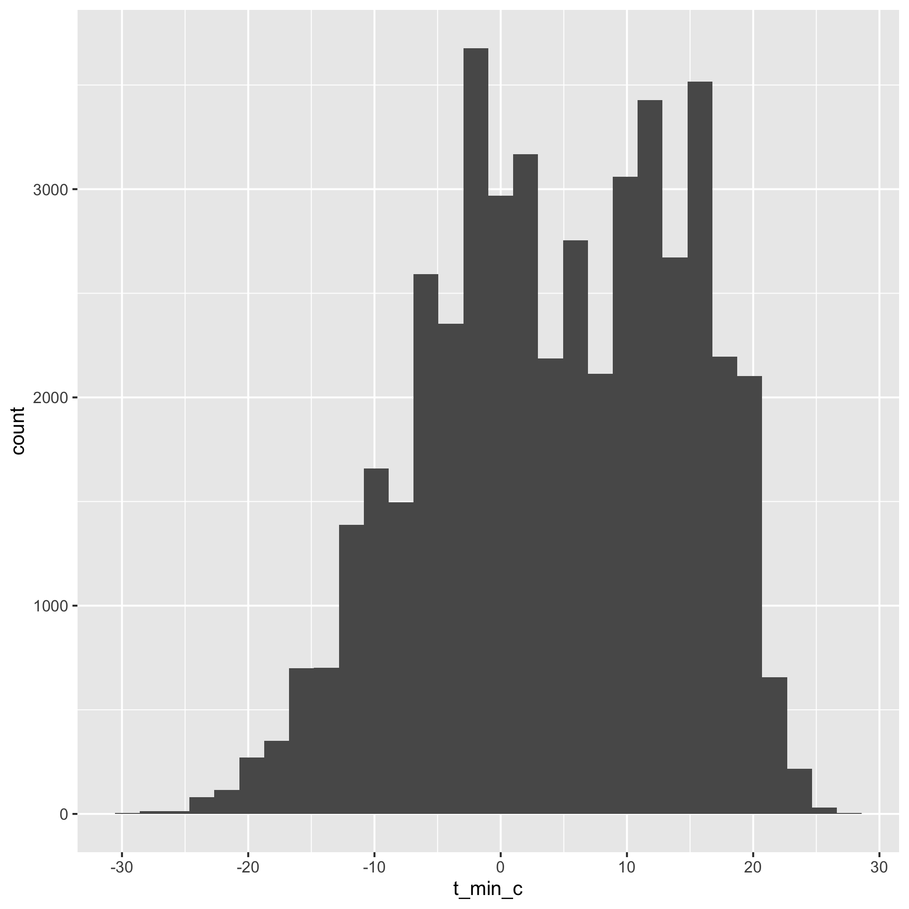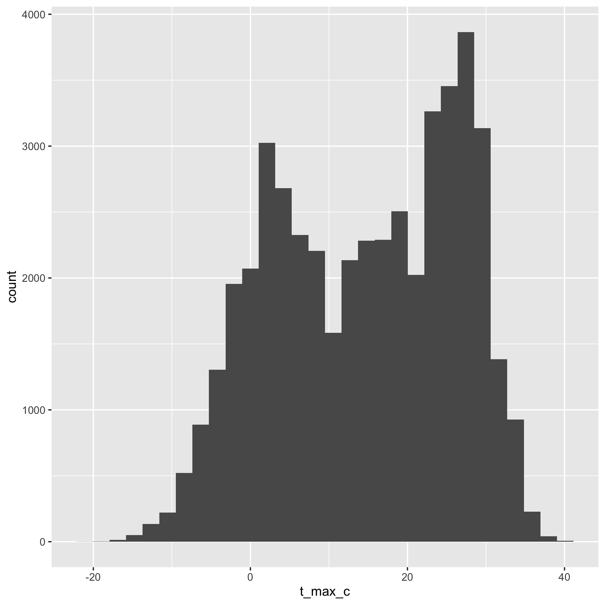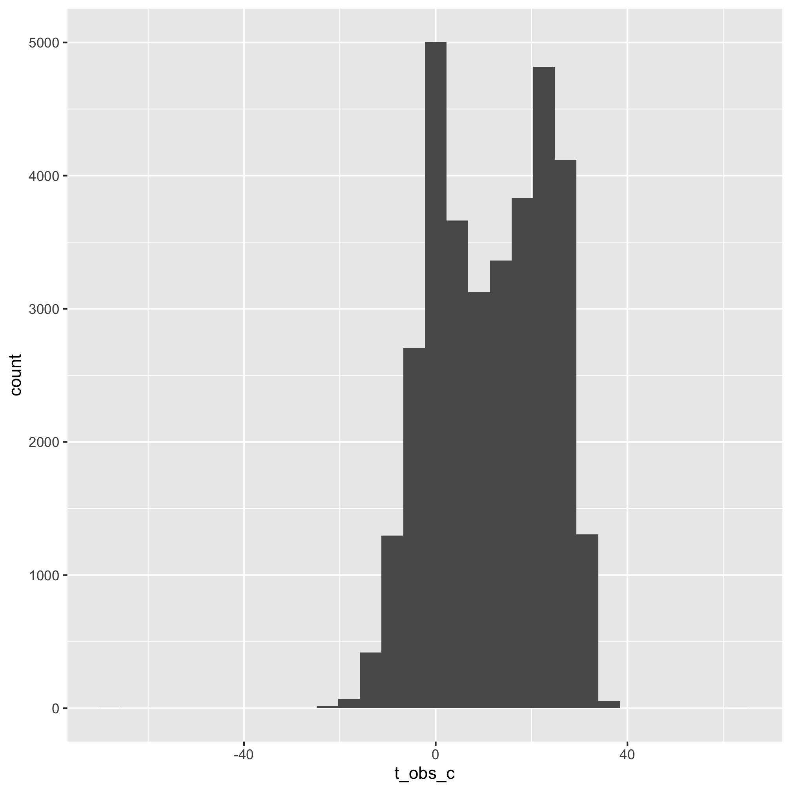

Two things to comment on here. First, you'll get the following feedback from running the command:

```
`stat_bin()` using `bins = 30`. Pick better value with `binwidth`.
Warning message:
Removed 163 rows containing non-finite values (stat_bin).
```

Starting with the warning message, it tells us that a number of the days in the dataset did not have values. We know that coverage for `t_min_c`/`TMIN` was not 100% so we should have expected that. Second, it tells us that it is using `bins=30` to build the histogram. It is telling us that we can manually set the number of bins or the width of the bins to draw the histogram.


```r
aa_weather %>% ggplot(aes(x=t_min_c)) + geom_histogram(bins=60)
```

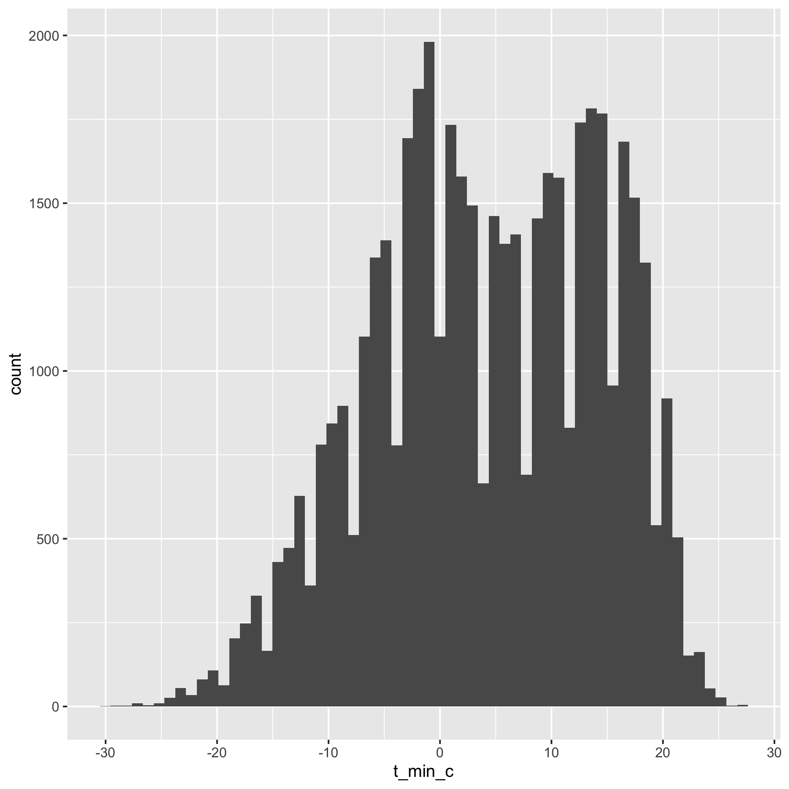


```r
aa_weather %>% ggplot(aes(x=t_min_c)) + geom_histogram(binwidth=1)
```

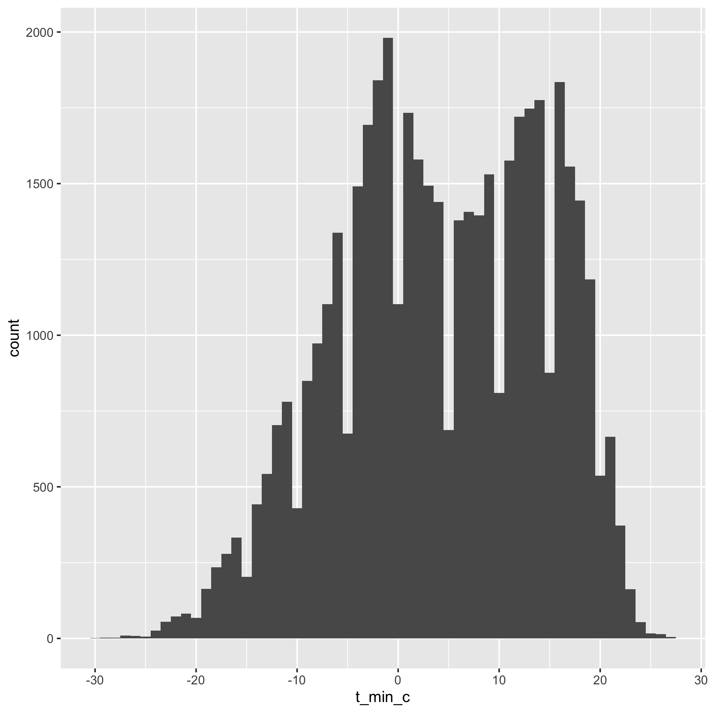

Unless we're interested in generating publication a quality figure, the default is probably good enough for our purposes.

Looking at the three plots that were generated, you'll notice that the histogram for `t_obs_c` has values greater than 60 and less than -60. Even for Ann Arbor, those temperatures are pretty extreme. I suspect the thermometer was having bad days when those observations were made. Something else that tells us the data don't make sense is that the `t_min_c` and `t_max_c` values approach those levels, which they should if `t_obs_c` was a single temperature reading. We can use `filter` to identify the days with these odd temperatures


```r
aa_weather %>% filter(t_obs_c > 40)
aa_weather %>% filter(t_obs_c < -40)
```

```
## # A tibble: 1 x 7
##   date       t_max_c t_min_c t_obs_c total_precip_mm snow_fall_mm snow_depth_mm
##   <date>       <dbl>   <dbl>   <dbl>           <dbl>        <dbl>         <dbl>
## 1 1934-05-12    13.3    -0.6      65               0            0             0
## # A tibble: 1 x 7
##   date       t_max_c t_min_c t_obs_c total_precip_mm snow_fall_mm snow_depth_mm
##   <date>       <dbl>   <dbl>   <dbl>           <dbl>        <dbl>         <dbl>
## 1 1944-06-18    33.3    19.4   -66.1               0            0             0
```

Those pipelines return the data for the two days with the suspect temperatures. I feel good throwing out these two temperatures because it was supposedly -66.1C (-87F) in June and 65C in May when the low temperature for the day was below freezing. Ann Arbor weather can be weird, but those temperatures don't make sense.


## Fixing data problems

Let's convert those weird temperatures to `NA` values, which will indicate we don't know the true value. We'll do this with two functions, one we've already seen, `mutate`, and another that builds upon the logical operators we've seen with `filter` called `ifelse`. `mutate` allows us to modify an existing column (i.e. `t_obs_c`) or to create a new column. For example, let's create a `t_max_f` column that has the maximum temperature for the day in degrees Fahrenheit. We'll add a `select` function call to make sure we can see the relevant columns.


```r
aa_weather %>%
	mutate(t_max_f = 9 * t_max_c / 5 + 32) %>%
	select(date, t_max_c, t_max_f)
```

```
## # A tibble: 46,650 x 3
##    date       t_max_c t_max_f
##    <date>       <dbl>   <dbl>
##  1 1891-10-01    20.6    69.1
##  2 1891-10-02    26.7    80.1
##  3 1891-10-03    26.1    79.0
##  4 1891-10-04    22.8    73.0
##  5 1891-10-05    13.9    57.0
##  6 1891-10-06    14.4    57.9
##  7 1891-10-07    10.6    51.1
##  8 1891-10-08    13.9    57.0
##  9 1891-10-09    15      59  
## 10 1891-10-10    16.7    62.1
## # … with 46,640 more rows
```

The other function we need is `ifelse`. This allows us to ask a logical question of the data. If the value is true, then we return one value. If it is false, we return another.


```r
my_numbers <- c(-5, -3, -1, 0, 1, 3, 5)
ifelse(my_numbers > 0, "positive", "negative")
```

```
## [1] "negative" "negative" "negative" "negative" "positive" "positive" "positive"
```

From this syntax we can see that `ifelse` has three "slots" - the logical question (i.e. `my_numbers > 0`), the value if the answer is `TRUE` (i.e. "positive"), the value if the answer is `FALSE` (i.e. "negative"). Let's see how we could put this together to recast the values of `t_obs_c` to remove those extreme temperatures


```r
aa_weather %>%
	mutate(t_obs_c = ifelse(t_obs_c > 40, NA, t_obs_c),
		t_obs_c = ifelse(t_obs_c < -40, NA, t_obs_c)) %>%
	ggplot(aes(x=t_obs_c)) +
		geom_histogram()
```


Slick, eh? You can see that we can mutate multiple columns or the same column multiple times by giving mutate two or more arguments separated by commas.


## Rinse, repeat

The histograms for temperature data made it pretty easy to pick off which numbers looked weird. We also probably have a good sense of what temperatures are extreme for an area. After living in the northern US for 25 years, I still don't know what an extreme, but acceptable snow or rain fall is.


```r
aa_weather %>% ggplot(aes(x=total_precip_mm)) + geom_histogram()
aa_weather %>% ggplot(aes(x=snow_fall_mm)) + geom_histogram()
aa_weather %>% ggplot(aes(x=snow_depth_mm)) + geom_histogram()
```

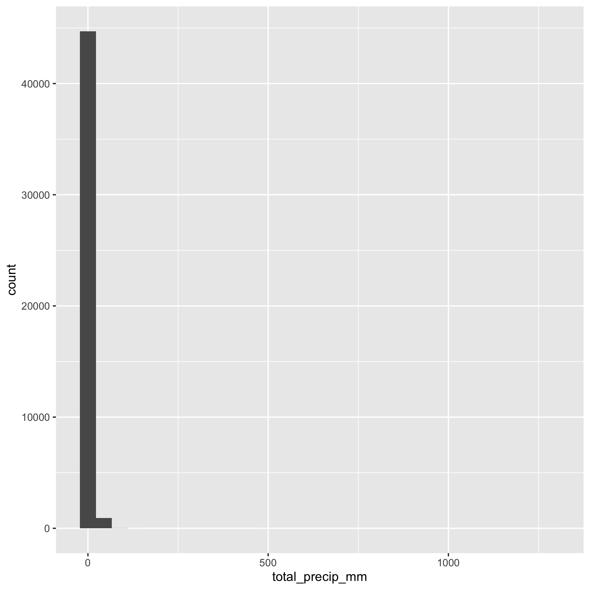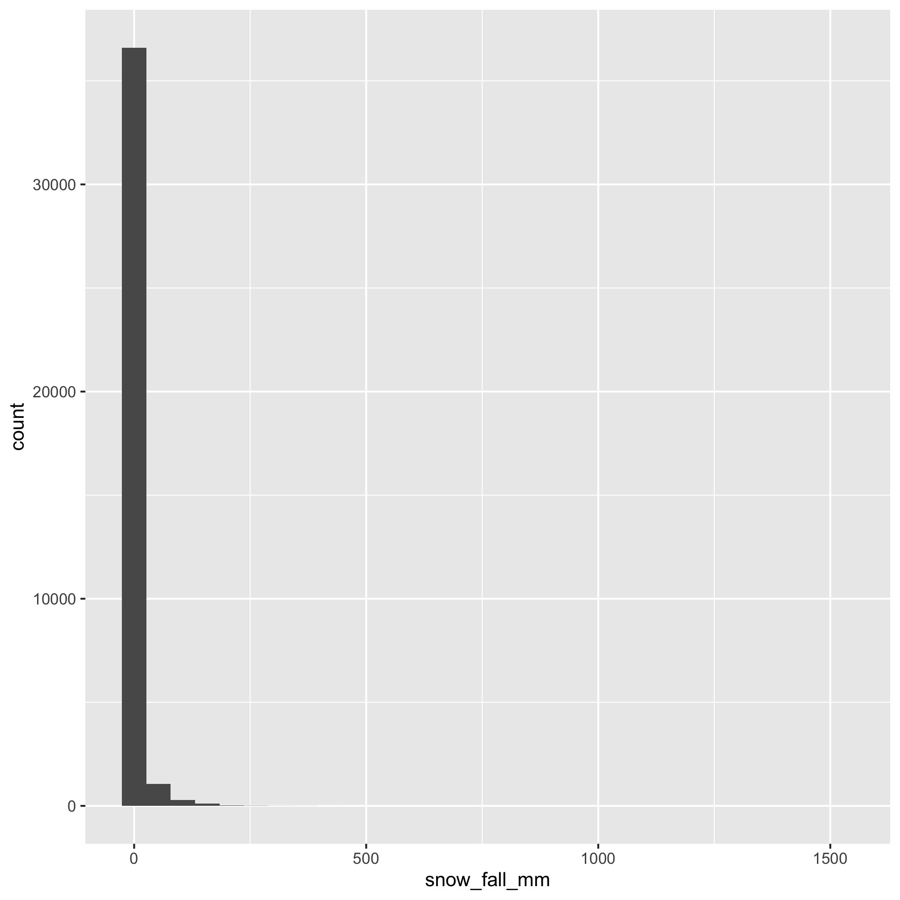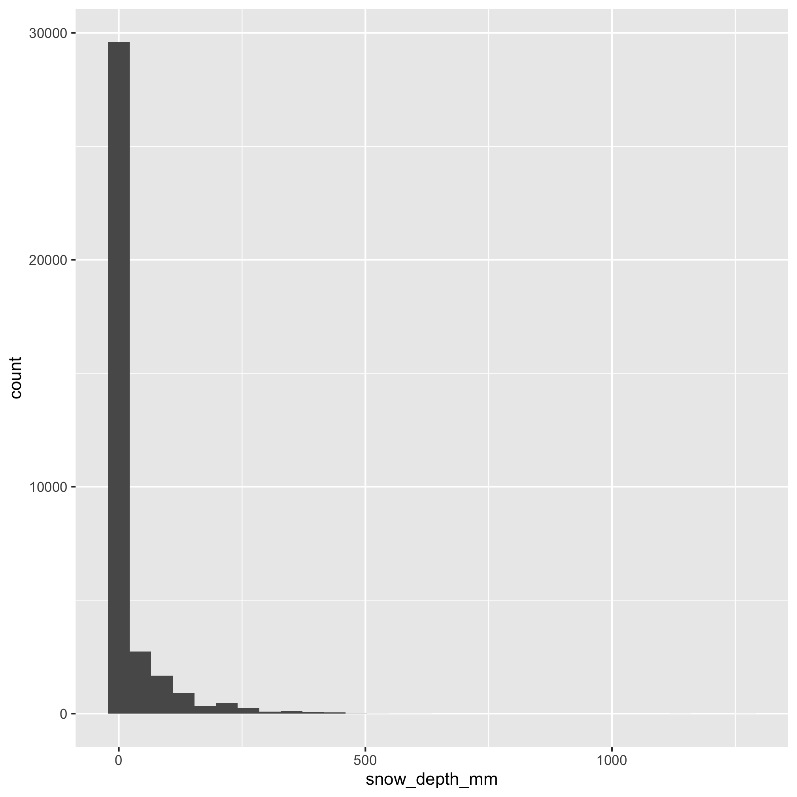

Let's think about this for a second - 1000 mm of precipitation is 100 cm or about 40 in. Yeah, that's a lot. We need to dig deeper into these data. I feel like 150 mm (~10 in) precipitation event is weird, but not outside of what we might expect for Ann Arbor. We can look at the data a different way - perhaps by plotting the data against the date like we did with the Project Tycho data


```r
aa_weather %>%
	ggplot(aes(x=date, y=total_precip_mm)) +
		geom_line()
```

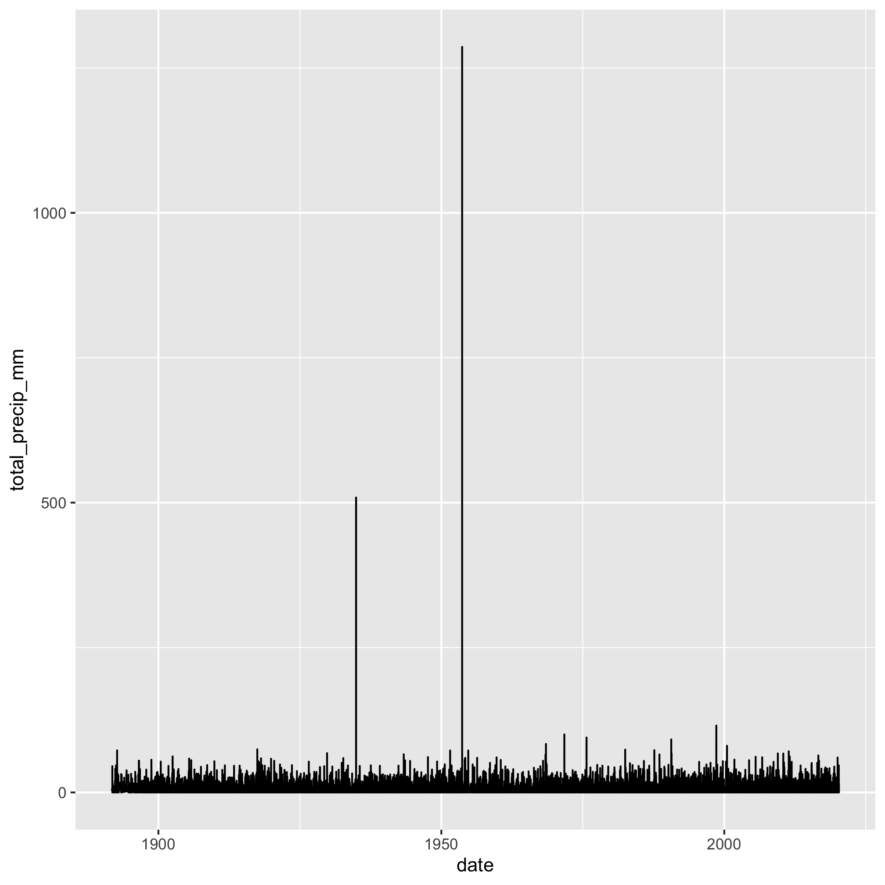

From this view, there appear to be 2 points that are above 250 mm that are outliers. We can use 250 mm to create a `filter` function call to find those rows with `total_precip_mm` values over 250


```r
aa_weather %>%
	filter(total_precip_mm > 250)
```

```
## # A tibble: 2 x 7
##   date       t_max_c t_min_c t_obs_c total_precip_mm snow_fall_mm snow_depth_mm
##   <date>       <dbl>   <dbl>   <dbl>           <dbl>        <dbl>         <dbl>
## 1 1934-12-08    -3.9    -8.3   -17.8            509.            5            NA
## 2 1953-09-05    23.9    12.8    18.3           1286.            0             0
```

A google search for "Ann Arbor 1953 rain" doesn't turn up anything and neither does using "1934" in place of "1953". I'd expect something like that amount of precipitation to be newsworthy! Taking our previous `mutate` function call, let's add this threshold for `total_precip_mm` to set values above this number as `NA`.


```r
aa_weather %>%
	mutate(t_obs_c = ifelse(t_obs_c > 40, NA, t_obs_c),
		t_obs_c = ifelse(t_obs_c < -40, NA, t_obs_c),
		total_precip_mm = ifelse(total_precip_mm > 250, NA, total_precip_mm)) %>%
	ggplot(aes(total_precip_mm)) + geom_histogram()
```

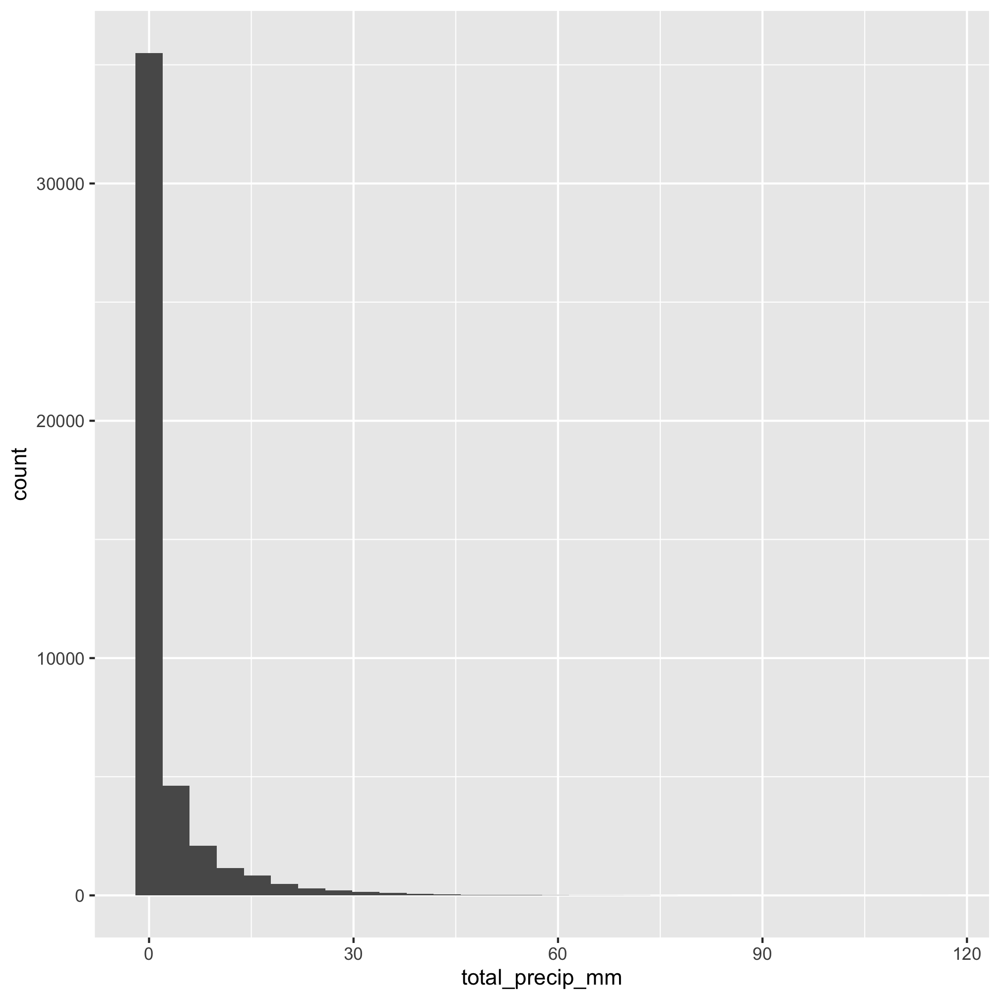

You'll notice that if we now do


```r
aa_weather %>%
	ggplot(aes(total_precip_mm)) + geom_histogram()
```


We again get the very long x-axis. Why is this? In all of our pipelines we are doing operations on the `aa_weather` data frame, but we haven't "written" anything to a new variable! We could do something like this to create a new data frame


```r
clean_aa_weather <- aa_weather %>%
	mutate(t_obs_c = ifelse(t_obs_c > 40, NA, t_obs_c),
		t_obs_c = ifelse(t_obs_c < -40, NA, t_obs_c),
		total_precip_mm = ifelse(total_precip_mm > 250, NA, total_precip_mm))

clean_aa_weather %>%
	ggplot(aes(total_precip_mm)) + geom_histogram()
```


or


```r
aa_weather <- aa_weather %>%
	mutate(t_obs_c = ifelse(t_obs_c > 40, NA, t_obs_c),
		t_obs_c = ifelse(t_obs_c < -40, NA, t_obs_c),
		total_precip_mm = ifelse(total_precip_mm > 250, NA, total_precip_mm))

aa_weather %>%
	ggplot(aes(total_precip_mm)) + geom_histogram()
```


I'd prefer to make one pipeline for cleaning up my data. So starting from the top


```r
aa_weather <- read_csv('noaa/USC00200230.csv', col_types="ccDdddddddddd") %>%
	select(DATE, starts_with("T"), PRCP, SNOW, SNWD) %>%
	rename("date" = "DATE",
		"t_max_c" = "TMAX",
		"t_min_c" = "TMIN",
		"t_obs_c" = "TOBS",
		"total_precip_mm" = "PRCP",
		"snow_fall_mm" = "SNOW",
		"snow_depth_mm" = "SNWD") %>%
	mutate(t_obs_c = ifelse(t_obs_c > 40, NA, t_obs_c),
		t_obs_c = ifelse(t_obs_c < -40, NA, t_obs_c),
		total_precip_mm = ifelse(total_precip_mm > 250, NA, total_precip_mm))
```

Now we have a data frame, `aa_weather`, that has our cleaned up data. What's better, is that we can throw this code in a new script file and as more data is added to the station, we can rerun the code to clean up the data by the same methods!


## Questions

1\. Perhaps you remember from earlier that we can combine logical questions to make a single filter command. Can you transform our two `filter` functions for finding weird `t_obs_c` values into one?

<input type="button" class="hideshow">
<div markdown="1" style="display:none;">

```r
aa_weather %>% filter(t_obs_c > 40 | t_obs_c < -40)
```

```
## # A tibble: 0 x 7
## # … with 7 variables: date <date>, t_max_c <dbl>, t_min_c <dbl>, t_obs_c <dbl>,
## #   total_precip_mm <dbl>, snow_fall_mm <dbl>, snow_depth_mm <dbl>
```
</div>


2\. Can you make the `mutate` function call above only modify the `t_obs_c` column once?

<input type="button" class="hideshow">
<div markdown="1" style="display:none;">

```r
aa_weather %>%
	mutate(t_obs_c = ifelse(t_obs_c > 40 | t_obs_c < -40, NA, t_obs_c)) %>%
	ggplot(aes(x=t_obs_c)) +
		geom_histogram()
```

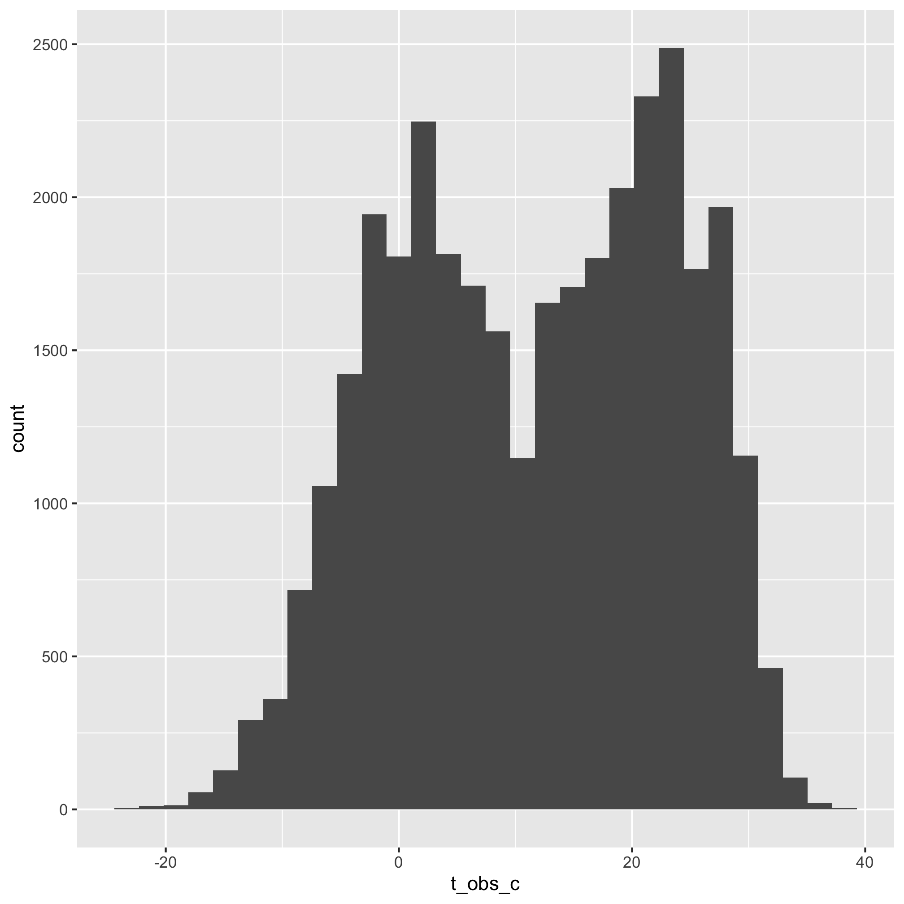
</div>


3\. What's wrong with this code chunk?


```r
aa_weather %>%
	mutate(t_obs_c = ifelse(t_obs_c > 40 | t_obs_c <-40, NA, t_obs_c)) %>%
	ggplot(aes(x=t_obs_c)) +
		geom_histogram()
```

<input type="button" class="hideshow">
<div markdown="1" style="display:none;">
There needs to be a space between the `<` and the `-` in `<-40`


```r
aa_weather %>%
	mutate(t_obs_c = ifelse(t_obs_c > 40 | t_obs_c < -40, NA, t_obs_c)) %>%
	ggplot(aes(x=t_obs_c)) +
		geom_histogram()
```


</div>


4\. Can you make a column called `is_freezing`, which contains logical data indicating whether the minimum temperature for the day was below freezing?

<input type="button" class="hideshow">
<div markdown="1" style="display:none;">

```r
aa_weather %>%
	mutate(is_freezing = ifelse(t_min_c <= 0, TRUE, FALSE)) %>%
	ggplot(aes(x=t_obs_c)) +
		geom_histogram()
```

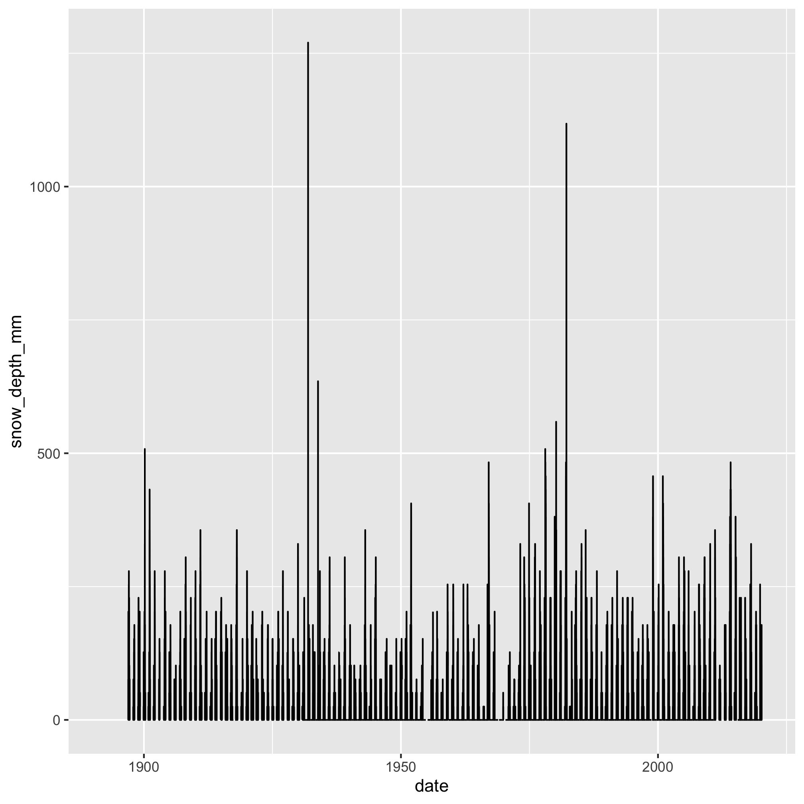
</div>


5\. Look at the `snow_fall_mm` and `snow_depth_mm` data and see whether you can spot any other weird data.

<input type="button" class="hideshow">
<div markdown="1" style="display:none;">
First, `snow_fall_mm`...


```r
aa_weather %>% ggplot(aes(x=date, y=snow_fall_mm)) + geom_line()

aa_weather %>% filter(snow_fall_mm > 500) #google doesn't indicate this is correct

aa_weather %>%
	mutate(snow_fall_mm = ifelse(snow_fall_mm > 500, NA, snow_fall_mm)) %>%
	ggplot(aes(x=snow_fall_mm)) +
		geom_histogram()
```

```
## # A tibble: 1 x 7
##   date       t_max_c t_min_c t_obs_c total_precip_mm snow_fall_mm snow_depth_mm
##   <date>       <dbl>   <dbl>   <dbl>           <dbl>        <dbl>         <dbl>
## 1 1931-03-08       0    -2.2       0            11.4         1524           178
```

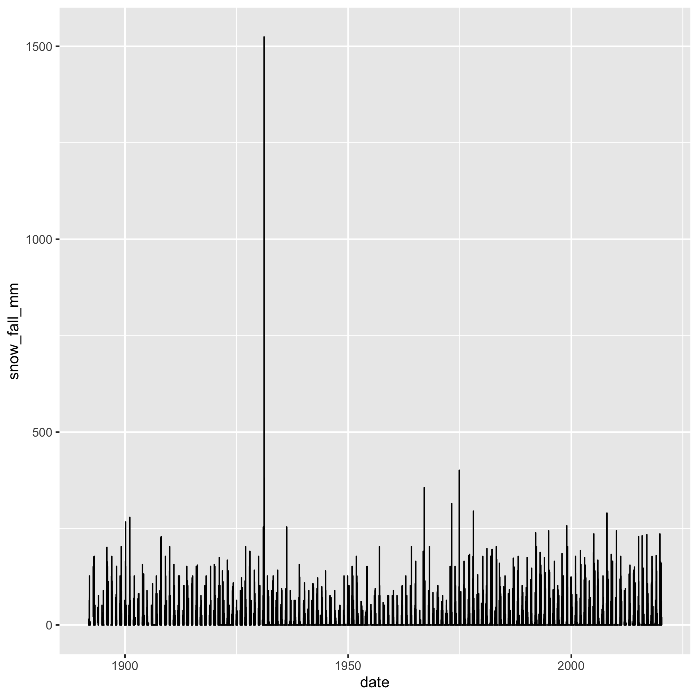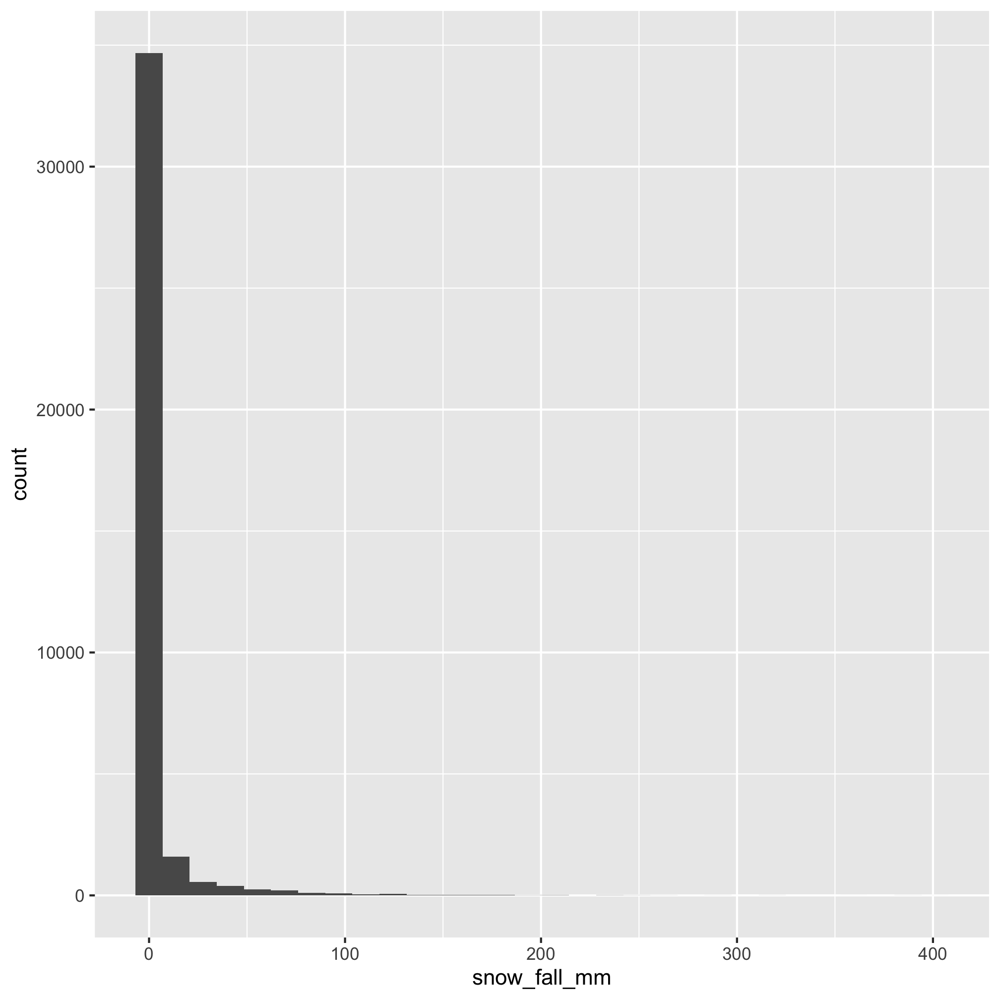

Then, `snow_depth_mm`...


```r
aa_weather %>% ggplot(aes(x=date, y=snow_depth_mm)) + geom_line()

aa_weather %>% filter(snow_depth_mm > 1000) #google doesn't indicate this is correct

aa_weather %>%
	mutate(snow_depth_mm = ifelse(snow_depth_mm > 500, NA, snow_depth_mm)) %>%
	ggplot(aes(x=snow_depth_mm)) +
		geom_histogram()
```

```
## # A tibble: 2 x 7
##   date       t_max_c t_min_c t_obs_c total_precip_mm snow_fall_mm snow_depth_mm
##   <date>       <dbl>   <dbl>   <dbl>           <dbl>        <dbl>         <dbl>
## 1 1931-12-09     1.7    -3.3     1.1             8.9          127          1270
## 2 1982-03-09    -1.1    -7.8    -6.1             9.9           84          1118
```

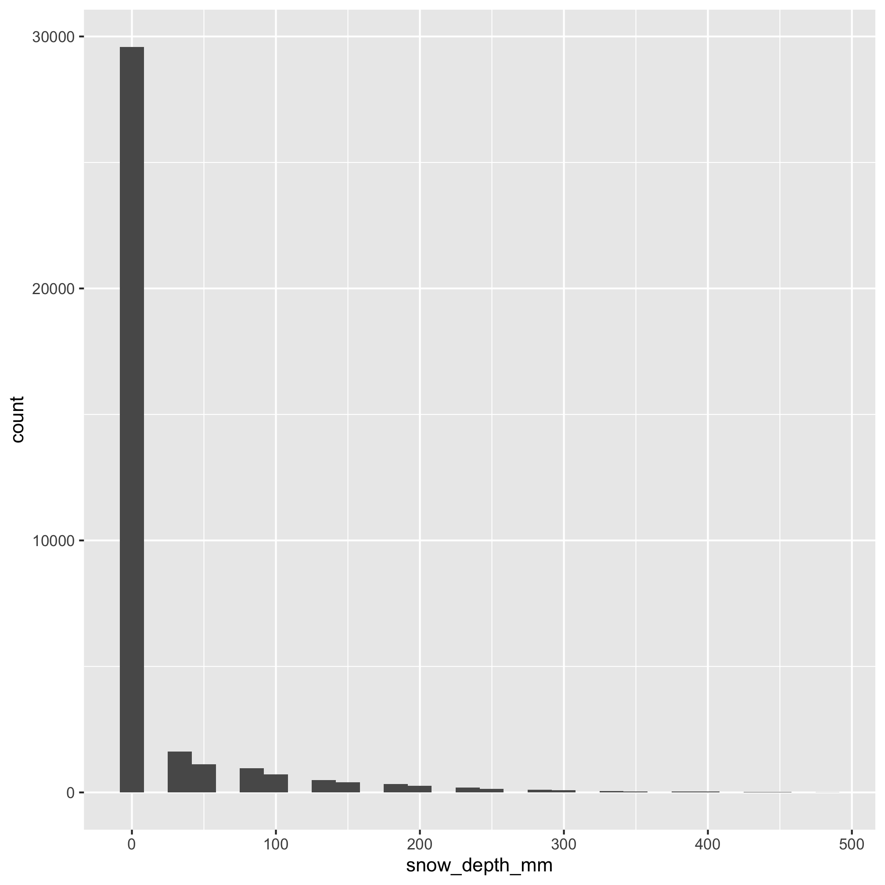
</div>
