## Topics
* Grouping and summarizing data
* Working with dates
* Thinking about and visualizing our data
* DRY revisited
* Rinse, repeat


## Grouping and summarizing data

There's way too much day-to-day variation to get a sense of the year-to-year variation. We have more than 46,000 rows of data in `aa_weather`. Even in graphical form, that's a lot to digest.


```r
library(tidyverse)

aa_weather <- read_csv('noaa/USC00200230.csv', col_types="ccDdddddddddd") %>%
	select(DATE, starts_with("T"), PRCP, SNOW, SNWD) %>%
	rename("date" = "DATE",
		"t_max_c" = "TMAX",
		"t_min_c" = "TMIN",
		"t_obs_c" = "TOBS",
		"total_precip_mm" = "PRCP",
		"snow_fall_mm" = "SNOW",
		"snow_depth_mm" = "SNWD") %>%
	mutate(t_obs_c = ifelse(t_obs_c > 40 | t_obs_c < -40, NA, t_obs_c),
		total_precip_mm = ifelse(total_precip_mm > 250, NA, total_precip_mm),
		snow_fall_mm = ifelse(snow_fall_mm > 500, NA, snow_fall_mm),
		snow_depth_mm = ifelse(snow_depth_mm > 500, NA, snow_depth_mm)
	)

aa_weather %>%
	ggplot(aes(x=date, y=t_max_c)) +
		geom_line()
```

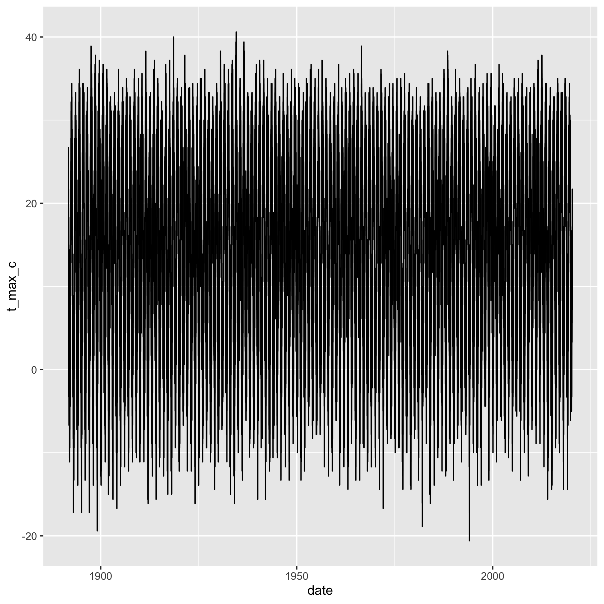

We need to do something to intelligently group the data. A lot of questions we might want to answer with these data involve grouping data that is similar and the summarizing the grouped data. For example,

* Which year had the most precipitation?
* How typical was the weather on my birth date?
* What is the probability of rain on my birthday?
* Which year has had the most precipitation?
* What is the high or low temperature for each day of the year? Which year was it set?


## Working with dates

To answer each of these questions, we will need to group the data and then do some type of summary on the grouped data (e.g. `median`, `min`, `max`). The other set of tools we'll need for these particular questions is provided by the `lubridate` package, which we saw with the Project Typcho data. `lubridate` is part of the `tidyverse`. We used the `year` function to extract the year from the date data.

As an aside, the date is one of those things that can be written [many different ways](https://xkcd.com/1179/). How do you write it? I was born on June 20, 1976. How do you most naturally write that date? 20 June 1976? 6/20/1976? 20/6/1976? 6/20/1976? There is a standard format that virtually no one outside of data science uses - ISO 8601. It is expressed as "YYYY-MM-DD". You'll notice that the date column follows this standard and so we need to convert our dates to the standard as well - "1976-06-20". If our data are nicely formatted, there's a lot of useful information that we can extract from that date. A handy [cheatsheet](https://github.com/rstudio/cheatsheets/raw/master/lubridate.pdf) is available to help you with formatting dates, extracting information, and other dates related goodies


```r
library(lubridate) # don't forget to add this to your script for analyzing weather data. I like
		# to put all of my library functions together at the top of a script

birth_date <- "1976-06-20"
year(birth_date) # year
month(birth_date) # month
day(birth_date) # day of the month
wday(birth_date) # day of the week with 1 => Monday
yday(birth_date) # Julian date
week(birth_date) # week of the year
```

```
## [1] 1976
## [1] 6
## [1] 20
## [1] 1
## [1] 172
## [1] 25
```

## Grouping and summarizing data, doing it

Let's find the year with the most precipitation. Take a moment and think to yourself what you would need to do to figure this out. Don't worry about the R syntax. Write it out in your own words, use pictures, whatever helps you think. Here's my thinking: I need to get the year for each observation in the data frame. Then I need to group the data by the year. Finally, I need to sum the `total_precip_mm` column within each year. You've seen all of these steps before with another application in the Project Tycho data, but we didn't discuss it in depth.

The first step should sound most familiar. We need to generate a `year` column using the `mutate` and `year` functions


```r
aa_weather %>%
	mutate(year = year(date)) %>%
	select(year, everything()) # this puts the year column first and then everything else
```

```
## # A tibble: 46,650 x 8
##     year date       t_max_c t_min_c t_obs_c total_precip_mm snow_fall_mm
##    <dbl> <date>       <dbl>   <dbl>   <dbl>           <dbl>        <dbl>
##  1  1891 1891-10-01    20.6     7.8      NA            NA             NA
##  2  1891 1891-10-02    26.7    13.9      NA            NA             NA
##  3  1891 1891-10-03    26.1    16.1      NA            NA             NA
##  4  1891 1891-10-04    22.8    11.1      NA             7.6           NA
##  5  1891 1891-10-05    13.9     6.7      NA            NA             NA
##  6  1891 1891-10-06    14.4     5        NA            NA             NA
##  7  1891 1891-10-07    10.6     5.6      NA             4.1           NA
##  8  1891 1891-10-08    13.9     3.3      NA            NA             NA
##  9  1891 1891-10-09    15       3.9      NA            NA             NA
## 10  1891 1891-10-10    16.7     5        NA            NA             NA
## # … with 46,640 more rows, and 1 more variable: snow_depth_mm <dbl>
```

Now we need to group the data by the year. To do this we'll use the `group_by` function


```r
aa_weather %>%
	mutate(year = year(date)) %>%
	group_by(year)
```

```
## # A tibble: 46,650 x 8
## # Groups:   year [130]
##    date       t_max_c t_min_c t_obs_c total_precip_mm snow_fall_mm snow_depth_mm
##    <date>       <dbl>   <dbl>   <dbl>           <dbl>        <dbl>         <dbl>
##  1 1891-10-01    20.6     7.8      NA            NA             NA            NA
##  2 1891-10-02    26.7    13.9      NA            NA             NA            NA
##  3 1891-10-03    26.1    16.1      NA            NA             NA            NA
##  4 1891-10-04    22.8    11.1      NA             7.6           NA            NA
##  5 1891-10-05    13.9     6.7      NA            NA             NA            NA
##  6 1891-10-06    14.4     5        NA            NA             NA            NA
##  7 1891-10-07    10.6     5.6      NA             4.1           NA            NA
##  8 1891-10-08    13.9     3.3      NA            NA             NA            NA
##  9 1891-10-09    15       3.9      NA            NA             NA            NA
## 10 1891-10-10    16.7     5        NA            NA             NA            NA
## # … with 46,640 more rows, and 1 more variable: year <dbl>
```

This output doesn't look that different than when we ran it without the `group_by` function. If you look closely at the second line of output, you'll see that it indicates, "# Groups:   year [130]". It has grouped our data in to 130 groups - one for each year in the dataset.

Finally, we need to sum the `total_precip_mm` column for each group (i.e. year). We will do this with the `summarize` and `sum` functions


```r
aa_weather %>%
	mutate(year = year(date)) %>%
	group_by(year) %>%
	summarize(annual_precip_mm = sum(total_precip_mm))
```

```
## # A tibble: 130 x 2
##     year annual_precip_mm
##    <dbl>            <dbl>
##  1  1891              NA 
##  2  1892              NA 
##  3  1893              NA 
##  4  1894              NA 
##  5  1895              NA 
##  6  1896              NA 
##  7  1897             830.
##  8  1898             836.
##  9  1899             682.
## 10  1900             726.
## # … with 120 more rows
```

Nice, eh?! We have a new data frame with the year and the total precipitation for the year as measured in millimeters. There are two things to mention here. First, for 1891 to 1896 we have `NA` values for `annual_precip_mm`. It's not clear to me whether an `NA` means missing data or no precipitation. We know that there were some records of precipitation in 1891 from the output of running `aa_weather` on its own at the R prompt. If we assume that `NA` means no data, then we can use a special argument to `sum` to treat `NA` values as zeros, `na.rm=TRUE`.


```r
aa_weather %>%
	mutate(year = year(date)) %>%
	group_by(year) %>%
	summarize(annual_precip_mm = sum(total_precip_mm, na.rm=TRUE))
```

```
## # A tibble: 130 x 2
##     year annual_precip_mm
##    <dbl>            <dbl>
##  1  1891             174.
##  2  1892             787.
##  3  1893             989.
##  4  1894             653.
##  5  1895             628.
##  6  1896             756.
##  7  1897             830.
##  8  1898             836.
##  9  1899             682.
## 10  1900             726.
## # … with 120 more rows
```

## Thinking about and visualizing our data

The data for 1891 started in October, which explains why it has relatively little precipitation. Again, whether to treat the `NA` values as zeroes really depends on what they represent for your data. For this dataset, I'm content to treat them as zeroes. I would like to get rid of the partial data for 1891 and 2020 with `filter`


```r
aa_weather %>%
	mutate(year = year(date)) %>%
	group_by(year) %>%
	summarize(annual_precip_mm = sum(total_precip_mm, na.rm=TRUE)) %>%
	filter(year != 1891 & year != 2020) # note that != is the opposite of ==, i.e not equal to
```

```
## # A tibble: 128 x 2
##     year annual_precip_mm
##    <dbl>            <dbl>
##  1  1892             787.
##  2  1893             989.
##  3  1894             653.
##  4  1895             628.
##  5  1896             756.
##  6  1897             830.
##  7  1898             836.
##  8  1899             682.
##  9  1900             726.
## 10  1901             657.
## # … with 118 more rows
```

Excellent! These data are sorted by year, how would we sort it by `annual_precip_mm`? We can use the `arrange` function


```r
aa_weather %>%
	mutate(year = year(date)) %>%
	group_by(year) %>%
	summarize(annual_precip_mm = sum(total_precip_mm, na.rm=TRUE)) %>%
	filter(year != 1891 & year != 2020) %>%
	arrange(annual_precip_mm)
```

```
## # A tibble: 128 x 2
##     year annual_precip_mm
##    <dbl>            <dbl>
##  1  1955             420.
##  2  1963             428.
##  3  1934             482.
##  4  1930             559.
##  5  1958             566.
##  6  1965             566.
##  7  1946             602.
##  8  1971             609 
##  9  1964             609.
## 10  1953             614.
## # … with 118 more rows
```

That does an ascending sort and shows that 1955, 1963, and 1934 were the driest years. To do a descending sort, we need to include the `desc` function


```r
aa_weather %>%
	mutate(year = year(date)) %>%
	group_by(year) %>%
	summarize(annual_precip_mm = sum(total_precip_mm, na.rm=TRUE)) %>%
	filter(year != 1891 & year != 2020) %>%
	arrange(desc(annual_precip_mm))
```

```
## # A tibble: 128 x 2
##     year annual_precip_mm
##    <dbl>            <dbl>
##  1  2011            1298.
##  2  2006            1208.
##  3  1990            1200.
##  4  2000            1166.
##  5  2019            1155.
##  6  1985            1097 
##  7  2018            1072.
##  8  1917            1068.
##  9  2008            1060 
## 10  2009            1049 
## # … with 118 more rows
```

That shows 7 of the 10 wettest years were since 2000.

We can also plot these data to get a sense of any trends in the data


```r
aa_weather %>%
	mutate(year = year(date)) %>%
	group_by(year) %>%
	summarize(annual_precip_mm = sum(total_precip_mm, na.rm=TRUE)) %>%
	filter(year != 1891 & year != 2020) %>%
	ggplot(aes(x=year, y=annual_precip_mm)) +
		geom_line()
```

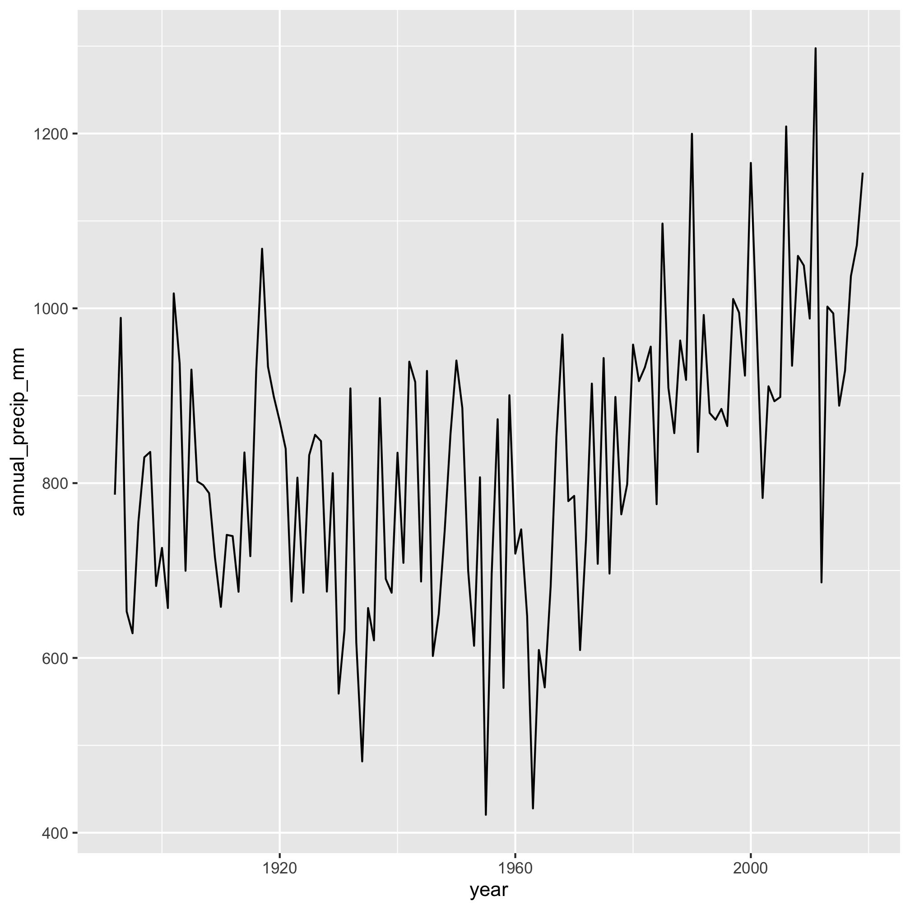

It really does appear that total precipitation starts to move upwards after 1960.  We can make this more evident by adding a smoothed line through the data with `geom_smooth`


```r
aa_weather %>%
	mutate(year = year(date)) %>%
	group_by(year) %>%
	summarize(annual_precip_mm = sum(total_precip_mm, na.rm=TRUE)) %>%
	filter(year != 1891 & year != 2020) %>%
	ggplot(aes(x=year, y=annual_precip_mm)) +
		geom_line() +
		geom_smooth()
```


Gulp. Hopefully, this progression of our analysis makes sense. We identified and created an attribute that we wanted to group our data by using `mutate`, grouped the data by the year using `group_by`, and totaled the amount of precipitation for the year with `summarize`. This workflow is amazingly powerful.


## DRY revisited

I should make one final point on this example. Previously, we discussed using functions to make our code DRY. We can also use variables to make our code DRY. In the last few code chunks, we've repeated a lot of the same code to generate the summary table. We should probably save that as a data frame and then do operations on that data frame.


```r
annual_precipitation <- aa_weather %>%
	mutate(year = year(date)) %>%
	group_by(year) %>%
	summarize(annual_precip_mm = sum(total_precip_mm, na.rm=TRUE)) %>%
	filter(year != 1891 & year != 2020)

annual_precipitation %>%
	arrange(desc(annual_precip_mm))

annual_precipitation %>%
	ggplot(aes(x=year, y=annual_precip_mm)) +
		geom_line() +
		geom_smooth()
```

```
## # A tibble: 128 x 2
##     year annual_precip_mm
##    <dbl>            <dbl>
##  1  2011            1298.
##  2  2006            1208.
##  3  1990            1200.
##  4  2000            1166.
##  5  2019            1155.
##  6  1985            1097 
##  7  2018            1072.
##  8  1917            1068.
##  9  2008            1060 
## 10  2009            1049 
## # … with 118 more rows
```

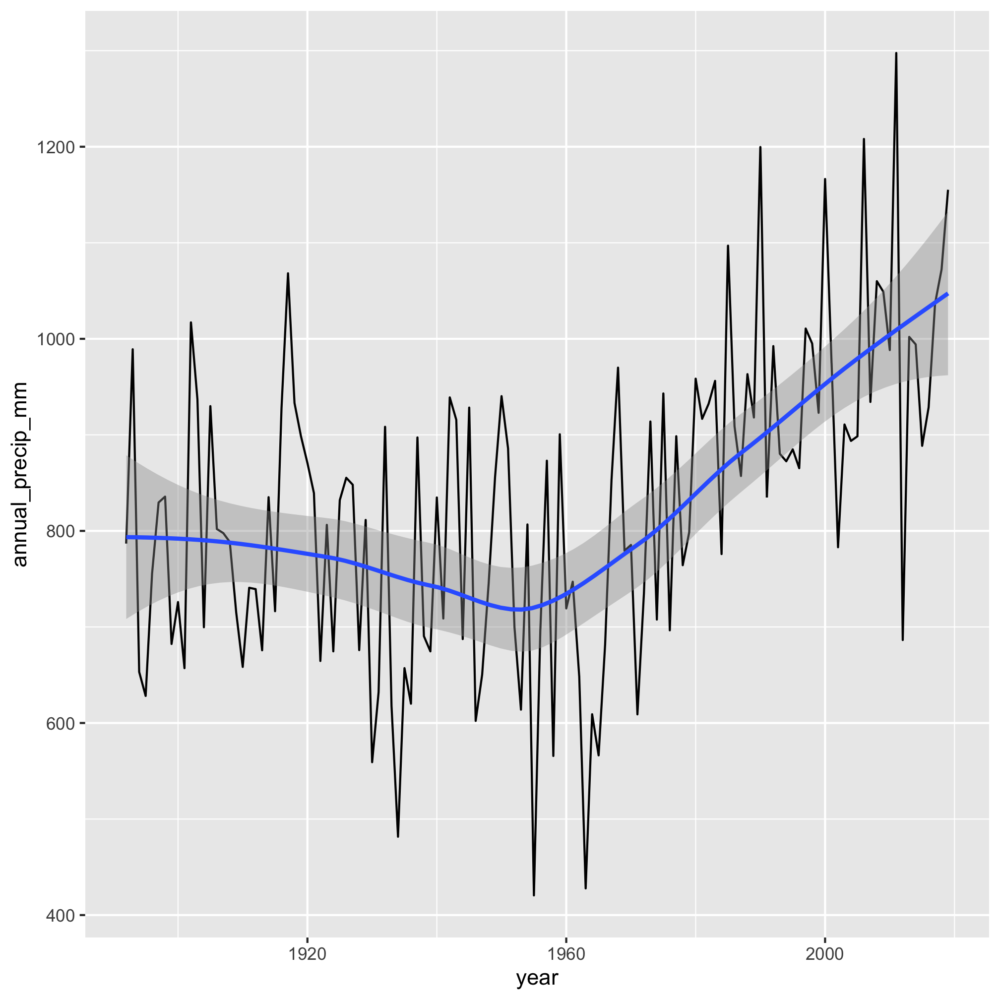


## Rinse, repeat

Let's work on the second question of how typical the weather was on my birth date. To ease into this type of question, let's get the weather in Ann Arbor on the day I was born - June 20, 1976 or 1976-06-20.


```r
aa_weather %>%
	filter(date == "1976-06-20")
```

```
## # A tibble: 1 x 7
##   date       t_max_c t_min_c t_obs_c total_precip_mm snow_fall_mm snow_depth_mm
##   <date>       <dbl>   <dbl>   <dbl>           <dbl>        <dbl>         <dbl>
## 1 1976-06-20    24.4    11.1    24.4               0            0             0
```

That is a perfect Pat Schloss day! Cool and dry. Maybe there were a couple of fluffy clouds in the sky. I'd like to know how typical that day's temperature (low of 11.1 C and high of 24.4 C) and lack of rain fall are for June 20th or any other day of the year. What I'd like to do is group all of the data by the month and day and return the median weather data along with the 95% confidence interval for the weather observation on each day.

As with anything in R, there are many ways to do this! Let's pause for a moment and think through our strategy.

1. Extract the month and day for each date, create a new column for each
2. Group the data by both the month and day
3. Calculate the median high temperature for each month/day combination along with the 95% confidence interval for each.
4. Filter to get the data for my birthday

That should look pretty familiar. I want to emphasize that thinking through the strategy is the hard part of programming. If you can figure out how to break down a problem into steps, then you can largely google the rest or find examples of how to do each step.

We'll start with creating a month and day column with `mutate`


```r
aa_weather %>%
	mutate(month = month(date),
		day = day(date)) %>%
	select(month, day, everything())
```

```
## # A tibble: 46,650 x 9
##    month   day date       t_max_c t_min_c t_obs_c total_precip_mm snow_fall_mm
##    <dbl> <int> <date>       <dbl>   <dbl>   <dbl>           <dbl>        <dbl>
##  1    10     1 1891-10-01    20.6     7.8      NA            NA             NA
##  2    10     2 1891-10-02    26.7    13.9      NA            NA             NA
##  3    10     3 1891-10-03    26.1    16.1      NA            NA             NA
##  4    10     4 1891-10-04    22.8    11.1      NA             7.6           NA
##  5    10     5 1891-10-05    13.9     6.7      NA            NA             NA
##  6    10     6 1891-10-06    14.4     5        NA            NA             NA
##  7    10     7 1891-10-07    10.6     5.6      NA             4.1           NA
##  8    10     8 1891-10-08    13.9     3.3      NA            NA             NA
##  9    10     9 1891-10-09    15       3.9      NA            NA             NA
## 10    10    10 1891-10-10    16.7     5        NA            NA             NA
## # … with 46,640 more rows, and 1 more variable: snow_depth_mm <dbl>
```

That looks right. Now we want to group by those two new columns. Previously, we grouped by a single column. To group by two or more columns, we separate the variables with commas


```r
aa_weather %>%
	mutate(month = month(date),
		day = day(date)) %>%
	group_by(month, day)
```

```
## # A tibble: 46,650 x 9
## # Groups:   month, day [366]
##    date       t_max_c t_min_c t_obs_c total_precip_mm snow_fall_mm snow_depth_mm
##    <date>       <dbl>   <dbl>   <dbl>           <dbl>        <dbl>         <dbl>
##  1 1891-10-01    20.6     7.8      NA            NA             NA            NA
##  2 1891-10-02    26.7    13.9      NA            NA             NA            NA
##  3 1891-10-03    26.1    16.1      NA            NA             NA            NA
##  4 1891-10-04    22.8    11.1      NA             7.6           NA            NA
##  5 1891-10-05    13.9     6.7      NA            NA             NA            NA
##  6 1891-10-06    14.4     5        NA            NA             NA            NA
##  7 1891-10-07    10.6     5.6      NA             4.1           NA            NA
##  8 1891-10-08    13.9     3.3      NA            NA             NA            NA
##  9 1891-10-09    15       3.9      NA            NA             NA            NA
## 10 1891-10-10    16.7     5        NA            NA             NA            NA
## # … with 46,640 more rows, and 2 more variables: month <dbl>, day <int>
```

Now that we've grouped the data, we see the line, `# Groups:   month, day [366]`. We are now set to summarize the data


```r
aa_weather %>%
	mutate(month = month(date),
		day = day(date)) %>%
	group_by(month, day) %>%
	summarize(t_med_c = median(t_max_c))
```

```
## # A tibble: 366 x 3
## # Groups:   month [12]
##    month   day t_med_c
##    <dbl> <int>   <dbl>
##  1     1     1    0.6 
##  2     1     2    0.6 
##  3     1     3    0   
##  4     1     4    0   
##  5     1     5   -0.6 
##  6     1     6   -1.1 
##  7     1     7   -0.3 
##  8     1     8   -0.6 
##  9     1     9   -0.85
## 10     1    10   -0.3 
## # … with 356 more rows
```

Here we're using the `median` function to get the median value of `t_max_c` within the desired month and day combination. We can use any function in `summarize`, including those we create, as long as the functions return a single value. Other functions you'll find useful include `mean`, `sd`, `IQR`, `max`, `min`, `quartile`, and `n`. Similar to the `mutate` function, we can create additional columns in the `summarize` function by separating them by commas. Let's try this with the 2.5 and 97.5 percentiles using the `quantile` function and adding a column that indicates the number of obserations we have.


```r
aa_weather %>%
	mutate(month = month(date),
		day = day(date)) %>%
	group_by(month, day) %>%
	summarize(t_med_c = median(t_max_c),
		t_lci_c = quantile(t_max_c, prob=0.025),
		t_uci_c = quantile(t_max_c, prob=0.975),
		n = n())
```

```
## Error in quantile.default(t_max_c, prob = 0.025): missing values and NaN's not allowed if 'na.rm' is FALSE
```

Here we get an error about `NA` values. Let's go ahead and ignore these in our calculations


```r
aa_weather %>%
	mutate(month = month(date),
		day = day(date)) %>%
	group_by(month, day) %>%
	summarize(t_med_c = median(t_max_c, na.rm=T),
		t_lci_c = quantile(t_max_c, prob=0.025, na.rm=T),
		t_uci_c = quantile(t_max_c, prob=0.975, na.rm=T),
		n = n())
```

```
## # A tibble: 366 x 6
## # Groups:   month [12]
##    month   day t_med_c t_lci_c t_uci_c     n
##    <dbl> <int>   <dbl>   <dbl>   <dbl> <int>
##  1     1     1    0.6    -8.9     10     128
##  2     1     2    0.6    -9.21    11.0   128
##  3     1     3    0     -11.0     11.6   128
##  4     1     4    0     -11.0     10.9   128
##  5     1     5   -0.6   -12.5     11.0   128
##  6     1     6   -1.1   -11.4     10.8   128
##  7     1     7   -0.3   -10       10.4   128
##  8     1     8   -0.6    -9.31    11.6   128
##  9     1     9   -0.85   -9.90    12.0   128
## 10     1    10   -0.3   -11.7      8.3   128
## # … with 356 more rows
```

Cool, eh? Something you might notice in the output is that it looks like we are still workign with grouped data. This can cause problems down the road, so we should use `ungroup` to ungroup the data. We'll also assign this pipeline to a variable so we aren't copying the code over and over


```r
daily_temps <- aa_weather %>%
	mutate(month = month(date),
		day = day(date)) %>%
	group_by(month, day) %>%
	summarize(t_med_c = median(t_max_c, na.rm=T),
		t_lci_c = quantile(t_max_c, prob=0.025, na.rm=T),
		t_uci_c = quantile(t_max_c, prob=0.975, na.rm=T),
		n = n()) %>%
	ungroup()
```


Now let's use `filter` to get the information for my birthday and remind ourselves of what it was in 1976


```r
daily_temps %>%
	filter(month == 6 & day == 20)

aa_weather %>%
	filter(date == "1976-06-20")
```

```
## # A tibble: 1 x 6
##   month   day t_med_c t_lci_c t_uci_c     n
##   <dbl> <int>   <dbl>   <dbl>   <dbl> <int>
## 1     6    20    27.2    18.9    33.9   128
## # A tibble: 1 x 7
##   date       t_max_c t_min_c t_obs_c total_precip_mm snow_fall_mm snow_depth_mm
##   <date>       <dbl>   <dbl>   <dbl>           <dbl>        <dbl>         <dbl>
## 1 1976-06-20    24.4    11.1    24.4               0            0             0
```

We see that the temperature on the day I was born was a few degrees cooler than the median temperature over the past 128 years. To plot these data to visually find the temperature for any day of the year we need to think about our x-axis value. We have lost the date because we summarized on `month` and `day`. We can create a new date column by making R think that it is always 2020 - this is a good choice because 2020 is a leap year. We'll make a new column called `date` that is the year, month, and day pasted with hyphens. We can do this pasting with the `paste` function.


```r
daily_temps %>%
	mutate(date = paste(2020, month, day, sep='-'))
```

```
## # A tibble: 366 x 7
##    month   day t_med_c t_lci_c t_uci_c     n date     
##    <dbl> <int>   <dbl>   <dbl>   <dbl> <int> <chr>    
##  1     1     1    0.6    -8.9     10     128 2020-1-1 
##  2     1     2    0.6    -9.21    11.0   128 2020-1-2 
##  3     1     3    0     -11.0     11.6   128 2020-1-3 
##  4     1     4    0     -11.0     10.9   128 2020-1-4 
##  5     1     5   -0.6   -12.5     11.0   128 2020-1-5 
##  6     1     6   -1.1   -11.4     10.8   128 2020-1-6 
##  7     1     7   -0.3   -10       10.4   128 2020-1-7 
##  8     1     8   -0.6    -9.31    11.6   128 2020-1-8 
##  9     1     9   -0.85   -9.90    12.0   128 2020-1-9 
## 10     1    10   -0.3   -11.7      8.3   128 2020-1-10
## # … with 356 more rows
```

We see that the `date` column is a character format, but we'd like it to be a date format. We can convert this ISO-ish format to true ISO date format by wrapping the `ymd` function around our `paste` function.


```r
daily_temps %>%
	mutate(date = ymd(paste(2020, month, day, sep='-')))
```

```
## # A tibble: 366 x 7
##    month   day t_med_c t_lci_c t_uci_c     n date      
##    <dbl> <int>   <dbl>   <dbl>   <dbl> <int> <date>    
##  1     1     1    0.6    -8.9     10     128 2020-01-01
##  2     1     2    0.6    -9.21    11.0   128 2020-01-02
##  3     1     3    0     -11.0     11.6   128 2020-01-03
##  4     1     4    0     -11.0     10.9   128 2020-01-04
##  5     1     5   -0.6   -12.5     11.0   128 2020-01-05
##  6     1     6   -1.1   -11.4     10.8   128 2020-01-06
##  7     1     7   -0.3   -10       10.4   128 2020-01-07
##  8     1     8   -0.6    -9.31    11.6   128 2020-01-08
##  9     1     9   -0.85   -9.90    12.0   128 2020-01-09
## 10     1    10   -0.3   -11.7      8.3   128 2020-01-10
## # … with 356 more rows
```

Now we can feed this into ggplot to plot our data


```r
daily_temps %>%
	mutate(date = ymd(paste(2020, month, day, sep='-'))) %>%
	ggplot(aes(x=date, y=t_med_c)) +
	geom_line()
```

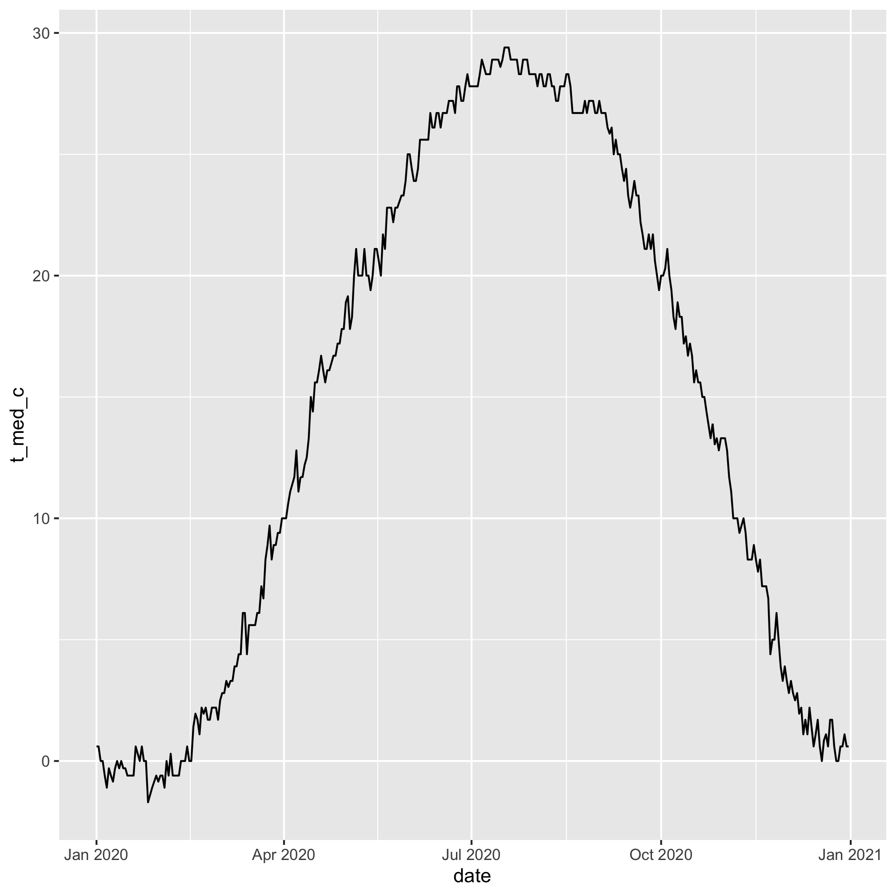

We can also add the confidence intervals using `geom_errorbar`


```r
daily_temps %>%
	mutate(date = ymd(paste(2020, month, day, sep='-'))) %>%
	ggplot(aes(x=date, y=t_med_c, ymin=t_lci_c, ymax=t_uci_c)) +
	geom_line(color="black") +
	geom_errorbar(color="gray")
```

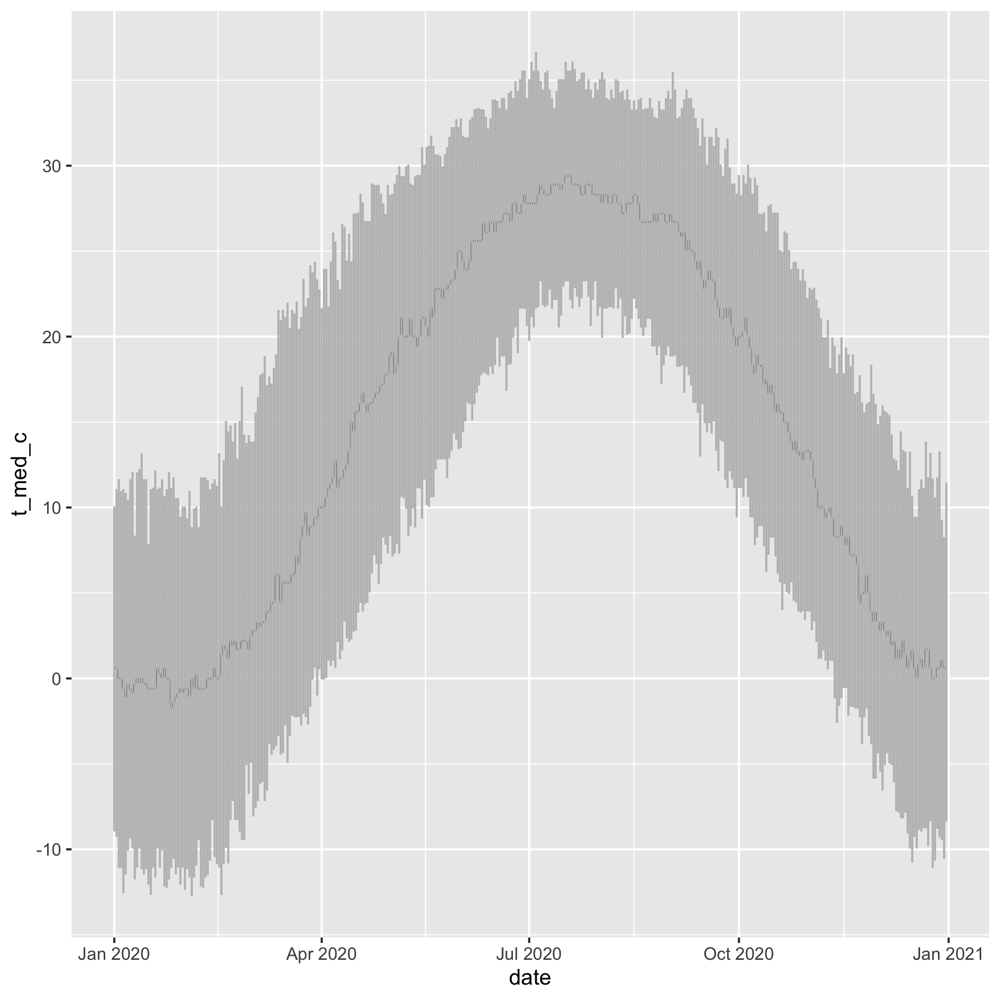


```r
daily_temps %>%
	mutate(date = ymd(paste(2020, month, day, sep='-'))) %>%
	ggplot(aes(x=date, y=t_med_c, ymin=t_lci_c, ymax=t_uci_c)) +
	geom_errorbar(color="gray") +
	geom_line(color="black")
```

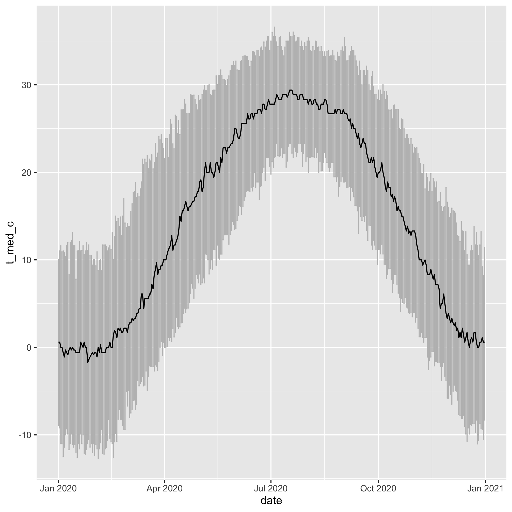

What is the temperature generally like on June 20th?


```r
daily_temps %>%
	mutate(date = ymd(paste(2020, month, day, sep='-'))) %>%
	ggplot(aes(x=date, y=t_med_c, ymin=t_lci_c, ymax=t_uci_c)) +
	geom_linerange(color="gray") +
	geom_line(color="black") +
	geom_vline(xintercept=ymd("2020-06-20"))
```


## Questions

1\. Which years had the most snowfall? How do the trends in those data look?

<input type="button" class="hideshow">
<div markdown="1" style="display:none;">

```r
annual_snowfall <- aa_weather %>%
	mutate(year = year(date)) %>%
	group_by(year) %>%
	summarize(annual_snowfall_mm = sum(snow_fall_mm, na.rm=TRUE)) %>%
	filter(year != 1891 & year != 2020)

annual_snowfall %>%
	arrange(desc(annual_snowfall_mm))

annual_snowfall %>%
	ggplot(aes(x=year, y=annual_snowfall_mm)) +
		geom_line() +
		geom_smooth()
```

```
## # A tibble: 128 x 2
##     year annual_snowfall_mm
##    <dbl>              <dbl>
##  1  2008               2687
##  2  2005               2471
##  3  1893               2238
##  4  1923               2231
##  5  2014               2138
##  6  2000               1957
##  7  1999               1924
##  8  2013               1886
##  9  1993               1866
## 10  2011               1831
## # … with 118 more rows
```

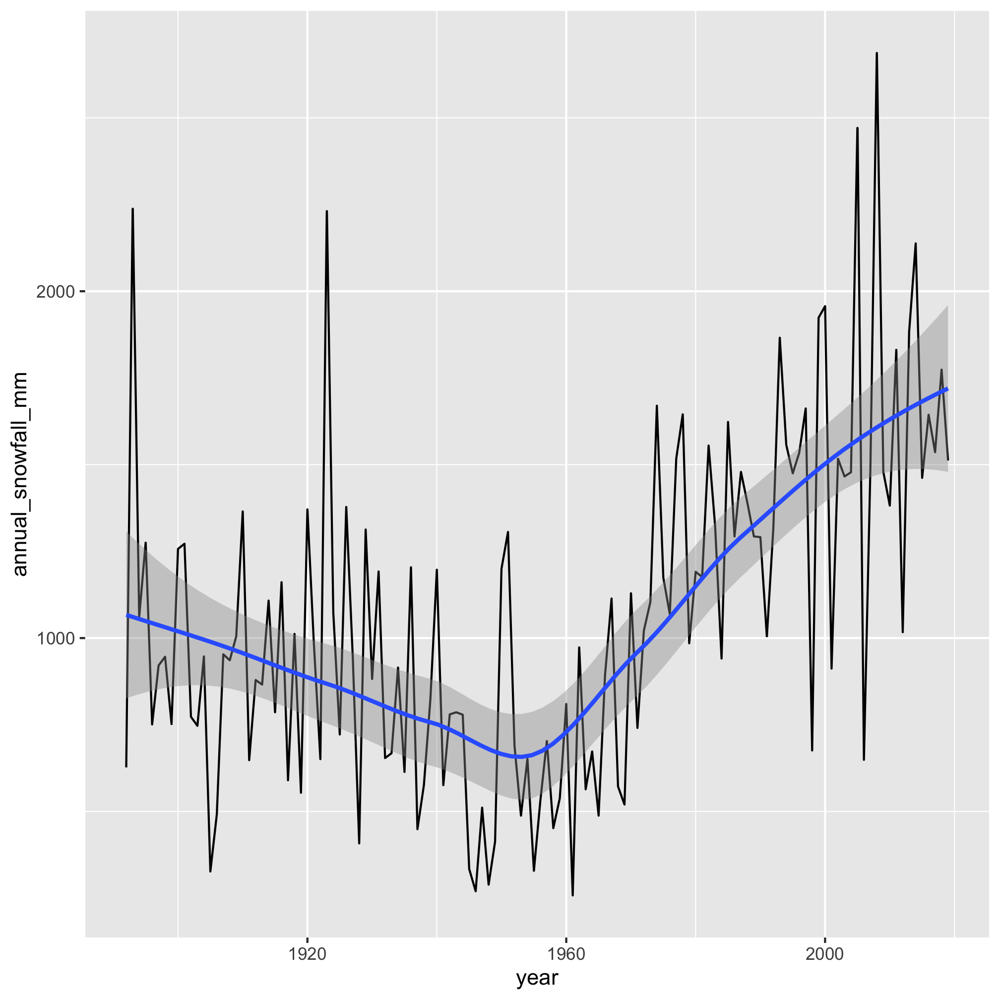
</div>

2\. Which months have the most precipitation?


<input type="button" class="hideshow">
<div markdown="1" style="display:none;">

```r
monthly_precipitation <- aa_weather %>%
	mutate(month = month(date)) %>%
	group_by(month) %>%
	summarize(monthly_precip_mm = sum(total_precip_mm, na.rm=TRUE)) %>%
	filter(month != 1891 & month != 2020)

monthly_precipitation %>%
	arrange(desc(monthly_precip_mm))

monthly_precipitation %>%
	ggplot(aes(x=month, y=monthly_precip_mm)) +
		geom_line() +
		geom_smooth()
```

```
## # A tibble: 12 x 2
##    month monthly_precip_mm
##    <dbl>             <dbl>
##  1     6            11231.
##  2     5            10909.
##  3     4             9813.
##  4     7             9795.
##  5     9             9562.
##  6     8             9553 
##  7    11             8385.
##  8    10             8244.
##  9     3             8012.
## 10    12             7504.
## 11     1             6852.
## 12     2             6458.
```

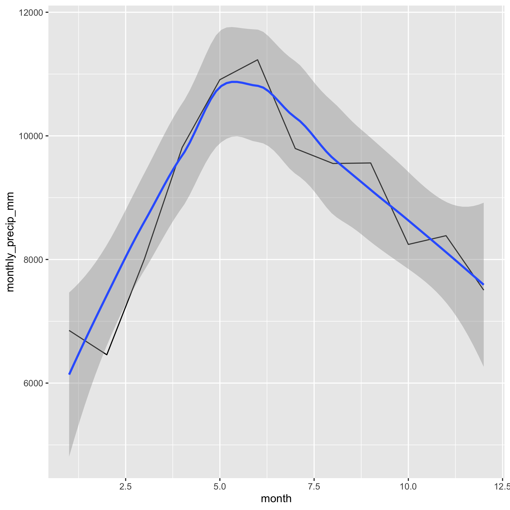
</div>

3\. Make a histogram of high temperatures recoded on your birthday and add a vertical line to indicate the temperature of the day you were born.

<input type="button" class="hideshow">
<div markdown="1" style="display:none;">

```r
aa_weather %>%
	mutate(month = month(date),
		day = day(date)) %>%
	filter(month == 6, day == 20) %>%
	ggplot(aes(x=t_max_c)) +
		geom_histogram(binwidth=3) +
		geom_vline(xintercept=24.4)
```

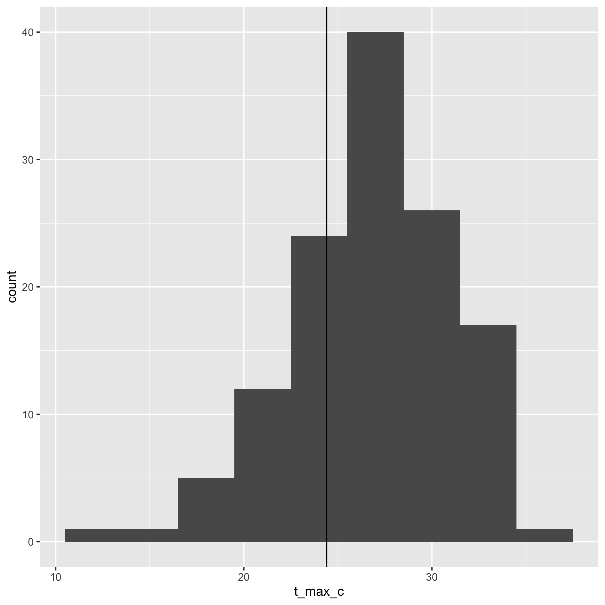
</div>

4\. Make a line plot of the average daily high temperature

<input type="button" class="hideshow">
<div markdown="1" style="display:none;">

```r
aa_weather %>%
	mutate(year = year(date), month = month(date)) %>%
	group_by(year) %>%
	summarize(t_mean_c = mean(t_max_c, na.rm=T)) %>%
	filter(year != 1891 & year != 2020) %>%
	ggplot(aes(x=year, y=t_mean_c)) +
		geom_line()
```

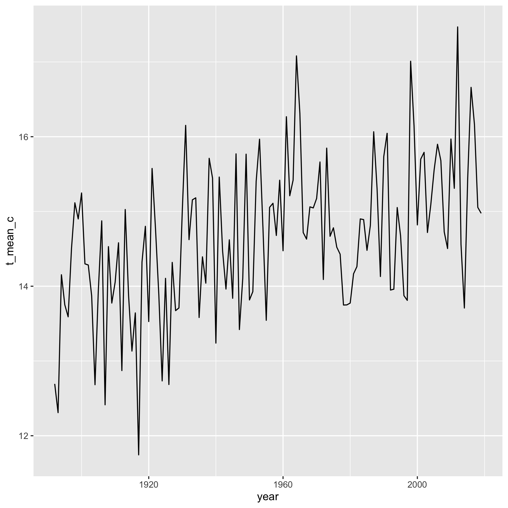
</div>

5\. Make a scatter plot of the total yearly precipitation on the y-axis and the average annual high temperature on the x-axis. Plot the year using the color aesthetic.

<input type="button" class="hideshow">
<div markdown="1" style="display:none;">

```r
aa_weather %>%
	mutate(year = year(date)) %>%
	group_by(year) %>%
	summarize(annual_precip_mm = sum(total_precip_mm, na.rm=TRUE),
		t_mean_c = mean(t_max_c, na.rm=T)) %>%
	filter(year != 1891 & year != 2020) %>%
	ggplot(aes(x=t_mean_c, y=annual_precip_mm, color=year)) +
		geom_point()
```

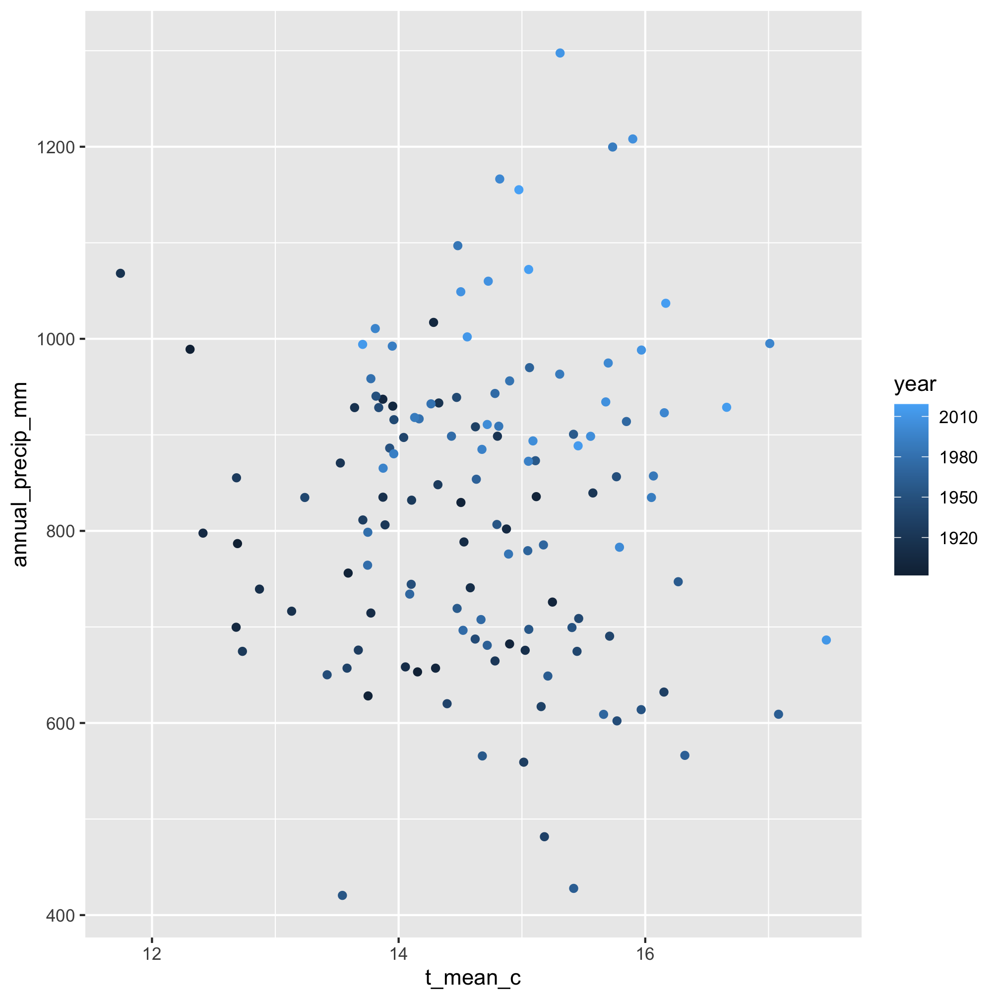
</div>
