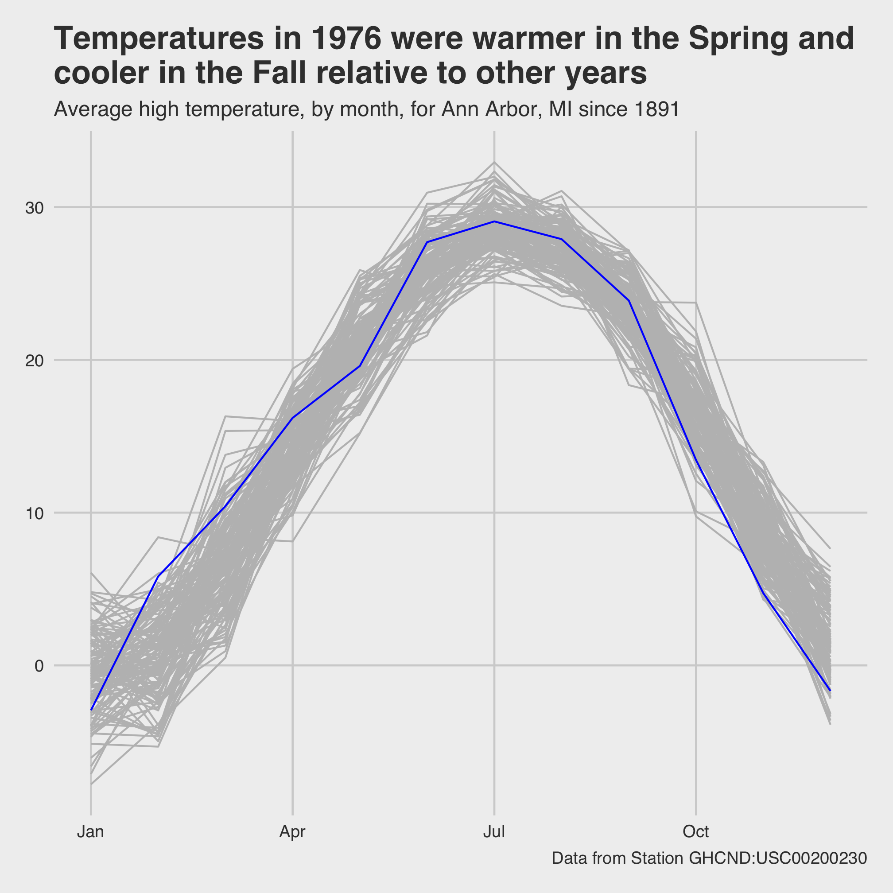

## Topics
* Critiquing visualizations
* Highlighting data: factors revisited
* Setting labels in a visualization
* Themes


## Critiquing visualizations

The plots we've been making are interesting, but they aren't the quality of a figure that you'd want to publish or even tweet out to your friends. Let's work with a few figures to see if we can make them more attractive.

We'll start with this code chunk


```r
library(tidyverse)
library(lubridate)

aa_weather <- read_csv('noaa/USC00200230.csv', col_types="ccDdddddddddd") %>%
	select(DATE, starts_with("T"), PRCP, SNOW, SNWD) %>%
	rename("date" = "DATE",
		"t_max_c" = "TMAX",
		"t_min_c" = "TMIN",
		"t_obs_c" = "TOBS",
		"total_precip_mm" = "PRCP",
		"snow_fall_mm" = "SNOW",
		"snow_depth_mm" = "SNWD") %>%
	mutate(t_obs_c = ifelse(t_obs_c > 40 | t_obs_c < -40, NA, t_obs_c),
		total_precip_mm = ifelse(total_precip_mm > 250, NA, total_precip_mm),
		snow_fall_mm = ifelse(snow_fall_mm > 500, NA, snow_fall_mm),
		snow_depth_mm = ifelse(snow_depth_mm > 500, NA, snow_depth_mm)
	)

aa_weather %>%
	mutate(year = year(date), month = month(date)) %>%
	group_by(year, month) %>%
	summarize(t_mean_c = mean(t_max_c, na.rm=T)) %>%
	ungroup() %>%
	filter(year != 1891 & year != 2020) %>%
	ggplot(aes(x=month, y=t_mean_c, group=year)) +
		geom_line()
```


You can hopefully tell that these curves represent the average monthly temperature for every year over the course of a year. Each line represents a different year. Take a moment and think of all the ways this plot is ... not ideal.

Here's my list
* It's impossible to differentiate the lines
* The axis labels don't have meaningful titles
* There's no title telling a reader what is going on
* The x-axis should have the months names, not numbers
* The gridded background is meh.

Great, we can work with that list. By the end of this lesson, we'll see how to fix each of these problems.


## Highlighting data: factors revisited

I'd like to plot all of the lines in a muted color, but have the line for 1976 or any other year pop out at the viewer. There are packages to help you with this, but by doing it ourselves we can reinforce a few concepts we've already seen. We'll start with making a new column in the data frame that indicates which data are from the highlighted year and which are not. We'll do this with the `mutate` and `ifelse` functions


```r
aa_weather %>%
	mutate(year = year(date), month = month(date)) %>%
	group_by(year, month) %>%
	summarize(t_mean_c = mean(t_max_c, na.rm=T)) %>%
	ungroup() %>%
	filter(year != 1891 & year != 2020) %>%
	mutate(highlight=ifelse(year == 1976, "yes", "no")) %>%
	ggplot(aes(x=month, y=t_mean_c, group=year)) +
		geom_line()
```


We'd like to map our `highlight` column values on to the `color` aesthetic. Do you remember how to do that from our earlier lessons?


```r
aa_weather %>%
	mutate(year = year(date), month = month(date)) %>%
	group_by(year, month) %>%
	summarize(t_mean_c = mean(t_max_c, na.rm=T)) %>%
	ungroup() %>%
	filter(year != 1891 & year != 2020) %>%
	mutate(highlight=(year == 1976)) %>%
	ggplot(aes(x=month, y=t_mean_c, group=year, color=highlight)) +
		geom_line()
```


Meh. The colors are pretty horrendous, but even worse is that our 1976 data is buried within all of the other lines. It turns out that `geom_line` plots the lines in order of the grouping variable. In this case, that is `year`. We need to reorder the `year` column to match the values in our `highlight` column. This gets us into one of the more confusing parts of R, which is the use of factors. We can think of factors as categorical variables. To highlight or not is a categorical variable, eye color, sex, blood type, etc. are all categorical variables. By default, R sets the order of factors to be its alpha-numerical order. We can order a factor by another variable using the `fct_reorder` function. Because "TRUE" is after "FALSE", alphabetically, the year(s) with values of `highlight` equal to `TRUE` will be plotted last or on top of the others.


```r
aa_weather %>%
	mutate(year = year(date), month = month(date)) %>%
	group_by(year, month) %>%
	summarize(t_mean_c = mean(t_max_c, na.rm=T)) %>%
	ungroup() %>%
	filter(year != 1891 & year != 2020) %>%
	mutate(highlight=(year == 1976),
		year=fct_reorder(year, highlight)) %>%
	ggplot(aes(x=month, y=t_mean_c, group=year, color=highlight)) +
		geom_line()
```

```
## Error: `f` must be a factor (or character vector).
```

Except this gives us an error that `Error: f must be a factor (or character vector).`. In this case `f` refers to the first argument, which needs to be a factor. We can wrap `year` within `as_factor` to achieve this


```r
aa_weather %>%
	mutate(year = year(date), month = month(date)) %>%
	group_by(year, month) %>%
	summarize(t_mean_c = mean(t_max_c, na.rm=T)) %>%
	ungroup() %>%
	filter(year != 1891 & year != 2020) %>%
	mutate(highlight=(year == 1976),
		year=fct_reorder(as_factor(year), highlight)) %>%
	ggplot(aes(x=month, y=t_mean_c, group=year, color=highlight)) +
		geom_line()
```


We're gaining on it. The 1976 line is now plotted on top of the other lines. Now we want to manually set the colors for the highlighted and non-highlighted lines. We can do this with `scale_color_discrete`


```r
aa_weather %>%
	mutate(year = year(date), month = month(date)) %>%
	group_by(year, month) %>%
	summarize(t_mean_c = mean(t_max_c, na.rm=T)) %>%
	ungroup() %>%
	filter(year != 1891 & year != 2020) %>%
	mutate(highlight=(year == 1976),
		year=fct_reorder(as_factor(year), highlight)) %>%
	ggplot(aes(x=month, y=t_mean_c, group=year, color=highlight)) +
		geom_line() +
		scale_color_manual(name="Highlighted",
			breaks=c(FALSE, TRUE),
			labels=c("Other years", "1976"),
			values=c("gray", "blue"))
```


I've filled out the information to show you how you can modify what appears in the legend. But, I'm not so excited about having the legend since I'm only drawing attention to one variable. I can turn off the legend by using `show.legend=F` as an argument for `geom_line`


```r
aa_weather %>%
	mutate(year = year(date), month = month(date)) %>%
	group_by(year, month) %>%
	summarize(t_mean_c = mean(t_max_c, na.rm=T)) %>%
	ungroup() %>%
	filter(year != 1891 & year != 2020) %>%
	mutate(highlight=(year == 1976),
		year=fct_reorder(as_factor(year), highlight)) %>%
	ggplot(aes(x=month, y=t_mean_c, group=year, color=highlight)) +
		geom_line(show.legend=FALSE) +
		scale_color_manual(name="Highlighted",
			breaks=c(FALSE, TRUE),
			labels=c("Other years", "1976"),
			values=c("gray", "blue"))
```


## Setting labels in a visualization

Next we can take on the axis labels using the `labels` function


```r
aa_weather %>%
	mutate(year = year(date), month = month(date)) %>%
	group_by(year, month) %>%
	summarize(t_mean_c = mean(t_max_c, na.rm=T)) %>%
	ungroup() %>%
	filter(year != 1891 & year != 2020) %>%
	mutate(highlight=(year == 1976),
		year=fct_reorder(as_factor(year), highlight)) %>%
	ggplot(aes(x=month, y=t_mean_c, group=year, color=highlight)) +
		geom_line(show.legend=FALSE) +
		scale_color_manual(name="Highlighted",
			breaks=c(FALSE, TRUE),
			labels=c("Other years", "1976"),
			values=c("gray", "blue")) +
		labs(x="Month", y="Temperature (\u00B0C)") # \u00B0 is unicode for the degree sign
```


We can also give the plot a title, subtitle, and caption using the `labs` function


```r
aa_weather %>%
	mutate(year = year(date), month = month(date)) %>%
	group_by(year, month) %>%
	summarize(t_mean_c = mean(t_max_c, na.rm=T)) %>%
	ungroup() %>%
	filter(year != 1891 & year != 2020) %>%
	mutate(highlight=(year == 1976),
		year=fct_reorder(as_factor(year), highlight)) %>%
	ggplot(aes(x=month, y=t_mean_c, group=year, color=highlight)) +
		geom_line(show.legend=FALSE) +
		scale_color_manual(name="Highlighted",
			breaks=c(FALSE, TRUE),
			labels=c("Other years", "1976"),
			values=c("gray", "blue")) +
		labs(x="Month",
			y="Temperature (\u00B0C)",
			title="Temperatures in 1976 were warmer in the Spring and cooler in the Fall\nrelative to other years",
			subtitle="Average high temperature, by month, for Ann Arbor, MI in 1976",
			caption="Data from Station GHCND:USC00200230")
```


Next, we would like to give the x-axis labels something more meaningful than numbers. We can customize our x-axis labels using `scale_x_continuous`. The primary arguments are `breaks` and `labels`, which allow you tell where (`breaks`) to put the desired `labels`. I don't think we need it for this figure, but there's an analogous `scale_y_continuous` function for placing labels on a continuous y-axis.


```r
aa_weather %>%
	mutate(year = year(date), month = month(date)) %>%
	group_by(year, month) %>%
	summarize(t_mean_c = mean(t_max_c, na.rm=T)) %>%
	ungroup() %>%
	filter(year != 1891 & year != 2020) %>%
	mutate(highlight=(year == 1976),
		year=fct_reorder(as_factor(year), highlight)) %>%
	ggplot(aes(x=month, y=t_mean_c, group=year, color=highlight)) +
		geom_line(show.legend=FALSE) +
		scale_color_manual(name="Highlighted",
			breaks=c(FALSE, TRUE),
			labels=c("Other years", "1976"),
			values=c("gray", "blue")) +
		labs(x="Month",
			y="Temperature (\u00B0C)",
			title="Temperatures in 1976 were warmer in the Spring and cooler in the Fall\nrelative to other years",
			subtitle="Average high temperature, by month, for Ann Arbor, MI in 1976",
			caption="Data from Station GHCND:USC00200230") +
		scale_x_continuous(breaks=c(1, 4, 7, 10), labels=c("Jan", "Apr", "Jul", "Oct"))
```


We could fiddle with how many labels to put on the x-axis. The tradeoff is how to provide sufficient context without making the labels too crowded. Regardless, I think this looks much nicer than using numbers.


## Themes

The final point I listed that needed improvement was the background with gridlines. I'm not a big fan of these default settings. We saw with the Project Tycho data that we can change these types of settings using "themes". Previously, we used `theme_classic`


```r
aa_weather %>%
	mutate(year = year(date), month = month(date)) %>%
	group_by(year, month) %>%
	summarize(t_mean_c = mean(t_max_c, na.rm=T)) %>%
	ungroup() %>%
	filter(year != 1891 & year != 2020) %>%
	mutate(highlight=(year == 1976),
		year=fct_reorder(as_factor(year), highlight)) %>%
	ggplot(aes(x=month, y=t_mean_c, group=year, color=highlight)) +
		geom_line(show.legend=FALSE) +
		scale_color_manual(name="Highlighted",
			breaks=c(FALSE, TRUE),
			labels=c("Other years", "1976"),
			values=c("gray", "blue")) +
		labs(x="Month",
			y="Temperature (\u00B0C)",
			title="Temperatures in 1976 were warmer in the Spring and cooler in the Fall\nrelative to other years",
			subtitle="Average high temperature, by month, for Ann Arbor, MI since 1891",
			caption="Data from Station GHCND:USC00200230") +
		scale_x_continuous(breaks=c(1, 4, 7, 10), labels=c("Jan", "Apr", "Jul", "Oct")) +
		theme_classic()
```


While many people would prefer to get a figure looking "good enough" and then tweak the styling in Illustrator, this is not ideal. I can't tell you how many times I've done this only have to repeat the tedious process because the data change or because I need to change something in the original figure. With a little patience and a lot of google, you can modify any part of the figure that you would like so that the output is ready for publication. If you read through `?theme` you can find the different ways to modify the styling of a figure. As just a taste, let's change the size and color of our titles and the size of the text on the axes


```r
aa_weather %>%
	mutate(year = year(date), month = month(date)) %>%
	group_by(year, month) %>%
	summarize(t_mean_c = mean(t_max_c, na.rm=T)) %>%
	ungroup() %>%
	filter(year != 1891 & year != 2020) %>%
	mutate(highlight=(year == 1976),
		year=fct_reorder(as_factor(year), highlight)) %>%
	ggplot(aes(x=month, y=t_mean_c, group=year, color=highlight)) +
		geom_line(show.legend=FALSE) +
		scale_color_manual(name="Highlighted",
			breaks=c(FALSE, TRUE),
			labels=c("Other years", "1976"),
			values=c("gray", "blue")) +
		labs(x="Month",
			y="Temperature (\u00B0C)",
			title="Temperatures in 1976 were warmer in the\nSpring and cooler in the Fall relative\nto other years",
			subtitle="Average high temperature, by month, for Ann Arbor, MI since 1891",
			caption="Data from Station GHCND:USC00200230") +
		scale_x_continuous(breaks=c(1, 4, 7, 10), labels=c("Jan", "Apr", "Jul", "Oct")) +
		theme_classic() +
		theme(
			plot.title = element_text(color = "red", size = 20, face = "bold"),
			plot.subtitle = element_text(color = "gray"),
			plot.caption = element_text(color = "dodgerblue", face = "italic", hjust=0),
			axis.text = element_text(size=15),
			axis.title = element_text(size=18)
		)
```


In fact, you might find a set of theme settings that you prefer. You might imagine a company wanting the colors and fonts in their figures to match the color and font schemes of their company branding. Once you have found that set of theme settings, you can define your own theme (e.g. `theme_classic`, `theme_gray`). Many examples of extra ggplot themes are available in the [`ggthemes` package](https://yutannihilation.github.io/allYourFigureAreBelongToUs/ggthemes/). To close this section, let's install `ggthemes` and use it to theme our figure with **inspiration** from [Five Thirty Eight](https://fivethirtyeight.com).


```r
#install.packages("ggthemes") # only need to run this the first time
library("ggthemes")

aa_weather %>%
	mutate(year = year(date), month = month(date)) %>%
	group_by(year, month) %>%
	summarize(t_mean_c = mean(t_max_c, na.rm=T)) %>%
	ungroup() %>%
	filter(year != 1891 & year != 2020) %>%
	mutate(highlight=(year == 1976),
		year=fct_reorder(as_factor(year), highlight)) %>%
	ggplot(aes(x=month, y=t_mean_c, group=year, color=highlight)) +
		geom_line(show.legend=FALSE) +
		scale_color_manual(name="Highlighted",
			breaks=c(FALSE, TRUE),
			labels=c("Other years", "1976"),
			values=c("gray", "blue")) +
		labs(x="Month",
			y="Temperature (\u00B0C)",
			title="Temperatures in 1976 were warmer in the Spring and\ncooler in the Fall relative to other years",
			subtitle="Average high temperature, by month, for Ann Arbor, MI since 1891",
			caption="Data from Station GHCND:USC00200230") +
		scale_x_continuous(breaks=c(1, 4, 7, 10), labels=c("Jan", "Apr", "Jul", "Oct")) +
		theme_fivethirtyeight()
```



## Questions
1\. Can you modify the x-axis to include a three letter abbreviation for each month? Can you label the y-axis to increment by 5 C steps? You don't need to provide the values for the `labels` argument if they're the same as those for the `breaks` argument.

<input type="button" class="hideshow">
<div markdown="1" style="display:none;">

```r
aa_weather %>%
	mutate(year = year(date), month = month(date)) %>%
	group_by(year, month) %>%
	summarize(t_mean_c = mean(t_max_c, na.rm=T)) %>%
	ungroup() %>%
	filter(year != 1891 & year != 2020) %>%
	mutate(highlight=(year == 1976),
		year=fct_reorder(as_factor(year), highlight)) %>%
	ggplot(aes(x=month, y=t_mean_c, group=year, color=highlight)) +
		geom_line(show.legend=FALSE) +
		scale_color_manual(name="Highlighted",
			breaks=c(FALSE, TRUE),
			labels=c("Other years", "1976"),
			values=c("gray", "blue")) +
		labs(x="Month",
			y="Temperature (\u00B0C)",
			title="Temperatures in 1976 were warmer in the Spring and cooler in the Fall\nrelative to other years",
			subtitle="Average high temperature, by month, for Ann Arbor, MI since 1891",
			caption="Data from Station GHCND:USC00200230") +
		scale_x_continuous(breaks=1:12, labels=c("Jan", "Feb", "Mar", "Apr", "May", "June", "Jul", "Aug", "Sep", "Oct", "Nov", "Dec")) +
		scale_y_continuous(breaks=c(-5, 0, 5, 10, 15, 20, 25, 30, 35)) +
		theme_classic()
```


</div>

2\. In the previous lesson, we plotted total annual precipitation against the year. Critique the figure that this generates and see what you can do to make the figure more presentable. Can you figure out how to get your y-axis to extend down to 0? No, we haven't seen this command yet.


```r
aa_weather %>%
	mutate(year = year(date)) %>%
	group_by(year) %>%
	summarize(annual_precip_mm = sum(total_precip_mm, na.rm=TRUE)) %>%
	filter(year != 1891 & year != 2020) %>%
	ggplot(aes(x=year, y=annual_precip_mm)) +
		geom_line() +
		geom_smooth()
```


<input type="button" class="hideshow">
<div markdown="1" style="display:none;">

```r
aa_weather %>%
	mutate(year = year(date)) %>%
	group_by(year) %>%
	summarize(annual_precip_mm = sum(total_precip_mm, na.rm=TRUE)) %>%
	filter(year != 1891 & year != 2020) %>%
	ggplot(aes(x=year, y=annual_precip_mm)) +
		geom_line() +
		geom_smooth(se=FALSE) +
		coord_cartesian(ylim=c(0, 1500)) +
		scale_x_continuous(breaks=c(1900, 1920, 1940, 1960, 1980, 2000, 2020)) +
		scale_y_continuous(breaks=c(0, 250, 500, 750, 1000, 1250, 1500)) +
		labs(x="Year",
			y="Annual Precipitation (mm)",
			title="Annual precipitation increased significantly following 1960",
			subtitle="Total annual precipitation for Ann Arbor, MI since 1892",
			caption="Data from Station GHCND:USC00200230") +
		theme_classic()
```


</div>


3\. The last question from Session 6 asked you to find weather station data with a long history for one of your favorite places. Use that data to regenerate one of the plots we made in this session.

4\. Take either data from Project Tycho or the weather data and make an attractive data visualization.
