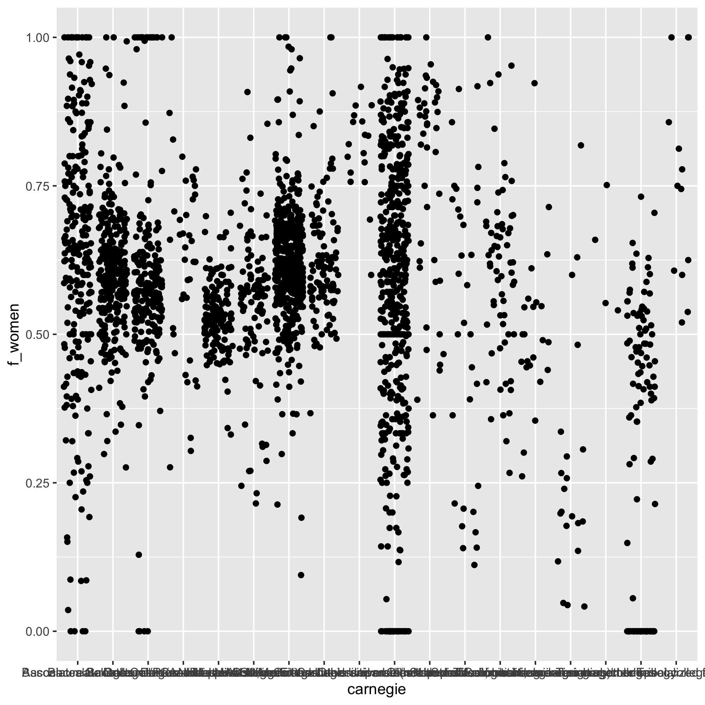
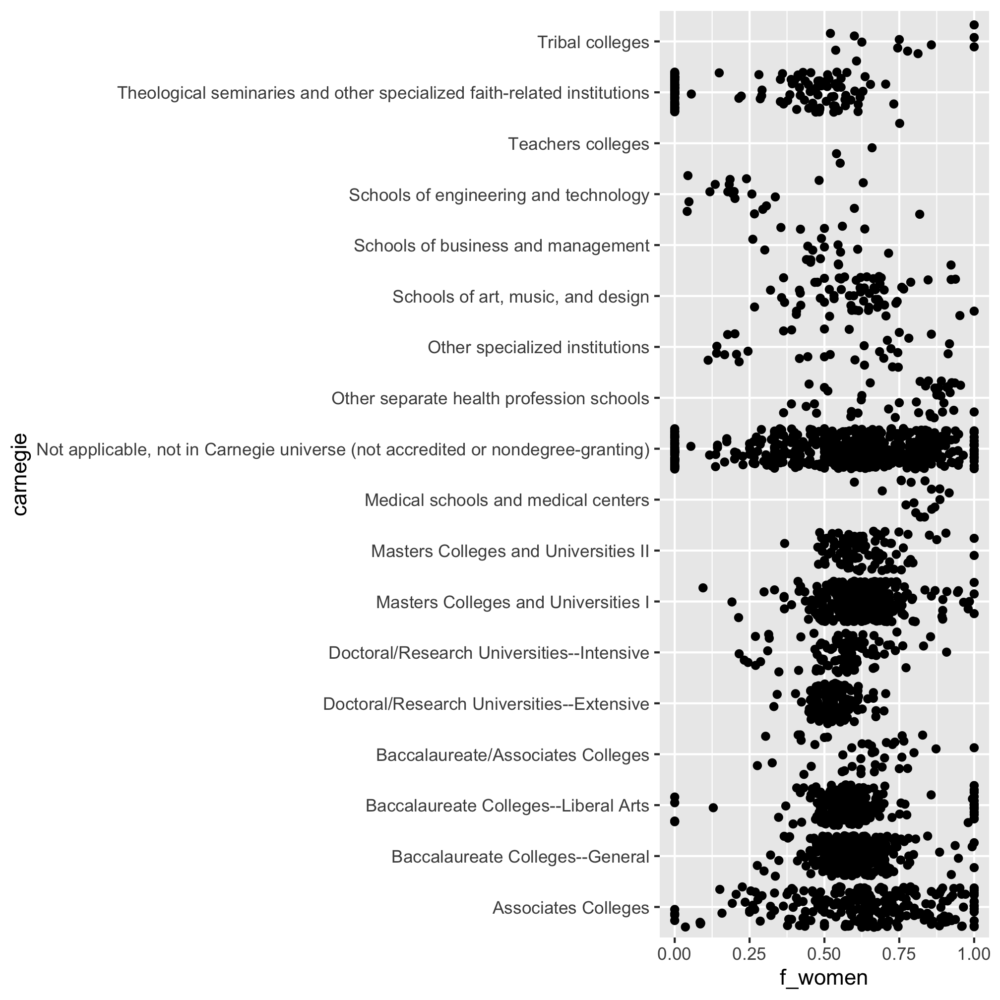
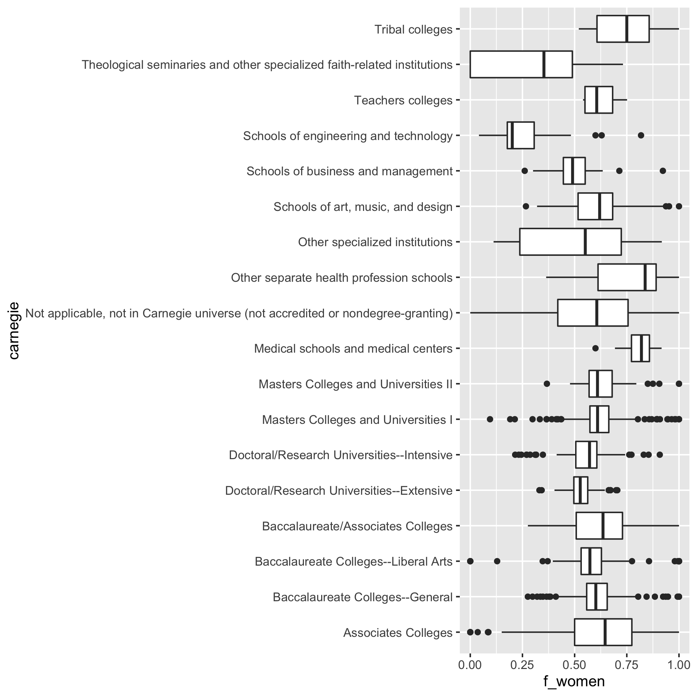
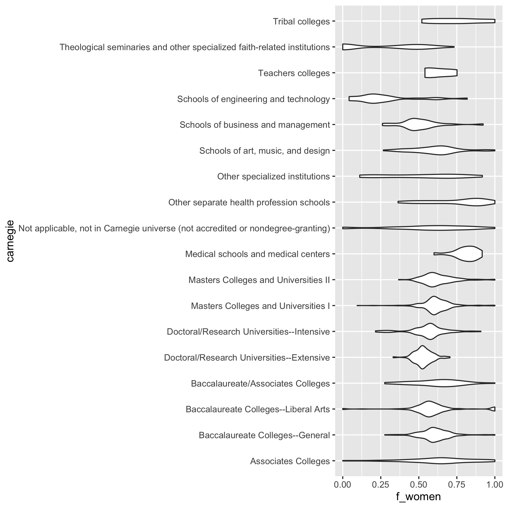
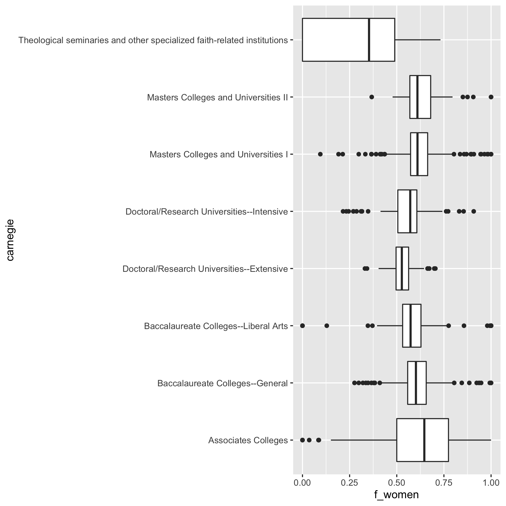
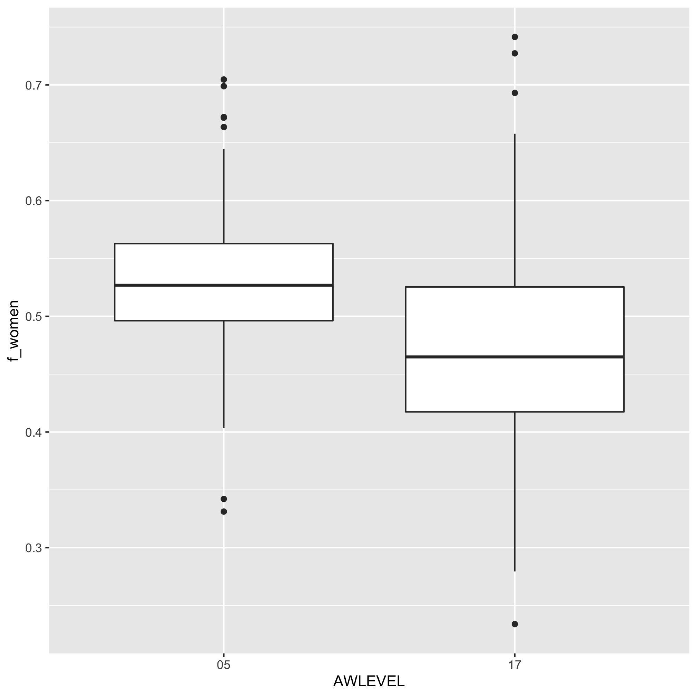
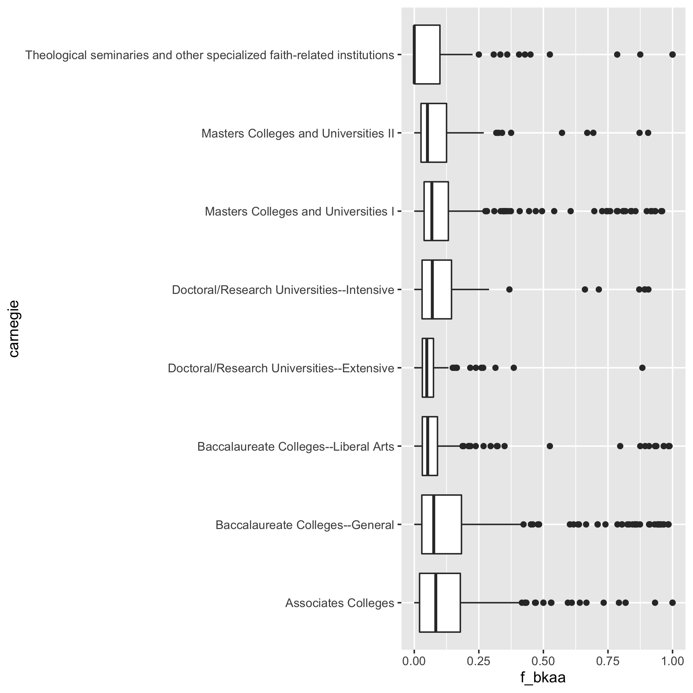
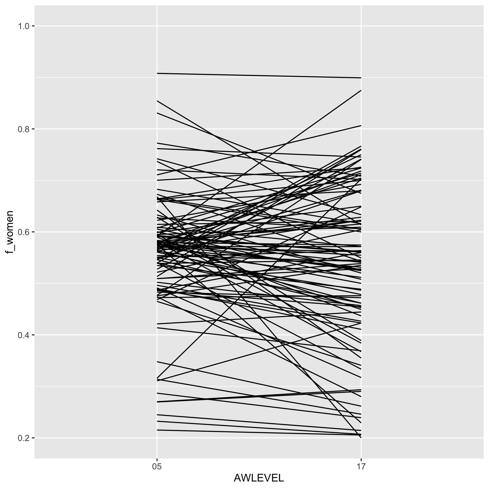
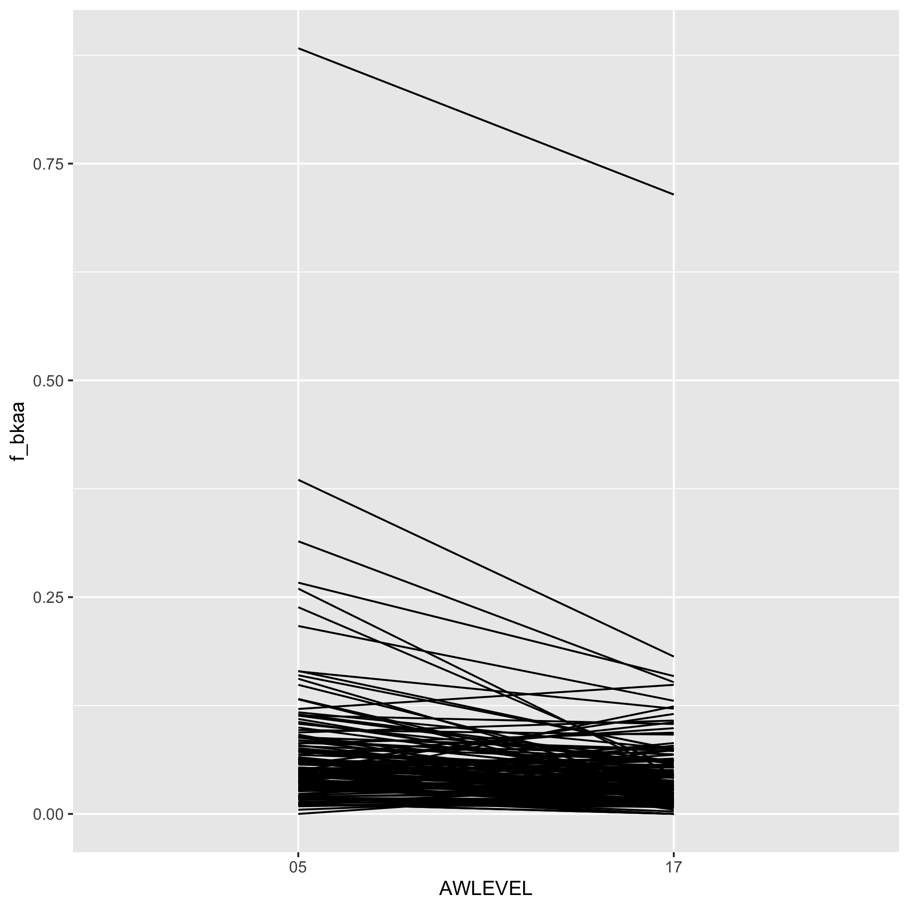
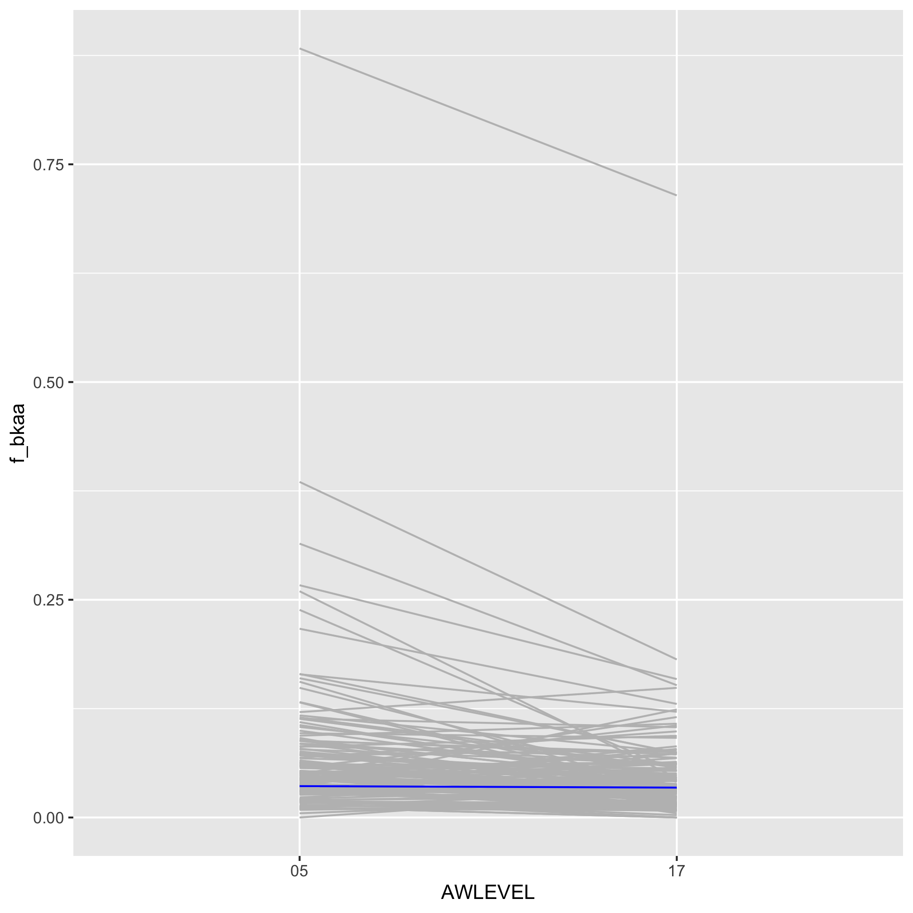

## Topics
* Rinse, repeat to answer new questions
* Plotting continuous data against categorical data
* Using `factor` to order categorical variables
* Thinking of our data as paired and redefining tidy


## Rinse, repeat to answer new questions

Before tacking representation within a specific (or broad) discipline, I'd like to understand representation of students graduating with a Bachelor's degree in 2018 at different types of institutions. Within the US there are different categories of schools based on their mission. One way of doing this is by using a [framework](http://carnegieclassifications.iu.edu/definitions.php) developed by the Carnegie Commission on Higher Education in 1970 and modified since. The data for the 2000 definition are provided in the `CARNEGIE` column of `ipeds/hd2018.csv` (there are newer definitions that break down institutions into finer categories). Let's ease into our analysis by reading in the awards data again finding the total number of Bachelor's degrees conferred at each institution. We'll take advantage of the observation that CIP code 99 indicates the total number of degrees awarded at the institution and that AWLEVEL "05" is for the Bachelor's degree. Then we'll bring in the institution name and its Carnegie information.


```r
library(tidyverse)

bachelors_degrees <- read_csv("ipeds/c2018_a.csv") %>%
	filter(MAJORNUM == 1 & CIPCODE == "99" & AWLEVEL == "05" & CTOTALT > 0)
```

To make the data frame easier to look at I'll remove these columns that we filtered on as well as any column that starts with an "X" (the X indicates how the data were generated).


```r
bachelors_degrees <- read_csv("ipeds/c2018_a.csv") %>%
	filter(MAJORNUM == 1 & CIPCODE == "99" & AWLEVEL == "05" & CTOTALT > 0) %>%
	select(-CIPCODE, -MAJORNUM, -AWLEVEL, -starts_with("x"))
```

We're left with the column for the institution identifier ("UNITID") and the counts of different groups on campus. Let's bring in the institution name and Carnegie information


```r
inst_carnegie <- read_csv("ipeds/hd2018.csv") %>%
	select(UNITID, INSTNM, CARNEGIE)
```

Of course, we'd like to bring in the title for each Carnegie code


```r
library(readxl)

carnegie_code <- read_excel("ipeds/hd2018.xlsx", sheet = "Frequencies") %>%
	filter(varname == "CARNEGIE") %>%
	select(codevalue, valuelabel)
```

Let's go ahead and merge our data frames


```r
inst_carnegie %>%
	count(CARNEGIE) %>%
	inner_join(., carnegie_code, by=c("CARNEGIE" = "codevalue"))
```

```
## Error: Can't join on 'CARNEGIE' x 'codevalue' because of incompatible types (numeric / character)
```

Now we have a new error! In `carnegie_code`, `codevalue` is a character and in `institutions`, `CARNEGIE` is a double or numeric value. We can convert numbers to characters using `as.character` and if the character is a number (e.g. "-2") we can convert it to a number with `as.numeric`. Since we won't be doing any math on these columns, I'd suggest we convert the numbers to characters.


```r
inst_carnegie %>%
	mutate(CARNEGIE = as.character(CARNEGIE)) %>%
	inner_join(., carnegie_code, by=c("CARNEGIE" = "codevalue"))
```

```
## # A tibble: 6,857 x 4
##    UNITID INSTNM               CARNEGIE valuelabel                              
##     <dbl> <chr>                <chr>    <chr>                                   
##  1 100654 Alabama A & M Unive… 16       Doctoral/Research Universities--Intensi…
##  2 100663 University of Alaba… 15       Doctoral/Research Universities--Extensi…
##  3 100690 Amridge University   51       Theological seminaries and other specia…
##  4 100706 University of Alaba… 16       Doctoral/Research Universities--Intensi…
##  5 100724 Alabama State Unive… 21       Masters Colleges and Universities I     
##  6 100733 University of Alaba… -2       Not applicable, not in Carnegie univers…
##  7 100751 The University of A… 15       Doctoral/Research Universities--Extensi…
##  8 100760 Central Alabama Com… 40       Associates Colleges                     
##  9 100812 Athens State Univer… 32       Baccalaureate Colleges--General         
## 10 100830 Auburn University a… 21       Masters Colleges and Universities I     
## # … with 6,847 more rows
```

Let's rename the `INSTNM` and `valuelabel` columns to make them easier to read, drop the `CARNEGIE` column, and add it to the previous pipeline for generating `inst_carnegie`


```r
inst_carnegie <- read_csv("ipeds/hd2018.csv") %>%
	select(UNITID, INSTNM, CARNEGIE) %>%
	mutate(CARNEGIE = as.character(CARNEGIE)) %>%
	inner_join(., carnegie_code, by=c("CARNEGIE" = "codevalue")) %>%
	rename("institution" = "INSTNM", "carnegie"="valuelabel") %>%
	select(-CARNEGIE)
```

Now we can join `inst_carnegie` and `bachelors_degrees` so that we have our demographic information for each institution with the Carnegie group labeled.


```r
bachelor_demographics <- inner_join(inst_carnegie, bachelors_degrees, by="UNITID") %>%
	select(-UNITID)
```

Let's see how many institutions we have in each category


```r
bachelor_demographics %>%
	count(carnegie)
```

```
## # A tibble: 18 x 2
##    carnegie                                                                    n
##    <chr>                                                                   <int>
##  1 Associates Colleges                                                       254
##  2 Baccalaureate Colleges--General                                           294
##  3 Baccalaureate Colleges--Liberal Arts                                      216
##  4 Baccalaureate/Associates Colleges                                          40
##  5 Doctoral/Research Universities--Extensive                                 149
##  6 Doctoral/Research Universities--Intensive                                 103
##  7 Masters Colleges and Universities I                                       478
##  8 Masters Colleges and Universities II                                      104
##  9 Medical schools and medical centers                                        17
## 10 Not applicable, not in Carnegie universe (not accredited or nondegree-…   515
## 11 Other separate health profession schools                                   41
## 12 Other specialized institutions                                             32
## 13 Schools of art, music, and design                                          62
## 14 Schools of business and management                                         23
## 15 Schools of engineering and technology                                      21
## 16 Teachers colleges                                                           4
## 17 Theological seminaries and other specialized faith-related institutions   129
## 18 Tribal colleges                                                            13
```

Now let's see the median fraction of graduates who were women for each type of institution


```r
bachelor_demographics %>%
	mutate(f_women =CTOTALW/CTOTALT) %>%
	group_by(carnegie) %>%
	summarize(f_women = median(f_women), n=n()) %>%
	arrange(desc(f_women))
```

```
## # A tibble: 18 x 3
##    carnegie                                                        f_women     n
##    <chr>                                                             <dbl> <int>
##  1 Other separate health profession schools                          0.838    41
##  2 Medical schools and medical centers                               0.820    17
##  3 Tribal colleges                                                   0.75     13
##  4 Associates Colleges                                               0.646   254
##  5 Baccalaureate/Associates Colleges                                 0.636    40
##  6 Schools of art, music, and design                                 0.620    62
##  7 Masters Colleges and Universities I                               0.610   478
##  8 Masters Colleges and Universities II                              0.610   104
##  9 Not applicable, not in Carnegie universe (not accredited or no…   0.606   515
## 10 Teachers colleges                                                 0.606     4
## 11 Baccalaureate Colleges--General                                   0.602   294
## 12 Baccalaureate Colleges--Liberal Arts                              0.573   216
## 13 Doctoral/Research Universities--Intensive                         0.571   103
## 14 Other specialized institutions                                    0.551    32
## 15 Doctoral/Research Universities--Extensive                         0.527   149
## 16 Schools of business and management                                0.490    23
## 17 Theological seminaries and other specialized faith-related ins…   0.353   129
## 18 Schools of engineering and technology                             0.201    21
```

These results are pretty interesting! The types of schools that have the most women are health related (nursing?) and Tribal colleges. Those with the poorest representation of women are business, engineering and technology, and theological schools.


## Plotting continuous data against categorical data

Believe it or not, we've done a lot of analysis so far in this lesson and we haven't learned any new syntax. Let's change that and see how we might plot these data. The first type of plot is a strip or jitter plot. Personally, I like these types of plots because they show every data point. This can also be their downfall because the plots can get a bit busy. We will plot the Carnegie category on the x-axis and the fraction of women on the y-axis


```r
bachelor_demographics %>%
	mutate(f_women =CTOTALW/CTOTALT) %>%
	select(carnegie, f_women) %>%
	ggplot(aes(x=carnegie, y=f_women)) +
		geom_jitter()
```



Yeah, there are a lot of points there. There are probably too many categories as well making it impossible to resolve the labels along the x-axis. To solve this second point we could switch the variables that we map to the `x` and `y` aesthetics


```r
bachelor_demographics %>%
	mutate(f_women =CTOTALW/CTOTALT) %>%
	select(carnegie, f_women) %>%
	ggplot(aes(y=carnegie, x=f_women)) +
		geom_jitter()
```


Alternatively, we can flip the axes using `coord_flip`


```r
bachelor_demographics %>%
	mutate(f_women =CTOTALW/CTOTALT) %>%
	select(carnegie, f_women) %>%
	ggplot(aes(x=carnegie, y=f_women)) +
		geom_jitter() +
		coord_flip()
```



As far as there being too many points, there are two options - box plots and violin plots. To flip the axes for these plots we have to use `coord_flip`


```r
bachelor_demographics %>%
	mutate(f_women =CTOTALW/CTOTALT) %>%
	select(carnegie, f_women) %>%
	ggplot(aes(x=carnegie, y=f_women)) +
		geom_boxplot() +
		coord_flip()
```



...and...


```r
bachelor_demographics %>%
	mutate(f_women =CTOTALW/CTOTALT) %>%
	select(carnegie, f_women) %>%
	ggplot(aes(x=carnegie, y=f_women)) +
		geom_violin() +
		coord_flip()
```




To reduce the number of columns, let's remove those institutions that are "not in the Carnegie universe" and those categories with fewer than 100 institutions. That will still leave us with 8 categories. I'm not interested in typing those in, so let's see if we can do this with a join.


```r
carnegie_categories <- bachelor_demographics %>%
	count(carnegie) %>%
	filter(carnegie != "Not applicable, not in Carnegie universe (not accredited or nondegree-granting)" & n > 100)
```

We can now insert a join to `carnegie_categories` into our pipeline


```r
bachelor_demographics %>%
	inner_join(., carnegie_categories, by="carnegie") %>%
	mutate(f_women =CTOTALW/CTOTALT) %>%
	select(carnegie, f_women) %>%
	ggplot(aes(x=carnegie, y=f_women)) +
		geom_boxplot() +
		coord_flip()
```




## Using `factor` to order categorical variables

How about if we want to order the categories by their median values? I would break up the last pipeline into three parts. The first to create a data frame with the fraction of women (i.e. `representation`). Then I would generate a summary table that is ordered by the median value of `f_women` (i.e. `carnegie_summary`). Then I would use the order of the `carnegie` column ni the `carnegie_summary` table to set the order of levels of the `carnegie` column in `representation` and create the plot. Let's see how that plan works out


```r
representation <- bachelor_demographics %>%
	inner_join(., carnegie_categories, by="carnegie") %>%
	mutate(f_women = CTOTALW/CTOTALT) %>%
	select(carnegie, f_women)

carnegie_ordered <- representation %>%
	group_by(carnegie) %>%
	summarize(f_women = median(f_women)) %>%
	arrange(desc(f_women)) %>%
	pull(carnegie)

representation %>%
	mutate(carnegie = factor(carnegie, levels=carnegie_ordered)) %>%
	ggplot(aes(x=carnegie, y=f_women)) +
		geom_boxplot() +
		coord_flip()
```


The two "tricks" here are using `pull` to create a vector, `carnegie_ordered`, which is the order of the categories as we want them in the plots. Then we used that vector to set the order of `levels` in `factor` when building the plot. We could do more to "beautify" the figure, but let's move on to other questions.

Instead of looking across all types of institutions, Let's look instead at the representation of women among institutions in the "Doctoral/Research Universities--Extensive" category. We'll look at the Bachelor's (AWLEVEL: 05) and Doctoral (Research) (AWLEVEL: 17) graduates from these institutions. As we did earlier, we'll begin by filtering the data in `ipeds/hd2018.csv` to obtain data from institutions in the "Doctoral/Research Universities--Extensive" category, which we saw earlier was CARNEGIE codes 15.


```r
library(tidyverse)

doc_institutions <- read_csv("ipeds/hd2018.csv") %>%
	filter(CARNEGIE == "15") %>%
	select(UNITID, INSTNM)
```

That results in a data frame with 258 institutions. Now we need to get the Bachelor's, Master's, and Doctorate awards data from the `ipeds/c2018_a.csv` data frame and join it with the `doc_institutions` data frame.


```r
read_csv("ipeds/c2018_a.csv") %>%
	filter(MAJORNUM == 1 & CIPCODE == "99" & CTOTALT > 0 & (AWLEVEL == "05" | AWLEVEL == "17")) %>%
	inner_join(doc_institutions, ., by="UNITID")
```

```
## # A tibble: 300 x 65
##    UNITID INSTNM CIPCODE MAJORNUM AWLEVEL XCTOTALT CTOTALT XCTOTALM CTOTALM
##     <dbl> <chr>  <chr>      <dbl> <chr>   <chr>      <dbl> <chr>      <dbl>
##  1 100663 Unive… 99             1 05      R           2463 R            986
##  2 100663 Unive… 99             1 17      R            161 R             66
##  3 100751 The U… 99             1 05      R           6750 R           2877
##  4 100751 The U… 99             1 17      R            232 R            116
##  5 100858 Aubur… 99             1 05      R           4801 R           2348
##  6 100858 Aubur… 99             1 17      R            253 R            147
##  7 104151 Arizo… 99             1 05      R           9994 R           5467
##  8 104151 Arizo… 99             1 17      R            508 R            301
##  9 104179 Unive… 99             1 05      R           7132 R           3267
## 10 104179 Unive… 99             1 17      R            451 R            229
## # … with 290 more rows, and 56 more variables: XCTOTALW <chr>, CTOTALW <dbl>,
## #   XCAIANT <chr>, CAIANT <dbl>, XCAIANM <chr>, CAIANM <dbl>, XCAIANW <chr>,
## #   CAIANW <dbl>, XCASIAT <chr>, CASIAT <dbl>, XCASIAM <chr>, CASIAM <dbl>,
## #   XCASIAW <chr>, CASIAW <dbl>, XCBKAAT <chr>, CBKAAT <dbl>, XCBKAAM <chr>,
## #   CBKAAM <dbl>, XCBKAAW <chr>, CBKAAW <dbl>, XCHISPT <chr>, CHISPT <dbl>,
## #   XCHISPM <chr>, CHISPM <dbl>, XCHISPW <chr>, CHISPW <dbl>, XCNHPIT <chr>,
## #   CNHPIT <dbl>, XCNHPIM <chr>, CNHPIM <dbl>, XCNHPIW <chr>, CNHPIW <dbl>,
## #   XCWHITT <chr>, CWHITT <dbl>, XCWHITM <chr>, CWHITM <dbl>, XCWHITW <chr>,
## #   CWHITW <dbl>, XC2MORT <chr>, C2MORT <dbl>, XC2MORM <chr>, C2MORM <dbl>,
## #   XC2MORW <chr>, C2MORW <dbl>, XCUNKNT <chr>, CUNKNT <dbl>, XCUNKNM <chr>,
## #   CUNKNM <dbl>, XCUNKNW <chr>, CUNKNW <dbl>, XCNRALT <chr>, CNRALT <dbl>,
## #   XCNRALM <chr>, CNRALM <dbl>, XCNRALW <chr>, CNRALW <dbl>
```

As we did earlier, we can clean this up a bit to remove the extra columns and assign the output to a variable.


```r
doc_degrees <- read_csv("ipeds/c2018_a.csv") %>%
	filter(MAJORNUM == 1 & CIPCODE == "99" & CTOTALT > 0 & (AWLEVEL == "05" | AWLEVEL == "17")) %>%
	inner_join(doc_institutions, ., by="UNITID") %>%
	select(-CIPCODE, -MAJORNUM, -starts_with("X"))
```

I'm interested in getting a plot for the fraction of women that graduated with bachelor's or doctorate degrees. We've already seen how to calculate the fraction of women, let's expand that to include these other categories and then simplify our data frame a bit


```r
doc_degree_rates <- doc_degrees %>%
	mutate(f_women = CTOTALW / CTOTALT) %>%
	select(UNITID, INSTNM, AWLEVEL, f_women)
```

Like before, we can plot these data with a boxplot


```r
doc_degree_rates %>%
	ggplot(aes(x=AWLEVEL, y=f_women)) +
		geom_boxplot()
```




## Thinking of our data as paired and redefining tidy

From the previous figure, it appears that the fraction of women who graduate with a doctorate is less than those that graduate with a bachelor's degree. Alternatively, we could plot the data as a slope plot by connecting the bachelor's rate to the doctorate rate.


```r
doc_degree_rates %>%
	ggplot(aes(x=AWLEVEL, y=f_women, group=UNITID)) +
		geom_line()
```


It would be good to quantify the difference between the representation at the two award levels. You should be thinking about using `group_by` and `summarize`. The challenge is that we would like to group by institution and calculate the difference between the two levels. Unfortunately, we can't easily calculate the difference between rows; only columns. To pull this off, we need to spread our `f_women` column across two columns corresponding to the two award levels. Our data frame has been "tidy" for our purposes, but now it is not - we actually need to make it wider to make it tidy! To do this, we will use the `pivot_wider` function. To demonstrate it, let's simplify our `doc_degree_rates` data frame a bit.


```r
doc_degree_rates %>%
	select(INSTNM, AWLEVEL, f_women)
```

```
## # A tibble: 300 x 3
##    INSTNM                              AWLEVEL f_women
##    <chr>                               <chr>     <dbl>
##  1 University of Alabama at Birmingham 05        0.600
##  2 University of Alabama at Birmingham 17        0.590
##  3 The University of Alabama           05        0.574
##  4 The University of Alabama           17        0.5  
##  5 Auburn University                   05        0.511
##  6 Auburn University                   17        0.419
##  7 Arizona State University-Tempe      05        0.453
##  8 Arizona State University-Tempe      17        0.407
##  9 University of Arizona               05        0.542
## 10 University of Arizona               17        0.492
## # … with 290 more rows
```

What we'd like is one line for each institution and three columns - `INSTNM`, `05`, and `17`. The `05` and `17` columns would have the `f_women` data for each institution. We'll do this with `pivot_wider`


```r
doc_degree_rates %>%
	select(INSTNM, AWLEVEL, f_women) %>%
	pivot_wider(names_from=AWLEVEL, values_from=f_women)
```

```
## # A tibble: 151 x 3
##    INSTNM                               `05`  `17`
##    <chr>                               <dbl> <dbl>
##  1 University of Alabama at Birmingham 0.600 0.590
##  2 The University of Alabama           0.574 0.5  
##  3 Auburn University                   0.511 0.419
##  4 Arizona State University-Tempe      0.453 0.407
##  5 University of Arizona               0.542 0.492
##  6 University of Arkansas              0.548 0.353
##  7 California Institute of Technology  0.404 0.298
##  8 University of California-Berkeley   0.536 0.414
##  9 University of California-Davis      0.582 0.473
## 10 University of California-Irvine     0.561 0.403
## # … with 141 more rows
```

It worked - great! You should be able to see that the column names camed from `AWLEVEL` and hte values came from `f_women`. Now we can calculate the percent drop with a `mutate` function


```r
doc_degree_rates %>%
	select(INSTNM, AWLEVEL, f_women) %>%
	pivot_wider(names_from=AWLEVEL, values_from=f_women) %>%
	mutate(percent_drop = 100*(`05` - `17`)/`05`)
```

```
## # A tibble: 151 x 4
##    INSTNM                               `05`  `17` percent_drop
##    <chr>                               <dbl> <dbl>        <dbl>
##  1 University of Alabama at Birmingham 0.600 0.590         1.60
##  2 The University of Alabama           0.574 0.5          12.9 
##  3 Auburn University                   0.511 0.419        18.0 
##  4 Arizona State University-Tempe      0.453 0.407        10.0 
##  5 University of Arizona               0.542 0.492         9.17
##  6 University of Arkansas              0.548 0.353        35.6 
##  7 California Institute of Technology  0.404 0.298        26.0 
##  8 University of California-Berkeley   0.536 0.414        22.6 
##  9 University of California-Davis      0.582 0.473        18.7 
## 10 University of California-Irvine     0.561 0.403        28.3 
## # … with 141 more rows
```

Finally, we can summarize the median representation for each award level as well as for the drop in women using `median`. Notice that we are using `summarize` without `group_by`


```r
doc_degree_rates %>%
	select(INSTNM, AWLEVEL, f_women) %>%
	pivot_wider(names_from=AWLEVEL, values_from=f_women) %>%
	mutate(percent_drop = 100*(`05` - `17`)/`05`) %>%
	summarize(med_bachelors = median(`05`, na.rm=T),
		med_doctorate = median(`17`, na.rm=T),
		med_drop = median(percent_drop, na.rm=T))
```

```
## # A tibble: 1 x 3
##   med_bachelors med_doctorate med_drop
##           <dbl>         <dbl>    <dbl>
## 1         0.527         0.465     10.7
```

At the most extensive doctorate institution, the percentage of women earning a doctorate degree after earning a bachelor's falls by nearly 6 percentage points or more than 10%.


## Questions

1\. Using `bachelor_demographics`, repeat the analysis we did to compare the fraction of women graduating with bachelor's degrees across Carnegie categories, but use the fraction of "Black or African American" graduates instead. Can you obtain the median rate of "Black or African American" bachelor's degree students for each category and the number of schools in each category?

<input type="button" class="hideshow">
<div markdown="1" style="display:none;">

```r
bachelor_bkaa <- bachelor_demographics %>%
	inner_join(., carnegie_categories, by="carnegie") %>%
	mutate(f_bkaa =CBKAAT/CTOTALT) %>%
	select(carnegie, f_bkaa)

bachelor_bkaa %>%
	ggplot(aes(x=carnegie, y=f_bkaa)) +
		geom_boxplot() +
		coord_flip()

bachelor_bkaa %>%
	group_by(carnegie) %>%
	summarize(median = median(f_bkaa), n=n()) %>%
	arrange(desc(median))
```

```
## # A tibble: 8 x 3
##   carnegie                                                          median     n
##   <chr>                                                              <dbl> <int>
## 1 Associates Colleges                                               0.0833   254
## 2 Baccalaureate Colleges--General                                   0.0754   294
## 3 Doctoral/Research Universities--Intensive                         0.0699   103
## 4 Masters Colleges and Universities I                               0.0681   478
## 5 Baccalaureate Colleges--Liberal Arts                              0.0520   216
## 6 Masters Colleges and Universities II                              0.0510   104
## 7 Doctoral/Research Universities--Extensive                         0.0485   149
## 8 Theological seminaries and other specialized faith-related insti… 0        129
```


</div>

2\. Generate a slop plot showing the differences in gender representation among graduates awarded bachelors and doctorate degrees using the data from the "Doctoral/Research Universities--Intensive" Carnegie category data. What is the average difference in representation by degree?

<input type="button" class="hideshow">
<div markdown="1" style="display:none;">

```r
doc_institutions <- read_csv("ipeds/hd2018.csv") %>%
	filter(CARNEGIE == "16") %>%
	select(UNITID, INSTNM)

degree_rates <- read_csv("ipeds/c2018_a.csv") %>%
	filter(MAJORNUM == 1 & CIPCODE == "99" & CTOTALT > 0 & (AWLEVEL == "05" | AWLEVEL == "17")) %>%
	inner_join(doc_institutions, ., by="UNITID") %>%
	select(-CIPCODE, -MAJORNUM, -starts_with("X"))  %>%
	mutate(f_women = CTOTALW / CTOTALT) %>%
	select(UNITID, INSTNM, AWLEVEL, f_women)

degree_rates %>%
	ggplot(aes(x=AWLEVEL, y=f_women, group=UNITID)) +
		geom_line()

degree_rates %>%
	select(INSTNM, AWLEVEL, f_women) %>%
	pivot_wider(names_from=AWLEVEL, values_from=f_women) %>%
	mutate(percent_drop = 100*(`05` - `17`)/`05`) %>%
	summarize(med_bachelors = median(`05`, na.rm=T),
		med_doctorate = median(`17`, na.rm=T),
		med_drop = median(percent_drop, na.rm=T))
```

```
## # A tibble: 1 x 3
##   med_bachelors med_doctorate med_drop
##           <dbl>         <dbl>    <dbl>
## 1         0.571         0.552     4.52
```


</div>


3\. Repeat the analysis from Question 2, but quantify the difference in representation among "Black or African American" graduates earning a bachelor's or doctorate degree from institutions in the  "Doctoral/Research Universities--Extensive" Carnegie category

<input type="button" class="hideshow">
<div markdown="1" style="display:none;">

```r
doc_institutions <- read_csv("ipeds/hd2018.csv") %>%
	filter(CARNEGIE == "15") %>%
	select(UNITID, INSTNM)

degree_rates <- read_csv("ipeds/c2018_a.csv") %>%
	filter(MAJORNUM == 1 & CIPCODE == "99" & CTOTALT > 0 & (AWLEVEL == "05" | AWLEVEL == "17")) %>%
	inner_join(doc_institutions, ., by="UNITID") %>%
	select(-CIPCODE, -MAJORNUM, -starts_with("X"))  %>%
	mutate(f_bkaa = CBKAAT / CTOTALT) %>%
	select(UNITID, INSTNM, AWLEVEL, f_bkaa)

degree_rates %>%
	ggplot(aes(x=AWLEVEL, y=f_bkaa, group=UNITID)) +
		geom_line()

degree_rates %>%
	select(INSTNM, AWLEVEL, f_bkaa) %>%
	pivot_wider(names_from=AWLEVEL, values_from=f_bkaa) %>%
	mutate(percent_drop = 100*(`05` - `17`)/`05`) %>%
	summarize(med_bachelors = median(`05`, na.rm=T),
		med_doctorate = median(`17`, na.rm=T),
		med_drop = median(percent_drop, na.rm=T))
```

```
## # A tibble: 1 x 3
##   med_bachelors med_doctorate med_drop
##           <dbl>         <dbl>    <dbl>
## 1        0.0485        0.0328     32.2
```


</div>


4\. Using one of the three slope plots we have generated, modify the code to make the line for your institution or your favorite doctorate-awarding institution stand out

<input type="button" class="hideshow">
<div markdown="1" style="display:none;">

```r
doc_institutions <- read_csv("ipeds/hd2018.csv") %>%
	filter(CARNEGIE == "15") %>%
	select(UNITID, INSTNM)

degree_rates <- read_csv("ipeds/c2018_a.csv") %>%
	filter(MAJORNUM == 1 & CIPCODE == "99" & CTOTALT > 0 & (AWLEVEL == "05" | AWLEVEL == "17")) %>%
	inner_join(doc_institutions, ., by="UNITID") %>%
	select(-CIPCODE, -MAJORNUM, -starts_with("X"))  %>%
	mutate(f_bkaa = CBKAAT / CTOTALT) %>%
	select(UNITID, INSTNM, AWLEVEL, f_bkaa) %>%
	mutate(highlight = (INSTNM == "University of Michigan-Ann Arbor"))

degree_rates %>%
	mutate(UNITID = fct_reorder(as_factor(UNITID), highlight)) %>%
	ggplot(aes(x=AWLEVEL, y=f_bkaa, group=UNITID, color=highlight)) +
		geom_line(show.legend=FALSE) +
		scale_color_manual(name="Highlighted",
			breaks=c(FALSE, TRUE),
			labels=c("Other Institutions", "University of Michigan-Ann Arbor"),
			values=c("gray", "blue"))


degree_rates %>%
	select(INSTNM, AWLEVEL, f_bkaa) %>%
	pivot_wider(names_from=AWLEVEL, values_from=f_bkaa) %>%
	mutate(percent_drop = 100*(`05` - `17`)/`05`) %>%
	filter(INSTNM == "University of Michigan-Ann Arbor")
```

```
## # A tibble: 1 x 4
##   INSTNM                             `05`   `17` percent_drop
##   <chr>                             <dbl>  <dbl>        <dbl>
## 1 University of Michigan-Ann Arbor 0.0361 0.0343         4.94
```


</div>
