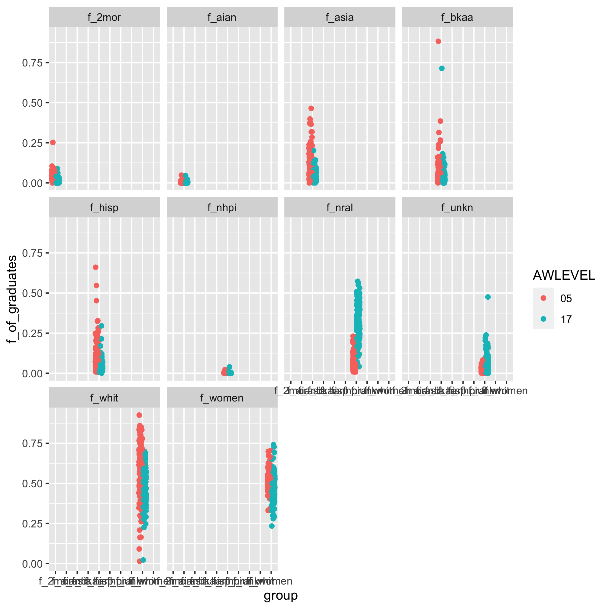
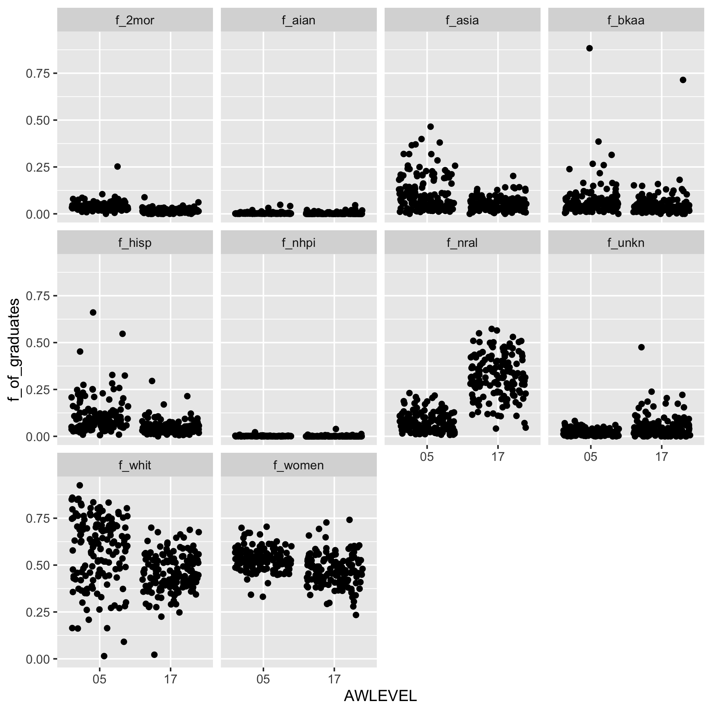
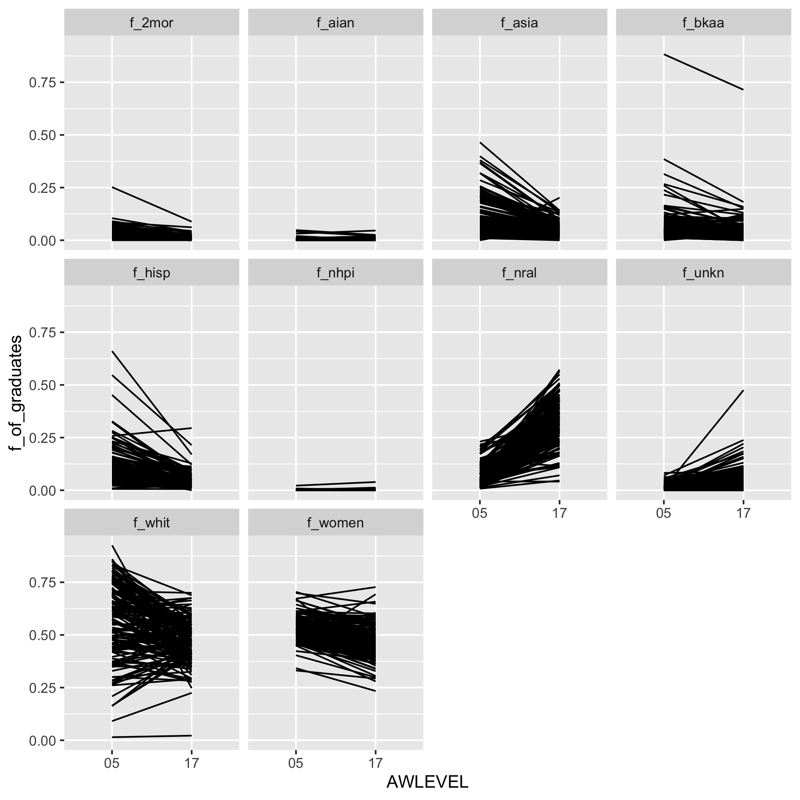

## Topics
* Generalizing an analysis
* Making a data frame tidy
* Plotting groups of data
* Faceting data visualizations


## Generalizing an analysis

In the last lesson we looked at the representation of women among people graduating with a Bachelor's degree at different types of institutions and at the difference in representation of women who graduated from large research extensive universities with a bachelor's degree and a doctorate degree. To achieve this, we used a number of functions we had seen in previous lessons but in a new context: `read_csv`, `read_excel`, `filter`, `group_by`, `summarize`, `select`, `inner_join`, and `arrange`. We also met some new functions including those to plot continuous data against categorical data like `geom_jitter`, `geom_boxplot`, and `geom_violin`. We also learned how to move rows to columns using `pivot_wider`. We put this all to good effect to see some interesting relationships in the data, namely, there's evidence for a "leaky pipeline" as women move from a bachelor's to doctoral degree program. If you did the Exercises at the end of the session, you also saw the even larger leaky pipeline among Black and African American individuals.

In this lesson, I want to build upon these observations to look at the differences for these and other groups of people. Like the exercises, we could repeat the analysis we did for women, substituting each women for each group. That would be tedious and would likely result in a lot of duplicated code (i.e. not DRY!). What we already had was close to what we want, so we'll be building upon those earlier concepts. Here is the code collected together to generate the final figure from the last session.


```r
library(tidyverse)

doc_institutions <- read_csv("ipeds/hd2018.csv") %>%
	filter(CARNEGIE == "15") %>%
	select(UNITID, INSTNM)

degree_rates <- read_csv("ipeds/c2018_a.csv") %>%
	filter(MAJORNUM == 1 & CIPCODE == "99" & CTOTALT > 0 & (AWLEVEL == "05" | AWLEVEL == "17")) %>%
	inner_join(doc_institutions, ., by="UNITID") %>%
	select(-CIPCODE, -MAJORNUM, -starts_with("X"))  %>%
	mutate(f_women = CTOTALW / CTOTALT) %>%
	select(UNITID, INSTNM, AWLEVEL, f_women)

degree_rates %>%
	ggplot(aes(x=AWLEVEL, y=f_women, group=UNITID)) +
		geom_line()

degree_rates %>%
	select(INSTNM, AWLEVEL, f_women) %>%
	pivot_wider(names_from=AWLEVEL, values_from=f_women) %>%
	mutate(percent_drop = 100*(`05` - `17`)/`05`) %>%
	summarize(med_bachelors = median(`05`, na.rm=T),
		med_doctorate = median(`17`, na.rm=T),
		med_drop = median(percent_drop, na.rm=T))
```

```
## # A tibble: 1 x 3
##   med_bachelors med_doctorate med_drop
##           <dbl>         <dbl>    <dbl>
## 1         0.527         0.465     10.7
```


In this code chunk, we worked with the data in columns `CTOTALT` and `CTOTALW` of `ipeds/c2018_a.csv`. If you look at the "varlist" page of the `ipeds/c2018_a.xlsx` workbook, you'll see a number of categories to classify people...

	```
	CTOTALW - Grand total women
	CAIANT - American Indian or Alaska Native total
	CASIAT - Asian total
	CBKAAT - Black or African American total
	CHISPT - Hispanic or Latino total
	CNHPIT - Native Hawaiian or Other Pacific Islander total
	CWHITT - White total
	C2MORT - Two or more races total
	CUNKNT - Race/ethnicity unknown total
	CNRALT - Nonresident alien total
	```

Beyond these are a break down by men and women. Those are denoted by a "M" or "W" in place of the "T" as the final character in the column names. For our first pass of the data we will look at the total for each group (except for women overall). Of course, our grand total column `CTOTALT` tells us the total number of individuals, regardless of gender, race/ethnicity, or nationality. Above, we generated a column, `f_women`. We'd like to generate a column for each of these other groups as well. For example, we need a `f_aian` column that equals `CAIANT/CTOTALT` to represent the fraction of "American Indian or Alaskan Native" individuals. We'll repeat this for the other groups as well.


```r
degree_rates <- read_csv("ipeds/c2018_a.csv") %>%
	filter(MAJORNUM == 1 & CIPCODE == "99" & CTOTALT > 0 & (AWLEVEL == "05" | AWLEVEL == "17")) %>%
	inner_join(doc_institutions, ., by="UNITID") %>%
	select(-CIPCODE, -MAJORNUM, -starts_with("X"))  %>%
	mutate(f_women = CTOTALW / CTOTALT,
		f_aian = CAIANT / CTOTALT,
		f_asia = CASIAT / CTOTALT,
		f_bkaa = CBKAAT / CTOTALT,
		f_hisp = CHISPT / CTOTALT,
		f_nhpi = CNHPIT / CTOTALT,
		f_whit = CWHITT / CTOTALT,
		f_2mor = C2MORT / CTOTALT,
		f_unkn = CUNKNT / CTOTALT,
		f_nral = CNRALT / CTOTALT) %>%
	select(UNITID, INSTNM, AWLEVEL, f_women, f_aian, f_asia, f_bkaa, f_hisp, f_nhpi, f_whit, f_2mor, f_unkn, f_nral)
```


## Making a data frame tidy

If you look at `degree_rates`, you'll see that we now have the fraction of bachelor's and doctorate graduates at each school broken down by each of these groupings. I can imagine multiple analyses using this data frame. To do each of those we need to tidy the data frame. We need a column that indicates the grouping and a column that contains the level of representation. To do this, we will use the function opposite of `pivot_wider`. We will use `pivot_longer`. Both of these `pivot_` functions are relatively new. I'm still use to `spread` and `gather`, which are their counterparts, but are no longer being maintained. Until I use a function enough times, I need to look at the usage description in its help page - `?pivot_longer`

```
Usage:

     pivot_longer(
       data,
       cols,
       names_to = "name",
       names_prefix = NULL,
       names_sep = NULL,
       names_pattern = NULL,
       names_ptypes = list(),
       names_repair = "check_unique",
       values_to = "value",
       values_drop_na = FALSE,
       values_ptypes = list()
     )
```

This tells me that I need to provide it the data (this will be piped from `degree_rates`), the columns (**cols**) to be gathered together, the name of the new column that will aggregate the names of the columns to be gathered (**names_to**), and the name of the new column that will aggregate the values in the columns to be gathered (**values_to**). Here's an example...


```r
temps <- tibble(day=c(1,2,3), chicago=c(75, 77, 74), detroit=c(69, 71, 70), nashville=c(79,80,78))
temps
```

```
## # A tibble: 3 x 4
##     day chicago detroit nashville
##   <dbl>   <dbl>   <dbl>     <dbl>
## 1     1      75      69        79
## 2     2      77      71        80
## 3     3      74      70        78
```

In this example, the columns I want to gather are `chicago`, `detroit`, and `nashville`. I want the column names to be aggregated in a new column, `city`. Finally, their temperatures should go to a new column, `temperatures`. I can do this with `pivot_longer` by one of two ways...


```r
temps %>%
	pivot_longer(cols=c(chicago, detroit, nashville), names_to="city", values_to="temperatures")
```

```
## # A tibble: 9 x 3
##     day city      temperatures
##   <dbl> <chr>            <dbl>
## 1     1 chicago             75
## 2     1 detroit             69
## 3     1 nashville           79
## 4     2 chicago             77
## 5     2 detroit             71
## 6     2 nashville           80
## 7     3 chicago             74
## 8     3 detroit             70
## 9     3 nashville           78
```

or


```r
temps %>%
	pivot_longer(cols=-day, names_to="city", values_to="temperatures")
```

```
## # A tibble: 9 x 3
##     day city      temperatures
##   <dbl> <chr>            <dbl>
## 1     1 chicago             75
## 2     1 detroit             69
## 3     1 nashville           79
## 4     2 chicago             77
## 5     2 detroit             71
## 6     2 nashville           80
## 7     3 chicago             74
## 8     3 detroit             70
## 9     3 nashville           78
```

If my city names had something in common that denoted that they were cities, I could use the `starts_with`, `ends_with`, etc helper functions. Turning to our graduation data we can exploit this fact. Here is the explicit listing of the columns to gather


```r
degree_rates %>%
	pivot_longer(cols=c("f_women", "f_asia", "f_bkaa", "f_hisp", "f_nhpi", "f_whit", "f_2mor", "f_unkn", "f_nral"), names_to="group", values_to="f_of_graduates")
```

```
## # A tibble: 2,700 x 6
##    UNITID INSTNM                           AWLEVEL  f_aian group  f_of_graduates
##     <dbl> <chr>                            <chr>     <dbl> <chr>           <dbl>
##  1 100663 University of Alabama at Birmin… 05      0.00203 f_wom…       0.600   
##  2 100663 University of Alabama at Birmin… 05      0.00203 f_asia       0.0641  
##  3 100663 University of Alabama at Birmin… 05      0.00203 f_bkaa       0.217   
##  4 100663 University of Alabama at Birmin… 05      0.00203 f_hisp       0.0341  
##  5 100663 University of Alabama at Birmin… 05      0.00203 f_nhpi       0.000406
##  6 100663 University of Alabama at Birmin… 05      0.00203 f_whit       0.626   
##  7 100663 University of Alabama at Birmin… 05      0.00203 f_2mor       0.0305  
##  8 100663 University of Alabama at Birmin… 05      0.00203 f_unkn       0.00609 
##  9 100663 University of Alabama at Birmin… 05      0.00203 f_nral       0.0203  
## 10 100663 University of Alabama at Birmin… 17      0       f_wom…       0.590   
## # … with 2,690 more rows
```

Alternatively, we could have also written...


```r
degree_rates %>%
	pivot_longer(cols=c(-UNITID, -INSTNM, -AWLEVEL), names_to="group", values_to="f_of_graduates")
```

```
## # A tibble: 3,000 x 5
##    UNITID INSTNM                              AWLEVEL group   f_of_graduates
##     <dbl> <chr>                               <chr>   <chr>            <dbl>
##  1 100663 University of Alabama at Birmingham 05      f_women       0.600   
##  2 100663 University of Alabama at Birmingham 05      f_aian        0.00203 
##  3 100663 University of Alabama at Birmingham 05      f_asia        0.0641  
##  4 100663 University of Alabama at Birmingham 05      f_bkaa        0.217   
##  5 100663 University of Alabama at Birmingham 05      f_hisp        0.0341  
##  6 100663 University of Alabama at Birmingham 05      f_nhpi        0.000406
##  7 100663 University of Alabama at Birmingham 05      f_whit        0.626   
##  8 100663 University of Alabama at Birmingham 05      f_2mor        0.0305  
##  9 100663 University of Alabama at Birmingham 05      f_unkn        0.00609 
## 10 100663 University of Alabama at Birmingham 05      f_nral        0.0203  
## # … with 2,990 more rows
```

...or...


```r
degree_rates %>%
	pivot_longer(cols=starts_with("f_"), names_to="group", values_to="f_of_graduates")
```

```
## # A tibble: 3,000 x 5
##    UNITID INSTNM                              AWLEVEL group   f_of_graduates
##     <dbl> <chr>                               <chr>   <chr>            <dbl>
##  1 100663 University of Alabama at Birmingham 05      f_women       0.600   
##  2 100663 University of Alabama at Birmingham 05      f_aian        0.00203 
##  3 100663 University of Alabama at Birmingham 05      f_asia        0.0641  
##  4 100663 University of Alabama at Birmingham 05      f_bkaa        0.217   
##  5 100663 University of Alabama at Birmingham 05      f_hisp        0.0341  
##  6 100663 University of Alabama at Birmingham 05      f_nhpi        0.000406
##  7 100663 University of Alabama at Birmingham 05      f_whit        0.626   
##  8 100663 University of Alabama at Birmingham 05      f_2mor        0.0305  
##  9 100663 University of Alabama at Birmingham 05      f_unkn        0.00609 
## 10 100663 University of Alabama at Birmingham 05      f_nral        0.0203  
## # … with 2,990 more rows
```

Let's add the `pivot_longer` function call to our pipeline that generated `degree_rates`


```r
degree_rates <- read_csv("ipeds/c2018_a.csv") %>%
	filter(MAJORNUM == 1 & CIPCODE == "99" & CTOTALT > 0 & (AWLEVEL == "05" | AWLEVEL == "17")) %>%
	inner_join(doc_institutions, ., by="UNITID") %>%
	select(-CIPCODE, -MAJORNUM, -starts_with("X"))  %>%
	mutate(f_women = CTOTALW / CTOTALT,
		f_aian = CAIANT / CTOTALT,
		f_asia = CASIAT / CTOTALT,
		f_bkaa = CBKAAT / CTOTALT,
		f_hisp = CHISPT / CTOTALT,
		f_nhpi = CNHPIT / CTOTALT,
		f_whit = CWHITT / CTOTALT,
		f_2mor = C2MORT / CTOTALT,
		f_unkn = CUNKNT / CTOTALT,
		f_nral = CNRALT / CTOTALT) %>%
	select(UNITID, INSTNM, AWLEVEL, f_women, f_aian, f_asia, f_bkaa, f_hisp, f_nhpi, f_whit, f_2mor, f_unkn, f_nral) %>%
	pivot_longer(cols=starts_with("f_"), names_to="group", values_to="f_of_graduates")
```


Because our data are now tidy, we can look at the fraction of graduates from each group


```r
degree_rates %>%
	group_by(group, AWLEVEL) %>%
	summarize(median = median(f_of_graduates)) %>%
	ungroup()
```

```
## # A tibble: 20 x 3
##    group   AWLEVEL   median
##    <chr>   <chr>      <dbl>
##  1 f_2mor  05      0.0349  
##  2 f_2mor  17      0.0157  
##  3 f_aian  05      0.00180 
##  4 f_aian  17      0       
##  5 f_asia  05      0.0728  
##  6 f_asia  17      0.0432  
##  7 f_bkaa  05      0.0485  
##  8 f_bkaa  17      0.0328  
##  9 f_hisp  05      0.0805  
## 10 f_hisp  17      0.0389  
## 11 f_nhpi  05      0.000974
## 12 f_nhpi  17      0       
## 13 f_nral  05      0.0604  
## 14 f_nral  17      0.314   
## 15 f_unkn  05      0.0150  
## 16 f_unkn  17      0.0404  
## 17 f_whit  05      0.614   
## 18 f_whit  17      0.455   
## 19 f_women 05      0.527   
## 20 f_women 17      0.465
```

From this table, we see that the only group that is better represented among those awarded a doctorate than a bachelor's degree is the "Nonresident alien" and "Unknown" groups. Of course, this ignores that the data are paired within an institution, so we'd like to consider how to reflect that. We'll do what we did in the last session, we'll use `pivot_wider` again!


```r
degree_rates %>%
	pivot_wider(names_from=AWLEVEL, values_from=f_of_graduates) %>%
	mutate(percent_drop = 100*(`05` - `17`)/`05`) %>%
	group_by(group) %>%
	summarize(med_bachelors = median(`05`, na.rm=T),
		med_doctorate = median(`17`, na.rm=T),
		med_drop = median(percent_drop, na.rm=T))
```

```
## # A tibble: 10 x 4
##    group   med_bachelors med_doctorate med_drop
##    <chr>           <dbl>         <dbl>    <dbl>
##  1 f_2mor       0.0349          0.0157     59.9
##  2 f_aian       0.00180         0         100. 
##  3 f_asia       0.0728          0.0432     46.7
##  4 f_bkaa       0.0485          0.0328     32.2
##  5 f_hisp       0.0805          0.0389     58.1
##  6 f_nhpi       0.000974        0         100  
##  7 f_nral       0.0604          0.314    -378. 
##  8 f_unkn       0.0150          0.0404   -123. 
##  9 f_whit       0.614           0.455      20.0
## 10 f_women      0.527           0.465      10.7
```

Intriguing and depressing results. If you compare the last code chunk to the one that we used to summarize the data for the fraction of women, you'll notice only a couple of differences.


```r
degree_rates %>%
	select(INSTNM, AWLEVEL, f_women) %>%
	pivot_wider(names_from=AWLEVEL, values_from=f_women) %>%
	mutate(percent_drop = 100*(`05` - `17`)/`05`) %>%
	summarize(med_bachelors = median(`05`, na.rm=T),
		med_doctorate = median(`17`, na.rm=T),
		med_drop = median(percent_drop, na.rm=T))
```

The key differences were...
* the `select` function, which was mainly for our convenience and not really important
* the syntax for `pivot_wider` went from using `values_from=f_women` to `values_from=f_of_graduates` to account for the broader scope of groups we were interested in
* the addition of `group_by(group)` to calculate the median values for each group rather than for women


## Plotting groups of data

Next, we'd like to graph the data for each demographic group. I'd like to make slopegraphs like we did before for women. Unfortunately, it's a bit of a challenge to generate those since the `geom_line` function we used wants to connect all of the points across the x-axis. Instead, we'll start with making boxplots. Our `degree_rates` data frame has `UNITID`, `INSTNM`, `AWLEVEL`, `group`, and `f_of_graduates` as its variables. The challenge is figuring out how to map those variables to the desired aesthetics. Let's start with the easy stuff! It seems obvious that `f_of_graduates` should go on the y-axis. Along the x-axis I'd like to have the `group` data and within each `group` value I would like to see the data for each `AWLEVEL` value.


```r
degree_rates %>%
	ggplot(aes(x=group, y=f_of_graduates, color=AWLEVEL)) +
		geom_boxplot()
```


If instead we wanted to use `geom_jitter` we would get this...


```r
degree_rates %>%
	ggplot(aes(x=group, y=f_of_graduates, color=AWLEVEL)) +
		geom_jitter()
```


In this case, the points are all plotted on top of each other. Here we need to give `geom_jitter` a value for its `pos` argument - `position_jitterdodge`.


```r
degree_rates %>%
	ggplot(aes(x=group, y=f_of_graduates, color=AWLEVEL)) +
		geom_jitter(pos=position_jitterdodge())
```


We can alter the width of the clouds with the `jitter.width` argument and the distance between the clouds with the `dodge.width` argument. Also useful is the `seed` argument since it will make the plots more reproducible.


```r
degree_rates %>%
	ggplot(aes(x=group, y=f_of_graduates, color=AWLEVEL)) +
		geom_jitter(pos=position_jitterdodge(jitter.width=0.3, seed = 1))
```


## Faceting data visualizations

Generating the slopegraphs like we had previously, isn't trivial to do in a single plot. One option we have is to use facets to generate separate slopegraphs for each group. We can use `facet_wrap` to create a tiled set of figures. The syntax is to add `facet_wrap` and to give it the variable you want to make different plots with as an argument following an `~`


```r
degree_rates %>%
	ggplot(aes(x=group, y=f_of_graduates, color=AWLEVEL)) +
		geom_jitter(pos=position_jitterdodge(jitter.width=0.3, seed = 1)) +
		facet_wrap(~group)
```



That gets us close, but we don't need all the other groupings on the x-axis. Once we remove the other groupings, we also no longer need the `position_jitterdodge`


```r
degree_rates %>%
	ggplot(aes(x=AWLEVEL, y=f_of_graduates)) +
		geom_jitter() +
		facet_wrap(~group)
```



Nice, eh? Let's replace `geom_jitter` with `geom_line` to get our slopegraph


```r
degree_rates %>%
	ggplot(aes(x=AWLEVEL, y=f_of_graduates, group=UNITID)) +
		geom_line() +
		facet_wrap(~group)
```



A couple of other things are useful to know about `facet_wrap`. First, we have 10 groups so it outputs a 3 by 4 grid of figures. Perhaps I would rather have 4 rows rather than 3. We can use the `nrow` and/or `ncol` arguments to set the number of rows


```r
degree_rates %>%
	ggplot(aes(x=AWLEVEL, y=f_of_graduates, group=UNITID)) +
		geom_line() +
		facet_wrap(~group, nrow=4)
```


Second, in our case, it might be helpful to let the y-axis scale vary by each facet. Note that this can sometimes be frowned upon because it makes it harder to compare across facets. We can "free" up the y-axis scales by using `scales="free_y"` (and `free_x` if you wanted to vary the x-axis range)


```r
degree_rates %>%
	ggplot(aes(x=AWLEVEL, y=f_of_graduates, group=UNITID)) +
		geom_line() +
		facet_wrap(~group, scales="free_y")
```


Finally, our facet heading labels aren't very attractive. We can specify the label by giving `facet_wrap` a lookup table that maps the abbreviation to the desired text


```r
group_lookup <- c(f_2mor="Two or more races",
			f_aian="American Indian\nor Alaska Native",
			f_asia="Asian",
			f_bkaa="Black or African American",
			f_hisp="Hispanic or Latino",
			f_nhpi="Native Hawaiian or\nOther Pacific Islander",
			f_nral="Nonresident alien",
			f_unkn="Race/ethnicity\nunknown",
			f_whit="White",
			f_women="All women")

degree_rates %>%
	ggplot(aes(x=AWLEVEL, y=f_of_graduates, group=UNITID)) +
		geom_line() +
		facet_wrap(~group, labeller=labeller(group = group_lookup))
```


## Exercises

1\. The results presented in the last figure were for graduates of research extensive institutions. Can you add the data from research intensive institutions as well? Can you plot the Carnegie classification as the color of the line in your slopegraph?

<input type="button" class="hideshow">
<div markdown="1" style="display:none;">

```r
all_doc_institutions <- read_csv("ipeds/hd2018.csv") %>%
	filter(CARNEGIE == "15" | CARNEGIE == "16") %>%
	mutate(CARNEGIE = as.character(CARNEGIE)) %>%
	select(UNITID, INSTNM, CARNEGIE)

all_doc_degree_rates <- read_csv("ipeds/c2018_a.csv") %>%
	filter(MAJORNUM == 1 & CIPCODE == "99" & CTOTALT > 0 & (AWLEVEL == "05" | AWLEVEL == "17")) %>%
	inner_join(all_doc_institutions, ., by="UNITID") %>%
	select(-CIPCODE, -MAJORNUM, -starts_with("X"))  %>%
	mutate(f_women = CTOTALW / CTOTALT,
		f_aian = CAIANT / CTOTALT,
		f_asia = CASIAT / CTOTALT,
		f_bkaa = CBKAAT / CTOTALT,
		f_hisp = CHISPT / CTOTALT,
		f_nhpi = CNHPIT / CTOTALT,
		f_whit = CWHITT / CTOTALT,
		f_2mor = C2MORT / CTOTALT,
		f_unkn = CUNKNT / CTOTALT,
		f_nral = CNRALT / CTOTALT) %>%
	select(UNITID, INSTNM, CARNEGIE, AWLEVEL, f_women, f_aian, f_asia, f_bkaa, f_hisp, f_nhpi, f_whit, f_2mor, f_unkn, f_nral) %>%
	pivot_longer(cols=starts_with("f_"), names_to="group", values_to="f_of_graduates")


all_doc_degree_rates %>%
	ggplot(aes(x=AWLEVEL, y=f_of_graduates, group=UNITID, color=CARNEGIE)) +
		geom_line() +
		facet_wrap(~group, labeller=labeller(group = group_lookup))
```


</div>


2\. In Exercise 1, several institutions stand out for graduating a large fraction (i.e. >80%) of individuals from different groups with bachelor's **and** doctorate degrees. Who are these institutions? What Carnegie class are these institutions from?

<input type="button" class="hideshow">
<div markdown="1" style="display:none;">

```r
all_doc_degree_rates %>%
	pivot_wider(names_from=AWLEVEL, values_from=f_of_graduates) %>%
	filter(`05` > 0.75 & `17` > 0.75) %>%
	arrange(group)
```

```
## # A tibble: 9 x 6
##   UNITID INSTNM                                CARNEGIE group    `05`  `17`
##    <dbl> <chr>                                 <chr>    <chr>   <dbl> <dbl>
## 1 138947 Clark Atlanta University              16       f_bkaa  0.871 0.767
## 2 175856 Jackson State University              16       f_bkaa  0.892 0.8  
## 3 218733 South Carolina State University       16       f_bkaa  0.906 1    
## 4 243221 University of Puerto Rico-Rio Piedras 16       f_hisp  0.903 0.929
## 5 145813 Illinois State University             16       f_whit  0.796 0.778
## 6 174914 University of St Thomas               16       f_whit  0.835 0.778
## 7 180489 The University of Montana             16       f_whit  0.818 0.821
## 8 220075 East Tennessee State University       16       f_whit  0.842 0.921
## 9 229179 Texas Woman's University              16       f_women 0.908 0.899
```
</div>


3\. One of the challenges with looking at relative abundance data is that if one group goes up, all of the others go down. Based on my experiences with graduate education, I wonder if some of the numbers are skewed because of the large number of non-US citizens that come to US institutions to pursue a PhD. As an alternative, look at the data as a ratio of counts to the traditionally privileged class, white men (i.e. `CWHITM`). This will tell us, relative to white men, whether a group is going up or down.

<input type="button" class="hideshow">
<div markdown="1" style="display:none;">

```r
relative_degree_rates <- read_csv("ipeds/c2018_a.csv") %>%
	filter(MAJORNUM == 1 & CIPCODE == "99" & CTOTALT > 0 & (AWLEVEL == "05" | AWLEVEL == "17")) %>%
	inner_join(doc_institutions, ., by="UNITID") %>%
	select(-CIPCODE, -MAJORNUM, -starts_with("X"))  %>%
	mutate(r_women = CTOTALW / CWHITM,
		r_aian = CAIANT / CWHITM,
		r_asia = CASIAT / CWHITM,
		r_bkaa = CBKAAT / CWHITM,
		r_hisp = CHISPT / CWHITM,
		r_nhpi = CNHPIT / CWHITM,
		r_2mor = C2MORT / CWHITM,
		r_unkn = CUNKNT / CWHITM,
		r_nral = CNRALT / CWHITM) %>%
	select(UNITID, INSTNM, AWLEVEL, r_women, r_aian, r_asia, r_bkaa, r_hisp, r_nhpi, r_2mor, r_unkn, r_nral) %>%
	pivot_longer(cols=starts_with("r_"), names_to="group", values_to="r_of_graduates")

group_lookup <- c(r_2mor="Two or more races",
	r_aian="American Indian\nor Alaska Native",
	r_asia="Asian",
	r_bkaa="Black or African American",
	r_hisp="Hispanic or Latino",
	r_nhpi="Native Hawaiian or\nOther Pacific Islander",
	r_nral="Nonresident alien",
	r_unkn="Race/ethnicity\nunknown",
	r_whit="White",
	r_women="All women")

relative_degree_rates %>%
	ggplot(aes(x=AWLEVEL, y=r_of_graduates, group=UNITID)) +
		geom_line() +
		facet_wrap(~group, labeller=labeller(group = group_lookup)) +
		coord_cartesian(ylim=c(0,2))
```


Yikes, that's hideous. Let's try a summary table


```r
relative_degree_rates %>%
	pivot_wider(names_from=AWLEVEL, values_from=r_of_graduates) %>%
	mutate(percent_drop = 100*(`05` - `17`)/`05`) %>%
	group_by(group) %>%
	summarize(med_bachelors = median(`05`, na.rm=T),
		med_doctorate = median(`17`, na.rm=T),
		med_drop = median(percent_drop, na.rm=T)) %>%
	arrange(med_drop)
```

```
## # A tibble: 9 x 4
##   group   med_bachelors med_doctorate med_drop
##   <chr>           <dbl>         <dbl>    <dbl>
## 1 r_nral        0.217          1.39    -446.  
## 2 r_unkn        0.0603         0.181   -141.  
## 3 r_women       1.94           2.08      -9.02
## 4 r_bkaa        0.178          0.157     25.8 
## 5 r_asia        0.274          0.206     37.9 
## 6 r_hisp        0.308          0.174     43.5 
## 7 r_2mor        0.121          0.0659    54.4 
## 8 r_aian        0.00683        0        100   
## 9 r_nhpi        0.00356        0        100
```

At least according to this approach, across all groups, women are more likely than men to graduate with a bachelor's or doctorate degree. As we saw earlier, there are significant losses of each US demographic group relative to the number of white men awarded a doctorate at research extensive universities in the US.
</div>


4\. Can you "beautify" the faceted plot that we ended with to make it look more attractive?
* Fix the x and y-axis labels
* Use `scale_y_continuous` to change the fractions to percentages at 0, 25, 50, 75, and 100
* Use `scale_x_discrete` to use text to describe the `AWLEVEL` values
* Use `coord_cartesian` to lengthen the y-axis from 0 to 100%


<input type="button" class="hideshow">
<div markdown="1" style="display:none;">

```r
group_lookup <- c(f_2mor="Two or more races",
	f_aian="American Indian\nor Alaska Native",
	f_asia="Asian",
	f_bkaa="Black or African American",
	f_hisp="Hispanic or Latino",
	f_nhpi="Native Hawaiian or\nOther Pacific Islander",
	f_nral="Nonresident alien",
	f_unkn="Race/ethnicity unknown",
	f_whit="White",
	f_women="All women")

degree_rates %>%
	ggplot(aes(x=AWLEVEL, y=f_of_graduates, group=UNITID)) +
		geom_line() +
		facet_wrap(~group, labeller=labeller(group = group_lookup)) +
		labs(x="Degree awarded", y="Percentage of all graduates") +
		scale_x_discrete(labels = c("05" = "Bachelor's", "17" = "Doctorate")) +
		scale_y_continuous(breaks=c(0, 0.25, 0.50, 0.75, 1.00), labels=c(0, 25, 50, 75, 100)) +
		coord_cartesian(ylim=c(0,1)) +
		theme_classic()
```


</div>
