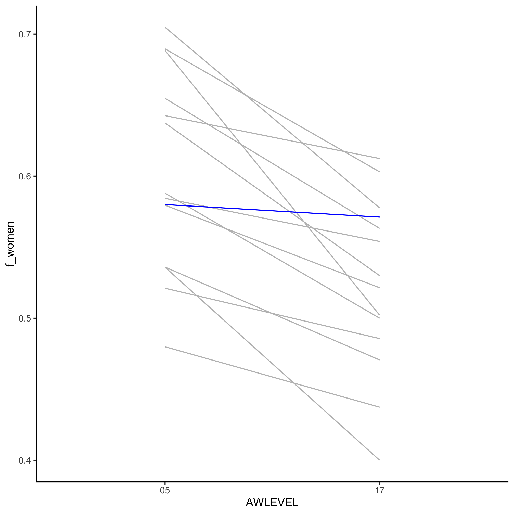
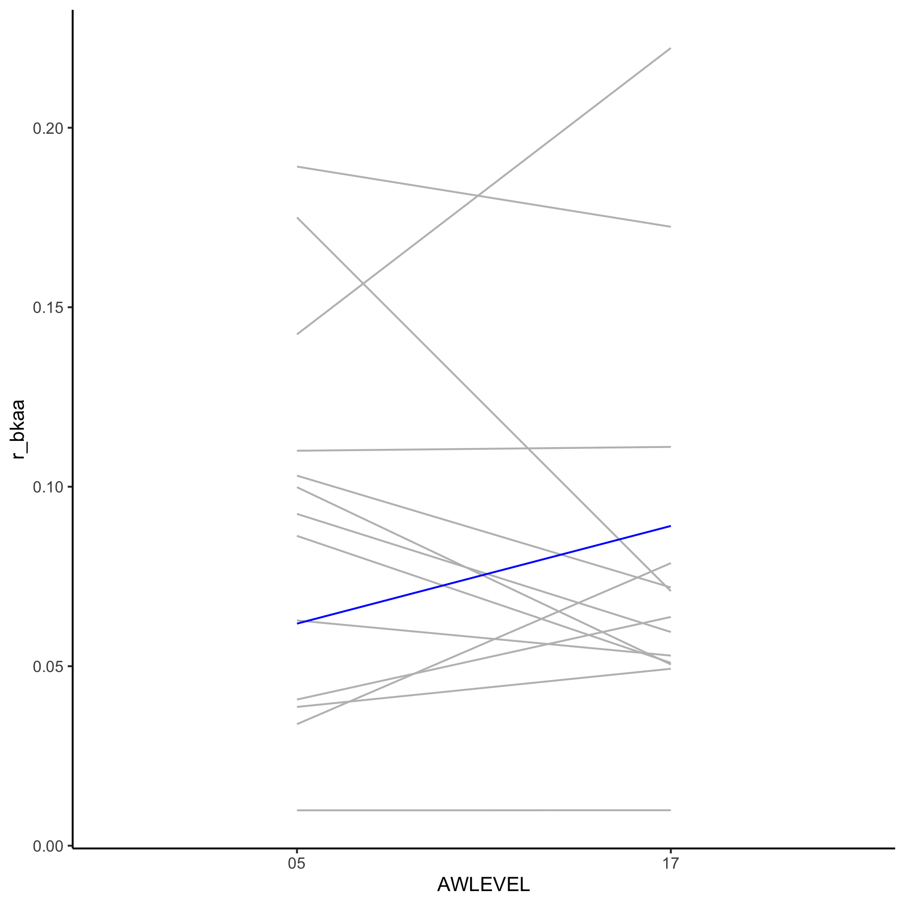

## Topics
* Thinking through questions
* Finding text with R
* Adjusting the shape of a data frame
* More sophisticated text searches
* Modifying text based on patterns


## Thinking through questions

In the last several sessions, we looked at gender and racial/ethnic representation at pretty granular levels - the level of institution type and particular institutions. I'd like to get a bit more refined and look within a specific set of disciplines. I'm going to start the analysis with "Microbiology". To do this analysis, I need to develop a sense of how the data are reported. A "microbiologist" is a very diverse concept! They can study organisms in any of the three domains of life, viruses, interactions with animals or plants or the natural environment. They can be engineered, host-associated, or natural ecosystems. They can be studied at the gene, protein, organismal, or community level. Depending on the campus, the people that study microbes at these various levels can be one person in a Biology department or 20 in a Microbiology department or 200 across 20 different departments. How we organize data into a framework is critical to the interpretation of our data. We could be the best R programmer in the world, but if we can't get the definitions right, we're toast.

Inspecting the CIP codes in `ipeds/c2018_a.xlsx`, I see that there's some organization to them - the first two numbers correspond to a broad discipline (e.g. 26 - Biology or 27 - Math). Naturally, I immediately noticed that "26.1102 - Biostatistics" is listed under Biology and not under Math and "27.0306 - Mathematical Biology" is listed under Math rather than Biology. For the microbiology-affiliated fields I listed above, I notice that their CIP codes all start with "26.05". Among those CIP codes, there are

* 26.0502	Microbiology, General
* 26.0503	Medical Microbiology and Bacteriology
* 26.0504	Virology
* 26.0505	Parasitology
* 26.0507	Immunology
* 26.0508	Microbiology and Immunology
* 26.0599	Microbiological Sciences and Immunology, Other

Of course, there are Immunologists that don't think much about microbes and there are card carrying microbiologists in general Biology departments and *even* Engineering. This overlap between subdisciplines is why it is a bad idea to aggregate all institutions blindly. A better practice would be to pick peer institutions where one has a better understanding of where a microbiologist would most likely be trained within that institution. In other words, take this analysis with a grain of salt. We're here to learn R, not make grand statements about bias in science.


## Finding text with R

This discussion gets us pretty close to figuring out the categories we're interested in, but let's step back and see if we can do a more systematic review of where microbiology shows up in the CIP codes.


```r
library(tidyverse)
library(readxl)

cip_codes <- read_excel("ipeds/c2018_a.xlsx", sheet="Frequencies") %>%
	filter(varname == "CIPCODE" & codevalue != "99") %>%
	select(codevalue, valuelabel) %>%
	rename(cip_code = codevalue,
		description = valuelabel)
```

As I pointed out above, it seems pretty clear that microbiology disciplines are "supposed" to have a CIP code that starts "26.05". I'm curious whether "Microbiology" shows up in any other titles. To figure this out, we need to learn a new function - `str_detect`. This function tells us whether a character variable contains a string we are interested in. For example, consider this character vector


```r
baseball_teams <- c("cubs", "white sox", "red sox", "cardinals", "yankees")
```

I want to know which values in `baseball_teams` has the word "sox". I can use `str_detect`


```r
str_detect(baseball_teams, "sox")
```

```
## [1] FALSE  TRUE  TRUE FALSE FALSE
```

If I wanted to know which elements in `baseball_teams` had "sox", I could use `str_which`


```r
str_which(baseball_teams, "sox")
```

```
## [1] 2 3
```

And if I wanted to get the values that contained "sox", I would use `str_subset`....


```r
str_subset(baseball_teams, "sox")
```

```
## [1] "white sox" "red sox"
```

The nice thing about `str_detect` is that because it returns a logical value, I can use it with `filter` to get those rows from a data frame that match the search string


```r
cip_codes %>%
	filter(str_detect(cip_code, "26.05"))
```

```
## # A tibble: 7 x 2
##   cip_code description                                   
##   <chr>    <chr>                                         
## 1 26.0502  Microbiology, General                         
## 2 26.0503  Medical Microbiology and Bacteriology         
## 3 26.0504  Virology                                      
## 4 26.0505  Parasitology                                  
## 5 26.0507  Immunology                                    
## 6 26.0508  Microbiology and Immunology                   
## 7 26.0599  Microbiological Sciences and Immunology, Other
```

Let's look for microbiology elsewhere by using `str_detect` on the `description` column


```r
cip_codes %>%
	filter(str_detect(description, "Microb"))
```

```
## # A tibble: 5 x 2
##   cip_code description                                   
##   <chr>    <chr>                                         
## 1 26.0502  Microbiology, General                         
## 2 26.0503  Medical Microbiology and Bacteriology         
## 3 26.0508  Microbiology and Immunology                   
## 4 26.0599  Microbiological Sciences and Immunology, Other
## 5 51.2504  Veterinary Microbiology and Immunobiology
```

Aha, we found a "Veterinary Microbiology and Immunology".

Let's look a bit broader for those descriptions that have "biology" in them


```r
cip_codes %>%
	filter(str_detect(description, "biology"))
```

```
## # A tibble: 10 x 2
##    cip_code description                              
##    <chr>    <chr>                                    
##  1 26.0209  Radiation Biology/Radiobiology           
##  2 26.0502  Microbiology, General                    
##  3 26.0503  Medical Microbiology and Bacteriology    
##  4 26.0508  Microbiology and Immunology              
##  5 26.1503  Neurobiology and Anatomy                 
##  6 26.1504  Neurobiology and Behavior                
##  7 26.1599  Neurobiology and Neurosciences, Other    
##  8 42.2706  Physiological Psychology/Psychobiology   
##  9 51.2504  Veterinary Microbiology and Immunobiology
## 10 51.2505  Veterinary Pathology and Pathobiology
```

of course, we could have also searched for


```r
cip_codes %>%
	filter(str_detect(description, "Biology"))
```

```
## # A tibble: 36 x 2
##    cip_code description                                          
##    <chr>    <chr>                                                
##  1 03.0502  Forest Sciences and Biology                          
##  2 13.1322  Biology Teacher Education                            
##  3 26.0101  Biology/Biological Sciences, General                 
##  4 26.0204  Molecular Biology                                    
##  5 26.0207  Structural Biology                                   
##  6 26.0209  Radiation Biology/Radiobiology                       
##  7 26.0210  Biochemistry and Molecular Biology                   
##  8 26.0299  Biochemistry, Biophysics and Molecular Biology, Other
##  9 26.0301  Botany/Plant Biology                                 
## 10 26.0308  Plant Molecular Biology                              
## # … with 26 more rows
```

or


```r
cip_codes %>%
	filter(str_detect(description, "Biolog"))
```

```
## # A tibble: 41 x 2
##    cip_code description                                          
##    <chr>    <chr>                                                
##  1 03.0502  Forest Sciences and Biology                          
##  2 13.1322  Biology Teacher Education                            
##  3 14.4501  Biological/Biosystems Engineering                    
##  4 26.0101  Biology/Biological Sciences, General                 
##  5 26.0204  Molecular Biology                                    
##  6 26.0207  Structural Biology                                   
##  7 26.0209  Radiation Biology/Radiobiology                       
##  8 26.0210  Biochemistry and Molecular Biology                   
##  9 26.0299  Biochemistry, Biophysics and Molecular Biology, Other
## 10 26.0301  Botany/Plant Biology                                 
## # … with 31 more rows
```

Developing a meaningful search term is a challenge. If we are too broad (e.g. "Micro") we could get something that isn't relevant like "Data Entry/Microcomputer Applications". If we're too specific (e.g. "Biological" vs. "Biology" vs "biology"), then we risk losing out on relevant matches. To make our search insensitive to the case of the search string


```r
cip_codes %>%
	filter(str_detect(description, "(?i)Biolog"))
```

```
## # A tibble: 51 x 2
##    cip_code description                                          
##    <chr>    <chr>                                                
##  1 03.0502  Forest Sciences and Biology                          
##  2 13.1322  Biology Teacher Education                            
##  3 14.4501  Biological/Biosystems Engineering                    
##  4 26.0101  Biology/Biological Sciences, General                 
##  5 26.0204  Molecular Biology                                    
##  6 26.0207  Structural Biology                                   
##  7 26.0209  Radiation Biology/Radiobiology                       
##  8 26.0210  Biochemistry and Molecular Biology                   
##  9 26.0299  Biochemistry, Biophysics and Molecular Biology, Other
## 10 26.0301  Botany/Plant Biology                                 
## # … with 41 more rows
```

Notice that this will match both "Biology/Biological Sciences, General" and "Microbiology, General". The "(?i)Biolog" is what is called a "regular expression". Believe it or not, this is a relatively simple regular expression. We can use far more complicated patterns to identify dates, email addresses, genes, and more.

If it wasn't already clear, defining "biology" or "microbiology" is pretty hard! Let's stick with the "26.05" CIP code stub to define microbiology


```r
microbiology_cips <- read_excel("ipeds/c2018_a.xlsx", sheet="Frequencies") %>%
	filter(varname == "CIPCODE" & codevalue != "99") %>%
	select(codevalue, valuelabel) %>%
	rename(cip_code = codevalue,
		description = valuelabel) %>%
	filter(str_detect(cip_code, "26.05"))
```

Which institutions have enough microbiology on campus that they feel comfortable using one of these codes? To answer this question, I could now do an inner join between `microbiology` and the data in `ipeds/c2018_a.csv` to find the `UNITID` values that reported graduates in one of these CIP codes. Then I could join those results with the broader institutional data in `ipeds/hd2018.csv`. All of this should sound familiar by now.


```r
microbiology_degrees <- read_csv("ipeds/c2018_a.csv") %>%
	inner_join(microbiology_cips, ., by=c("cip_code" = "CIPCODE")) %>%
	filter(MAJORNUM == 1 & CTOTALT > 0 & (AWLEVEL == "05" | AWLEVEL == "17"))
```


## Adjusting the shape of a data frame

Before we go all the way, let's see how many institutions claimed each type of microbiology for each degree type.


```r
microbiology_degrees %>%
	count(description, AWLEVEL)
```

```
## # A tibble: 10 x 3
##    description                                    AWLEVEL     n
##    <chr>                                          <chr>   <int>
##  1 Immunology                                     17         28
##  2 Medical Microbiology and Bacteriology          05         11
##  3 Medical Microbiology and Bacteriology          17         26
##  4 Microbiological Sciences and Immunology, Other 05          1
##  5 Microbiological Sciences and Immunology, Other 17         11
##  6 Microbiology and Immunology                    05          7
##  7 Microbiology and Immunology                    17         17
##  8 Microbiology, General                          05         77
##  9 Microbiology, General                          17         47
## 10 Virology                                       17          3
```

That's a little hard for me to read, what if we make the column names the different degree types? Remember how to do that?


```r
microbiology_degrees %>%
	count(description, AWLEVEL) %>%
	pivot_wider(names_from=AWLEVEL, values_from=n, values_fill=list(n=0)) %>% # if we leave out `values_fill we get NA values`
	select(description, `05`, `17`)
```

```
## # A tibble: 6 x 3
##   description                                     `05`  `17`
##   <chr>                                          <int> <int>
## 1 Immunology                                         0    28
## 2 Medical Microbiology and Bacteriology             11    26
## 3 Microbiological Sciences and Immunology, Other     1    11
## 4 Microbiology and Immunology                        7    17
## 5 Microbiology, General                             77    47
## 6 Virology                                           0     3
```

From this, it looks like most bachelor's degrees in Microbiology are in "Microbiology, General" and occasionally in "Medical Microbiology and Bacteriology". On the other hand, there is more specialization at the doctorate level. Back to our question of which schools are these... I will modify `microbiology_degrees` to get the total number of graduates with a bachelor's and doctorate degree from each major as separate columns


```r
microbiology_degrees %>%
	select(UNITID, description, AWLEVEL, CTOTALT) %>%
	pivot_wider(names_from=AWLEVEL, values_from=CTOTALT, values_fill=list(n=0))
```

```
## # A tibble: 196 x 4
##    UNITID description            `17`  `05`
##     <dbl> <chr>                 <dbl> <dbl>
##  1 100663 Microbiology, General    13    NA
##  2 100724 Microbiology, General     2    NA
##  3 100751 Microbiology, General    NA    15
##  4 104151 Microbiology, General     2    65
##  5 104179 Microbiology, General     1    44
##  6 105330 Microbiology, General    NA    27
##  7 110404 Microbiology, General     1    NA
##  8 110422 Microbiology, General    NA    10
##  9 110538 Microbiology, General    NA    24
## 10 110583 Microbiology, General    NA    21
## # … with 186 more rows
```

This code chunk shows there are 196 institution/department combinations that awarded a microbiology degree in 2018. Are there institutions that show up multiple times?


```r
microbiology_degrees %>%
	select(UNITID, description, AWLEVEL, CTOTALT) %>%
	pivot_wider(names_from=AWLEVEL, values_from=CTOTALT, values_fill=list(n=0)) %>%
	count(UNITID) %>%
	count(n)
```

```
## # A tibble: 4 x 2
##       n    nn
##   <int> <int>
## 1     1   139
## 2     2    22
## 3     3     3
## 4     4     1
```

It appears that 139 schools offer one microbiology major, 22 offer two, 3 offer three, and 1 offers four. How many does the University of Michigan offer?


```r
microbiology_degrees %>%
	select(UNITID, description, AWLEVEL, CTOTALT) %>%
	pivot_wider(names_from=AWLEVEL, values_from=CTOTALT, values_fill=list(n=0)) %>%
	count(UNITID) %>%
	filter(UNITID == 170976)
```

```
## # A tibble: 1 x 2
##   UNITID     n
##    <dbl> <int>
## 1 170976     3
```

3!?! I know there's "Microbiology and Immunology", "Immunology" and... I'm not sure. Let's find out.


```r
microbiology_degrees %>%
	select(UNITID, description, AWLEVEL, CTOTALT) %>%
	pivot_wider(names_from=AWLEVEL, values_from=CTOTALT, values_fill=list(n=0)) %>%
	filter(UNITID == 170976)
```

```
## # A tibble: 3 x 4
##   UNITID description                  `17`  `05`
##    <dbl> <chr>                       <dbl> <dbl>
## 1 170976 Microbiology, General          NA    56
## 2 170976 Immunology                      3    NA
## 3 170976 Microbiology and Immunology     9    NA
```

Ah, yes. The undergrads - "Microbiology, General". Instead of looking up `UNITID` codes manually, let's bring those in with a join


```r
micro_degree_counts <- microbiology_degrees %>%
	select(UNITID, description, AWLEVEL, CTOTALT) %>%
	pivot_wider(names_from=AWLEVEL, values_from=CTOTALT, values_fill=list(n=0)) %>%
	inner_join(read_csv("ipeds/hd2018.csv"), ., by="UNITID") %>%
	select(UNITID, INSTNM, description, `17`, `05`)
```

Now it's easier to see how many different microbiology majors these schools offer


```r
micro_degree_counts %>%
	count(INSTNM) %>%
	arrange(desc(n))
```

```
## # A tibble: 165 x 2
##    INSTNM                                         n
##    <chr>                                      <int>
##  1 University of Pittsburgh-Pittsburgh Campus     4
##  2 Harvard University                             3
##  3 University of Michigan-Ann Arbor               3
##  4 Washington University in St Louis              3
##  5 Baylor College of Medicine                     2
##  6 Boston University                              2
##  7 Cornell University                             2
##  8 Iowa State University                          2
##  9 North Carolina State University at Raleigh     2
## 10 Pennsylvania State University-Main Campus      2
## # … with 155 more rows
```


## More sophisticated text searches

Looking through these institutions, it's pretty clear that to have a dedicated microbiology program of any type suggests that the institution is research focused. We can also see that the program to graduate the most doctorates, University of Wisconsin-Madison, only awarded 19 PhDs in 2018. Based on this, it probably doesn't make much sense to compare the representation at individual institutions for a single year. Now that we have a better handle on the data, let's see what the gender representation looks like for microbiologists awarded bachelor's and doctorate degrees in 2018.


```r
microbiology_degrees %>%
	select(UNITID, description, AWLEVEL, CTOTALW, CTOTALT) %>%
	group_by(AWLEVEL) %>%
	summarize(f_women = sum(CTOTALW)/sum(CTOTALT))
```

```
## # A tibble: 2 x 2
##   AWLEVEL f_women
##   <chr>     <dbl>
## 1 05        0.580
## 2 17        0.571
```

The fraction of women receiving a bachelors degree and a PhD are fairly similar in microbiology. What does this fraction look like for all of the biology CIP codes? To answer this, I can modify the code chunk from above where we defined `microbiology_cips`


```r
biology_cips <- read_excel("ipeds/c2018_a.xlsx", sheet="Frequencies") %>%
	filter(varname == "CIPCODE" & codevalue != "99") %>%
	select(codevalue, valuelabel) %>%
	rename(cip_code = codevalue,
		description = valuelabel) %>%
	filter(str_detect(cip_code, "26"))
```

If you look at `biology_cips` you'll notice a small problem. We identified any CIP code that contained "26", which got us things like "Italian Studies" and "German Language Teacher Education". Oops. We what CIP codes that *start* with "26". We can modify our search term to use an "anchor". The `^` tells `str_detect` to look at the beginning of a string and `$` tells it to look at the end of the string.


```r
biology_cips <- read_excel("ipeds/c2018_a.xlsx", sheet="Frequencies") %>%
	filter(varname == "CIPCODE" & codevalue != "99") %>%
	select(codevalue, valuelabel) %>%
	rename(cip_code = codevalue,
		description = valuelabel) %>%
	filter(str_detect(cip_code, "^26"))
```

That's more like it. We can create `biology_degrees` similar to how we generated `microbiology_degrees`


```r
biology_degrees <- read_csv("ipeds/c2018_a.csv") %>%
	inner_join(biology_cips, ., by=c("cip_code" = "CIPCODE")) %>%
	filter(MAJORNUM == 1 & CTOTALT > 0 & (AWLEVEL == "05" | AWLEVEL == "17"))
```

And we can calculate the fraction of women across all biology for both degree levels


```r
biology_degrees %>%
	select(UNITID, description, AWLEVEL, CTOTALW, CTOTALT) %>%
	group_by(AWLEVEL) %>%
	summarize(f_women = sum(CTOTALW)/sum(CTOTALT))
```

```
## # A tibble: 2 x 2
##   AWLEVEL f_women
##   <chr>     <dbl>
## 1 05        0.622
## 2 17        0.533
```

Interesting, it appears that in some fields there is a larger drop in representation of women. The individual number of graduates in each sub discipline are too small to tell us much. However, if we aggregated the data at the "hundredths" place in the CIP code we could look at a broader level that is still more resolved than all of biology.


## Modifying text based on patterns

How do we extract "26.05" from "26.0502"? How do we do extract "26.01" from "26.0101" with the same command? We need another function that works with strings - `str_replace`. This function takes a set of strings, a pattern to match, and a replacement value. Here's the brute force way to do it for one CIP code


```r
cip_code <- "26.0502"
str_replace(cip_code, pattern="26.0502", replacement="26.05")
```

```
## [1] "26.05"
```

The challenge is that we can't write hundreds of `str_replace` functions. Also, if we reanalyze the data when the 2019 data are released, we may need to add more `str_replace` function calls. No fun. We need to learn a little more about regular expressions. We can use "metacharacters" to represent a generic letter, number, or space. Here's a quick set of examples...


```r
x <- "My phone number is (555)678-1234"
#str_replace only replaces the first matched value
str_replace_all(x, "\\w", "x") # match any alphanumeric character
```

```
## [1] "xx xxxxx xxxxxx xx (xxx)xxx-xxxx"
```


```r
str_replace_all(x, "\\d", "#") # match any number
```

```
## [1] "My phone number is (###)###-####"
```


```r
str_replace_all(x, "\\s", "_") # match any space
```

```
## [1] "My_phone_number_is_(555)678-1234"
```


```r
str_replace_all(x, "[()-]", "_") # match any (, ), or -
```

```
## [1] "My phone number is _555_678_1234"
```

We can match more than a single character


```r
str_replace_all(x, "\\d\\d\\d\\d", "####") # match any number
```

```
## [1] "My phone number is (555)678-####"
```

What does that mean for our CIP code?


```r
str_replace(cip_code, "\\d\\d$", "")
```

```
## [1] "26.05"
```

Let's apply this to group by the sub fields within biology and calculate the percent drop going from bachelor's to doctorate degrees


```r
biology_degrees %>%
	select(UNITID, cip_code, description, AWLEVEL, CTOTALW, CTOTALT) %>%
	mutate(sub_category = str_replace(cip_code, "\\d\\d$", "")) %>%
	group_by(sub_category, AWLEVEL) %>%
	summarize(f_women = sum(CTOTALW)/sum(CTOTALT)) %>%
	ungroup() %>%
	pivot_wider(names_from=AWLEVEL, values_from=f_women) %>%
	mutate(percent_drop = 100*(`05`-`17`)/`05`) %>%
	arrange(percent_drop)
```

```
## # A tibble: 15 x 4
##    sub_category   `05`  `17` percent_drop
##    <chr>         <dbl> <dbl>        <dbl>
##  1 26.05         0.580 0.571         1.52
##  2 26.13         0.643 0.612         4.70
##  3 26.10         0.584 0.554         5.20
##  4 26.02         0.521 0.486         6.81
##  5 26.11         0.480 0.437         8.87
##  6 26.04         0.580 0.521        10.0 
##  7 26.03         0.536 0.471        12.2 
##  8 26.99         0.690 0.603        12.6 
##  9 26.15         0.655 0.563        14.0 
## 10 26.09         0.588 0.5          15.0 
## 11 26.01         0.637 0.530        16.9 
## 12 26.08         0.705 0.578        18.1 
## 13 26.12         0.536 0.4          25.4 
## 14 26.07         0.688 0.502        27.1 
## 15 26.14        NA     0.528        NA
```

It appears that of all the biology disciplines, microbiology does the best job of retaining its gender balance between the bachelor's and doctorate degree awardees.


## Exercises

1\. It is interesting that after microbiology, sub field "26.13" is next in the ranking for retaining women and has more than 60% of its degrees going to women at both levels. What subfields are in that grouping? The worst at retention is "26.07". What field is that?

<input type="button" class="hideshow">
<div markdown="1" style="display:none;">

```r
biology_cips %>%
	filter(str_detect(cip_code, "^26.13"))
```

```
## # A tibble: 11 x 2
##    cip_code description                                                  
##    <chr>    <chr>                                                        
##  1 26.1301  Ecology                                                      
##  2 26.1302  Marine Biology and Biological Oceanography                   
##  3 26.1303  Evolutionary Biology                                         
##  4 26.1304  Aquatic Biology/Limnology                                    
##  5 26.1305  Environmental Biology                                        
##  6 26.1306  Population Biology                                           
##  7 26.1307  Conservation Biology                                         
##  8 26.1308  Systematic Biology/Biological Systematics                    
##  9 26.1309  Epidemiology                                                 
## 10 26.1310  Ecology and Evolutionary Biology                             
## 11 26.1399  Ecology, Evolution, Systematics and Population Biology, Other
```

Ecology and evolutionary biology.


```r
biology_cips %>%
	filter(str_detect(cip_code, "^26.07"))
```

```
## # A tibble: 6 x 2
##   cip_code description                  
##   <chr>    <chr>                        
## 1 26.0701  Zoology/Animal Biology       
## 2 26.0702  Entomology                   
## 3 26.0707  Animal Physiology            
## 4 26.0708  Animal Behavior and Ethology 
## 5 26.0709  Wildlife Biology             
## 6 26.0799  Zoology/Animal Biology, Other
```

Animal biology
</div>

2\. Generate a slopegraph of the biology CIP codes with each line representing a different sub field (i.e. to the level of XX.XX). Can you highlight the microbiology line?

<input type="button" class="hideshow">
<div markdown="1" style="display:none;">

```r
biology_degrees %>%
	select(UNITID, cip_code, description, AWLEVEL, CTOTALW, CTOTALT) %>%
	mutate(sub_category = str_replace(cip_code, "\\d\\d$", "")) %>%
	group_by(sub_category, AWLEVEL) %>%
	summarize(f_women = sum(CTOTALW)/sum(CTOTALT)) %>%
	ungroup() %>%
	mutate(highlight = sub_category == "26.05",
		sub_category = fct_reorder(sub_category, highlight)) %>%
	ggplot(aes(x=AWLEVEL, y=f_women, group=sub_category, color=highlight)) +
		geom_line(show.legend=FALSE) +
		scale_color_manual(name="Highlighted",
			breaks=c(FALSE, TRUE),
			labels=c("Other Institutions", "University of Michigan-Ann Arbor"),
			values=c("gray", "blue")) +
		theme_classic()
```


</div>


3\. Can you repeat the analysis resulting in the slope graph in the last exercise, but looking at the representation of "Black and African American" awardees as a ratio of "White" awardees?

<input type="button" class="hideshow">
<div markdown="1" style="display:none;">

```r
biology_degrees %>%
	select(UNITID, cip_code, description, AWLEVEL, CBKAAT, CWHITT) %>%
	mutate(sub_category = str_replace(cip_code, "\\d\\d$", "")) %>%
	group_by(sub_category, AWLEVEL) %>%
	summarize(r_bkaa = sum(CBKAAT)/sum(CWHITT)) %>%
	ungroup() %>%
	mutate(highlight = sub_category == "26.05",
		sub_category = fct_reorder(sub_category, highlight)) %>%
	ggplot(aes(x=AWLEVEL, y=r_bkaa, group=sub_category, color=highlight)) +
		geom_line(show.legend=FALSE) +
		scale_color_manual(name="Highlighted",
			breaks=c(FALSE, TRUE),
			labels=c("Other Institutions", "University of Michigan-Ann Arbor"),
			values=c("gray", "blue")) +
		theme_classic()
```


</div>


4\. Of the engineering sub fields with more than 100 bachelor's and 100 doctorate degrees, which has the best retention and representation of women? The worst?

<input type="button" class="hideshow">
<div markdown="1" style="display:none;">

```r
engineering_cips <- read_excel("ipeds/c2018_a.xlsx", sheet="Frequencies") %>%
	filter(varname == "CIPCODE" & codevalue != "99") %>%
	select(codevalue, valuelabel) %>%
	rename(cip_code = codevalue,
		description = valuelabel) %>%
	filter(str_detect(cip_code, "^14"))

engineering_degrees <- read_csv("ipeds/c2018_a.csv") %>%
	inner_join(engineering_cips, ., by=c("cip_code" = "CIPCODE")) %>%
	filter(MAJORNUM == 1 & CTOTALT > 0 & (AWLEVEL == "05" | AWLEVEL == "17"))

engineering_degrees %>%
	select(UNITID, cip_code, description, AWLEVEL, CTOTALW, CTOTALT) %>%
	mutate(sub_category = str_replace(cip_code, "\\d\\d$", "")) %>%
	group_by(sub_category, AWLEVEL) %>%
	summarize(n_degrees = sum(CTOTALT), f_women = sum(CTOTALW)/sum(CTOTALT)) %>%
	ungroup() %>%
	pivot_wider(names_from=AWLEVEL, values_from=c(f_women, n_degrees)) %>%
	mutate(percent_drop = 100*(f_women_05-f_women_17)/f_women_05) %>%
	arrange(percent_drop) %>%
	filter(n_degrees_05 > 100 & n_degrees_17 > 100) %>%
	print(n=100)
```

```
## # A tibble: 17 x 6
##    sub_category f_women_05 f_women_17 n_degrees_05 n_degrees_17 percent_drop
##    <chr>             <dbl>      <dbl>        <dbl>        <dbl>        <dbl>
##  1 14.09             0.128      0.216         9729          388      -68.5  
##  2 14.99             0.233      0.313          994          163      -34.1  
##  3 14.10             0.144      0.173        17140         2334      -20.6  
##  4 14.08             0.254      0.295        14143         1057      -16.0  
##  5 14.25             0.170      0.195         2151          133      -15.2  
##  6 14.27             0.299      0.327          755          110       -9.33 
##  7 14.19             0.143      0.151        35526         1586       -5.80 
##  8 14.14             0.481      0.485         1595          165       -0.826
##  9 14.03             0.391      0.386         1170          153        1.49 
## 10 14.01             0.242      0.233         2700          437        3.49 
## 11 14.23             0.157      0.147          535          184        6.54 
## 12 14.18             0.310      0.277         1522          708       10.7  
## 13 14.02             0.139      0.122         4132          352       12.2  
## 14 14.05             0.459      0.401         7416         1091       12.6  
## 15 14.07             0.349      0.300        11653         1017       14.2  
## 16 14.13             0.324      0.254          553          114       21.4  
## 17 14.35             0.333      0.252         5654          329       24.3
```

Best retention...

```r
engineering_cips %>% filter(str_detect(cip_code, "^14.09"))
```

```
## # A tibble: 4 x 2
##   cip_code description                  
##   <chr>    <chr>                        
## 1 14.0901  Computer Engineering, General
## 2 14.0902  Computer Hardware Engineering
## 3 14.0903  Computer Software Engineering
## 4 14.0999  Computer Engineering, Other
```

Computer science.

Worst retention....

```r
engineering_cips %>% filter(str_detect(cip_code, "^14.35"))
```

```
## # A tibble: 1 x 2
##   cip_code description           
##   <chr>    <chr>                 
## 1 14.3501  Industrial Engineering
```

Industrial engineering

</div>
