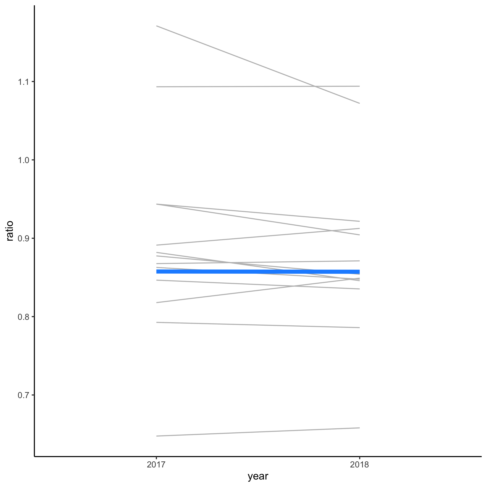
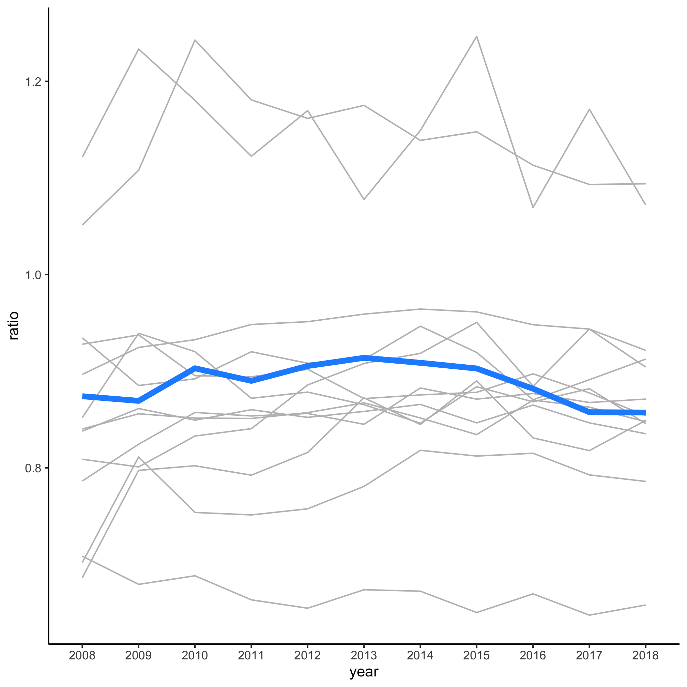
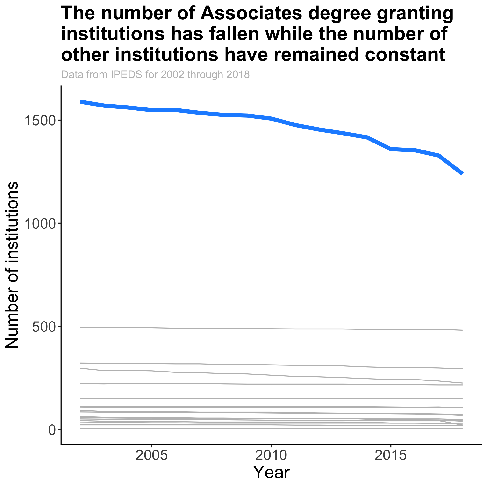

## Topics
* Thinking through problems
* Combining data frames
* DRYing code with functions
* File operations in R
* DRYing code with maps


As I have thought about the analyses we've done over the past few sessions, I have started to wonder whether 2018 was a unique year or whether there are any notable trends over time. If I return to the [Integrated Postsecondary Education Data System (IPEDS)](https://nces.ed.gov/ipeds/) website, I notice that there are data going back to 1980. Forty years of data - not bad! As we dig into the "Completions" survey data we see that those data go back to 1984, along the way definitions of different sub-fields have changed, and that gender and race/ethnicity weren't combined until 1994. Hey, these are real data. This sounds like a great opportunity to demonstrate how we might go about working with this added level of complexity. The question that I'd like to use to motivate this session is how has the ratio of the fraction of women earning research doctorates to the fraction of women earning bachelor's degrees changed over time in Biology relative to other disciplines. From this, I hope you can see how you might make the question more specific (e.g. Microbiology relative to other Biology sub-fields) and general (e.g. across racial/ethnic groups).


## Combining data frames

Let's start slow by incorporating the data from 2017. The data for 2017 can be found on the [IPEDS website](https://nces.ed.gov/ipeds/datacenter/data/C2017_A.zip). Clicking on that link will download a file, C2017_A.zip. Depending on your operating system and settings that file might be automatically decompressed. If it wasn't done automatically for you, decompress the zip file and move it to the `ipeds/` directory that we have been working with. Go ahead and also download the Microsoft Excel workbook that has the [data dictionary](https://nces.ed.gov/ipeds/datacenter/data/C2017_A_Dict.zip). As you go through this process, you'll notice that there are two versions of the `CSV` file in the first archive - `c2017_a.csv` and `c2017_a_rv.csv`. The latter is a revised version that, according to the data dictionary, was released in August 2019. For simplicity, I'm going to use the original `c2017_a.csv` file, which was released in November 2018. Let's read in the 2018 and 2017 data.


```r
library(tidyverse)

bac_doc_degrees_2018 <- read_csv("ipeds/c2018_a.csv") %>%
	filter(MAJORNUM == 1 & CTOTALT > 0 & (AWLEVEL == "05" | AWLEVEL == "17") & CIPCODE != 99)

bac_doc_degrees_2017 <- read_csv("ipeds/c2017_a.csv") %>%
	filter(MAJORNUM == 1 & CTOTALT > 0 & (AWLEVEL == "05" | AWLEVEL == "17") & CIPCODE != 99)
```

From here we could go ahead and aggregate by the first two digits of the CIP code for each of our data frames. That doesn't sound very DRY. Does it? Alternatively, we could combine the data frames into a single data frame and then proceed with the rest of our analysis. We can do this with `bind_rows`


```r
bind_rows(bac_doc_degrees_2017, bac_doc_degrees_2018)
```

```
## # A tibble: 148,990 x 64
##    UNITID CIPCODE MAJORNUM AWLEVEL XCTOTALT CTOTALT XCTOTALM CTOTALM XCTOTALW
##     <dbl> <chr>      <dbl> <chr>   <chr>      <dbl> <chr>      <dbl> <chr>   
##  1 100654 01.0999        1 05      R              6 R              2 R       
##  2 100654 01.1001        1 05      R              8 R              1 R       
##  3 100654 01.1001        1 17      R              4 R              1 R       
##  4 100654 01.9999        1 05      R              3 R              1 R       
##  5 100654 01.9999        1 17      R              2 R              2 Z       
##  6 100654 03.0599        1 05      R              8 R              5 R       
##  7 100654 04.0301        1 05      R              4 R              2 R       
##  8 100654 10.0202        1 05      R             20 R              6 R       
##  9 100654 11.0101        1 05      R             16 R             10 R       
## 10 100654 13.1001        1 05      R              2 Z              0 R       
## # … with 148,980 more rows, and 55 more variables: CTOTALW <dbl>,
## #   XCAIANT <chr>, CAIANT <dbl>, XCAIANM <chr>, CAIANM <dbl>, XCAIANW <chr>,
## #   CAIANW <dbl>, XCASIAT <chr>, CASIAT <dbl>, XCASIAM <chr>, CASIAM <dbl>,
## #   XCASIAW <chr>, CASIAW <dbl>, XCBKAAT <chr>, CBKAAT <dbl>, XCBKAAM <chr>,
## #   CBKAAM <dbl>, XCBKAAW <chr>, CBKAAW <dbl>, XCHISPT <chr>, CHISPT <dbl>,
## #   XCHISPM <chr>, CHISPM <dbl>, XCHISPW <chr>, CHISPW <dbl>, XCNHPIT <chr>,
## #   CNHPIT <dbl>, XCNHPIM <chr>, CNHPIM <dbl>, XCNHPIW <chr>, CNHPIW <dbl>,
## #   XCWHITT <chr>, CWHITT <dbl>, XCWHITM <chr>, CWHITM <dbl>, XCWHITW <chr>,
## #   CWHITW <dbl>, XC2MORT <chr>, C2MORT <dbl>, XC2MORM <chr>, C2MORM <dbl>,
## #   XC2MORW <chr>, C2MORW <dbl>, XCUNKNT <chr>, CUNKNT <dbl>, XCUNKNM <chr>,
## #   CUNKNM <dbl>, XCUNKNW <chr>, CUNKNW <dbl>, XCNRALT <chr>, CNRALT <dbl>,
## #   XCNRALM <chr>, CNRALM <dbl>, XCNRALW <chr>, CNRALW <dbl>
```

Do you see a problem with this output? There's no indication which file each row came from. Before merging the data frames, we could add a column to each with `mutate` to indicate the year and then use `bind_rows`. We might come back to that approach, but we can also use the `.id` argument in `bind_rows` to indicate the data frame that the row came from


```r
bind_rows(bac_doc_degrees_2017, bac_doc_degrees_2018, .id="year")
```

```
## # A tibble: 148,990 x 65
##    year  UNITID CIPCODE MAJORNUM AWLEVEL XCTOTALT CTOTALT XCTOTALM CTOTALM
##    <chr>  <dbl> <chr>      <dbl> <chr>   <chr>      <dbl> <chr>      <dbl>
##  1 1     100654 01.0999        1 05      R              6 R              2
##  2 1     100654 01.1001        1 05      R              8 R              1
##  3 1     100654 01.1001        1 17      R              4 R              1
##  4 1     100654 01.9999        1 05      R              3 R              1
##  5 1     100654 01.9999        1 17      R              2 R              2
##  6 1     100654 03.0599        1 05      R              8 R              5
##  7 1     100654 04.0301        1 05      R              4 R              2
##  8 1     100654 10.0202        1 05      R             20 R              6
##  9 1     100654 11.0101        1 05      R             16 R             10
## 10 1     100654 13.1001        1 05      R              2 Z              0
## # … with 148,980 more rows, and 56 more variables: XCTOTALW <chr>,
## #   CTOTALW <dbl>, XCAIANT <chr>, CAIANT <dbl>, XCAIANM <chr>, CAIANM <dbl>,
## #   XCAIANW <chr>, CAIANW <dbl>, XCASIAT <chr>, CASIAT <dbl>, XCASIAM <chr>,
## #   CASIAM <dbl>, XCASIAW <chr>, CASIAW <dbl>, XCBKAAT <chr>, CBKAAT <dbl>,
## #   XCBKAAM <chr>, CBKAAM <dbl>, XCBKAAW <chr>, CBKAAW <dbl>, XCHISPT <chr>,
## #   CHISPT <dbl>, XCHISPM <chr>, CHISPM <dbl>, XCHISPW <chr>, CHISPW <dbl>,
## #   XCNHPIT <chr>, CNHPIT <dbl>, XCNHPIM <chr>, CNHPIM <dbl>, XCNHPIW <chr>,
## #   CNHPIW <dbl>, XCWHITT <chr>, CWHITT <dbl>, XCWHITM <chr>, CWHITM <dbl>,
## #   XCWHITW <chr>, CWHITW <dbl>, XC2MORT <chr>, C2MORT <dbl>, XC2MORM <chr>,
## #   C2MORM <dbl>, XC2MORW <chr>, C2MORW <dbl>, XCUNKNT <chr>, CUNKNT <dbl>,
## #   XCUNKNM <chr>, CUNKNM <dbl>, XCUNKNW <chr>, CUNKNW <dbl>, XCNRALT <chr>,
## #   CNRALT <dbl>, XCNRALM <chr>, CNRALM <dbl>, XCNRALW <chr>, CNRALW <dbl>
```

We see that the first column is labelled "year" and you could use `count` to show that there are two values - `1` and `2`. These numbers refer to the order of the data fames being bound. We can make it more explicit by "naming" the data frames by the year they came from


```r
bind_rows("2017" = bac_doc_degrees_2017, "2018" = bac_doc_degrees_2018, .id="year")
```

```
## # A tibble: 148,990 x 65
##    year  UNITID CIPCODE MAJORNUM AWLEVEL XCTOTALT CTOTALT XCTOTALM CTOTALM
##    <chr>  <dbl> <chr>      <dbl> <chr>   <chr>      <dbl> <chr>      <dbl>
##  1 2017  100654 01.0999        1 05      R              6 R              2
##  2 2017  100654 01.1001        1 05      R              8 R              1
##  3 2017  100654 01.1001        1 17      R              4 R              1
##  4 2017  100654 01.9999        1 05      R              3 R              1
##  5 2017  100654 01.9999        1 17      R              2 R              2
##  6 2017  100654 03.0599        1 05      R              8 R              5
##  7 2017  100654 04.0301        1 05      R              4 R              2
##  8 2017  100654 10.0202        1 05      R             20 R              6
##  9 2017  100654 11.0101        1 05      R             16 R             10
## 10 2017  100654 13.1001        1 05      R              2 Z              0
## # … with 148,980 more rows, and 56 more variables: XCTOTALW <chr>,
## #   CTOTALW <dbl>, XCAIANT <chr>, CAIANT <dbl>, XCAIANM <chr>, CAIANM <dbl>,
## #   XCAIANW <chr>, CAIANW <dbl>, XCASIAT <chr>, CASIAT <dbl>, XCASIAM <chr>,
## #   CASIAM <dbl>, XCASIAW <chr>, CASIAW <dbl>, XCBKAAT <chr>, CBKAAT <dbl>,
## #   XCBKAAM <chr>, CBKAAM <dbl>, XCBKAAW <chr>, CBKAAW <dbl>, XCHISPT <chr>,
## #   CHISPT <dbl>, XCHISPM <chr>, CHISPM <dbl>, XCHISPW <chr>, CHISPW <dbl>,
## #   XCNHPIT <chr>, CNHPIT <dbl>, XCNHPIM <chr>, CNHPIM <dbl>, XCNHPIW <chr>,
## #   CNHPIW <dbl>, XCWHITT <chr>, CWHITT <dbl>, XCWHITM <chr>, CWHITM <dbl>,
## #   XCWHITW <chr>, CWHITW <dbl>, XC2MORT <chr>, C2MORT <dbl>, XC2MORM <chr>,
## #   C2MORM <dbl>, XC2MORW <chr>, C2MORW <dbl>, XCUNKNT <chr>, CUNKNT <dbl>,
## #   XCUNKNM <chr>, CUNKNM <dbl>, XCUNKNW <chr>, CUNKNW <dbl>, XCNRALT <chr>,
## #   CNRALT <dbl>, XCNRALM <chr>, CNRALM <dbl>, XCNRALW <chr>, CNRALW <dbl>
```

Now we get the names that we gave the two data frames as the values in the `year` column. Here's what we have so far


```r
library(tidyverse)

bac_doc_degrees_2018 <- read_csv("ipeds/c2018_a.csv") %>%
	filter(MAJORNUM == 1 & CTOTALT > 0 & (AWLEVEL == "05" | AWLEVEL == "17") & CIPCODE != 99)

bac_doc_degrees_2017 <- read_csv("ipeds/c2017_a.csv") %>%
	filter(MAJORNUM == 1 & CTOTALT > 0 & (AWLEVEL == "05" | AWLEVEL == "17") & CIPCODE != 99)

bac_doc_degrees <- bind_rows("2017" = bac_doc_degrees_2017, "2018" = bac_doc_degrees_2018, .id="year")
```


## DRYing code with functions

Thinking ahead to when we have more than two data frames we want to work with, we might want to encapsulate the `read_csv` and `filter` functions into a function so that if we provide it a filename, we'll get the filtered data frame as output.


```r
get_bac_doc_degrees <- function(file_name) {

	annual_bac_doc_data <- read_csv(file_name) %>%
		filter(MAJORNUM == 1 & CTOTALT > 0 & (AWLEVEL == "05" | AWLEVEL == "17") & CIPCODE != 99)

	return(annual_bac_doc_data)
}

bac_doc_degrees_2018 <- get_bac_doc_degrees("ipeds/c2018_a.csv")

bac_doc_degrees_2017 <- get_bac_doc_degrees("ipeds/c2017_a.csv")

bac_doc_degrees <- bind_rows("2017" = bac_doc_degrees_2017, "2018" = bac_doc_degrees_2018, .id="year")
```

Now, for every `bac_doc_degrees_####` data frame we can call `get_bac_doc_degrees` with the data file name and get the appropriate output. Perhaps you're thinking ahead and asking, are we going to have 20 some function calls for each line? Well, yes. But we'll find a way to get around that problem.

Before we move on to the problem of looking at more years, let's calculate the ratio of bachelor's to doctorate degrees for women by each CIP code prefix. Here's how we'll tackle this part of the problem:

1. Extract the CIP code prefix
2. Group the data by the year, CIP code prefix, and degree level
3. For each group, get the total number of degrees and fraction of awardees who were women
4. Remove those CIP codes where the number of doctorate degrees awarded in 2018 was fewer than 1000 degrees
5. Put bachelor's and doctorate data in their own column
6. Calculate the ratio of doctorate to bachelor's counts for each year and CIP code prefix
7. Generate a slopegraph comparing 2017 to 2018


```r
degree_ratio_of_ratios <- bac_doc_degrees %>%
	mutate(cip_prefix = str_replace(CIPCODE, "\\.\\d*", "")) %>%
	group_by(year, cip_prefix, AWLEVEL) %>%
	summarize(n_degrees = sum(CTOTALT), f_women = sum(CTOTALW)/sum(CTOTALT)) %>%
	ungroup() %>%
	pivot_wider(names_from=c("AWLEVEL", "year"), values_from=c(n_degrees, f_women), values_fill=list(n_degrees=0, f_women=0)) %>%
	filter(n_degrees_17_2018 > 1000) %>%
	select(-starts_with("n_degrees")) %>%
	pivot_longer(cols=starts_with("f_women"), names_to=c("degree", "year"), values_to="f_women", names_pattern="f_women_(\\d\\d)_(\\d\\d\\d\\d)") %>%
	pivot_wider(names_from="degree", values_from=f_women) %>%
	mutate(ratio = `17`/`05`,
		highlight = cip_prefix == "26",
		cip_prefix = fct_reorder(cip_prefix, highlight))

degree_ratio_of_ratios %>%
	ggplot(aes(x=year, y=ratio, group=cip_prefix, color=highlight, size=highlight)) +
		geom_line(show.legend=FALSE) +
		scale_color_manual(name="Highlighted",
			breaks=c(FALSE, TRUE),
			labels=c("Other Fields", "Biology"),
			values=c("gray", "dodgerblue")) +
		scale_size_manual(name="Highlighted",
			breaks=c(FALSE, TRUE),
			labels=c("Other Fields", "Biology"),
			values=c(0.5, 2)) +
		theme_classic()
```



Believe it or not, but there is only one new function in this code chunk and you've seen it's relatives already (`scale_size_manual`). There are some new arguments in `pivot_wider` and `pivot_longer`. Figuring out what is going on at each line of the code chunk and how it relates back to the outline we made is saved for an Exercise.

From the figure generated by this code, we see that the ratio of the fraction of women earning bachelor's and doctorate biology degrees did not change much between 2017 and 2018. At this point, you should be fairly proficient at figuring out how to determine which fields are represented by the two lines at the top of the figure (Computer Science and Engineering) and the line at the bottom (Math). Hopefully, you can also see that if we feed this code a `bac_doc_degrees` data frame that has additional years, we should be able to generate a plot that goes back further in time.


## File operations in R

Returning to this problem of getting older data there are a couple of issues that we would first like to solve. First, we have to download each of the files going back to 1984. Second, we have to figure out how to call `get_bac_doc_degrees` without writing the function and file names more than 20 times. Finally, we have to make sure everything "works" once we put it all together.

To solve the first problem, we could manually download each file. That sounds painful. Sometimes we can read remote compressed files directly within `read_csv`. In an ideal world, this should work...


```r
read_csv("https://nces.ed.gov/ipeds/datacenter/data/C2018_A.zip")
```

Unfortunately, it does not. After a lag, we get an error message (**Error in nchar(x) : invalid multibyte string, element 2**) that it doesn't know how to parse the file. Instead, what we'll need to do is tell R to create a directory for us, download the file to the directory, unzip the desired file, read it, and then toss the file. We could do all of this in our `get_bac_doc_degrees` function. It is important that we consider the folks running the IPEDS server. Each time I would run the proposed `get_bac_doc_degrees` function, I would download the data from their site. If I do this frequently enough, it could limit their bandwidth. Some sites keep track of the IP numbers of users downloading data and will either slow download speeds or block users that make what they consider an inappropriate number of downloads. To circumvent this, we can program in a pause between files (see `?Sys.sleep`) and/or we could download the data once and then reuse the downloaded data. That would also make things a lot faster on our end since it takes a minute to download each file. Instead of doing our downloading, reading, and filtering together, let's break it apart. We can download and extract file to a desired directory with these commands


```r
temp <- tempfile() # create a blank temporary file
download.file("https://nces.ed.gov/ipeds/datacenter/data/C2018_A.zip", temp) # download the file to temp
unzip(temp, "c2018_a.csv", exdir="time_series") # unzip and read the file we want from the zip file
unlink(temp) # toss the temporary file
```

If you look in the `time_series` directory, you should see a file called `c2018_a.csv`. That's pretty cool. We can then use that file as input to `get_bac_doc_degrees` as we did previously.

I hope, you're thinking, we could turn those four lines into a function that would take a year and download the data we want. Exactly! Before we can do that, we need to know how we can make the download URL and file name since the year seems to be embedded in them. If you look at the files behind the link on the IPEDS website, you'll see that the "Completions" survey data we are interested in has the format "https://nces.ed.gov/ipeds/datacenter/data/CXXXX_A.zip"  where the "XXXX" is the year. This format seems to hold for the data since 2000. Prior to 2008 IPEDS did not appear to collect demographic data for individuals earning a research-based doctorate. The "Doctor's degree" only appeared to include those receiving a professional doctorate (e.g. MD, JD). Given our question depends on comparing bachelor's rates to doctorate rates, we will focus on the data reported since 2008.

If we can generate the name of the zip file, we can write a function that will take that name and return the data frame that we are interested in. In other words, if I call `get_completions_data("2018")` or `get_completions_data("2000")` I should get a `CSV` for 2018 and 2000, respectively.


```r
get_completions_data <- function(year_stub) {

	temp <- tempfile() # create a blank temporary file
	download.file("https://nces.ed.gov/ipeds/datacenter/data/C2018_A.zip", temp) # download the file to temp
	unzip(temp, "c2018_a.csv", exdir="time_series") # unzip and read the file we want from the zip file
	unlink(temp) # toss the temporary file

	return(TRUE) # tells us that everything worked
}

completions_data_2018 <- get_completions_data("2018")
```

Hopefully, you'll notice that regardless of what value we give `year_stub`, we'll only get the 2018 data. We need to learn a new function, `paste`, which allows us to "paste" together different strings. Let's look at some examples.


```r
first_name <- "Pat"
last_name <- "Schloss"

paste(first_name, last_name)
paste(last_name, first_name, sep=", ")
paste(first_name, last_name, sep="")
```

```
## [1] "Pat Schloss"
## [1] "Schloss, Pat"
## [1] "PatSchloss"
```

How about this?


```r
year_stub <- 2018

paste("https://nces.ed.gov/ipeds/datacenter/data/C", year_stub, "_A.zip", sep="")
paste("c", year_stub, "_a.csv", sep="")
```

```
## [1] "https://nces.ed.gov/ipeds/datacenter/data/C2018_A.zip"
## [1] "c2018_a.csv"
```

Let's integrate this into our function and code block


```r
get_completions_data <- function(year_stub) {

	url <- paste("https://nces.ed.gov/ipeds/datacenter/data/C", year_stub, "_A.zip", sep="")
	file <- paste("c", year_stub, "_a.csv", sep="")

	temp <- tempfile() # create a blank temporary file
	download.file(url, temp) # download the file to temp
	unzip(temp, file, exdir="time_series") # unzip and read the file we want from the zip file
	unlink(temp) # toss the temporary file

	return(TRUE) # tells us that everything worked
}

completions_data_2018 <- get_completions_data("2018")
completions_data_2017 <- get_completions_data("2017")
```

If you look at the `time_series` directory in your finder window, you will now see `c2018_a.csv` and `c2000_a.csv`. Alternatively, you can use `list.files("time_series")` to see what files are in the directory. You should also have noticed that the `return` statement in our function returned `TRUE`. This tells us that everything worked fine.


## DRYing code with maps

It may not feel like it, but we've actually made considerable progress. Even if this "only" saves us from having to manually click on links, decompress files, and move them to a common directory that is quite a savings. The challenge with the current approach is that we have to write `get_completions_data` for each `year_stub`. To solve this problem, we'll use the `map` function from the `purrr` package, which is also part of the `tidyverse`. To illustrate `map`, let's start with a small example


```r
map_chr(letters, toupper)
```

```
##  [1] "A" "B" "C" "D" "E" "F" "G" "H" "I" "J" "K" "L" "M" "N" "O" "P" "Q" "R" "S"
## [20] "T" "U" "V" "W" "X" "Y" "Z"
```

This is a somewhat silly example because we could have also written `LETTERS` or `toupper(letters)` and gotten a similar result. `map` functions take in a vector of values and then sends each value, separately, to the function that is provided. The output of `map` is what's called a list. We don't really need to care about lists right now, but hopefully you can see the output makes sense. There are other flavors of `map` including `map_chr` (used above), `map_dbl`, and `map_lgl`, which output a character, double, or logical vector instead of a list. We can use `map_lgl` to run `get_completions_data` over a vector of `year_stub` values. This allows us to write very concise syntax to download all of the files


```r
map_lgl(2008:2018, get_completions_data)
```

This will take a few minutes to run. The beauty of using `map_lgl` is that we've replaced 11 calls to the same function with one line. Now we can use a map function on all the things!

In addition to the `map` functions that I listed above, there are two other functions that are useful - `map_dfr` and `map_dfc`. These return a data frame that is the product of joining together data frames that are generated for each value of the vector.

We need to create the values to pass to the `file_name` argument in the `get_bac_doc_degrees` function. This approach will be similar to what we did before, except that we'll only give `paste` one vector


```r
csv_files <- paste("time_series/c", 2008:2018, "_a.csv", sep="")
```

At the start of this session, we discussed using `bind_rows` to bind together two data frames. For the 24 data frames that we generate with `get_bac_doc_degrees`, will use `map_dfr` to call `get_bac_doc_degrees` and join them using `bind_rows`


```r
bac_doc_degrees <- map_dfr(csv_files, get_bac_doc_degrees)
```

This again takes a bit of time to run but eventually results in the `bac_doc_degrees` data frame, which is 777,023 million rows long. Unfortunately, this loses the year information from our file names in the `csv_files` vector. We can supply the name of the column we want to use to distguish dates to `map_dfr` as the value of the `.id` argument.


```r
bac_doc_degrees <- map_dfr(csv_files, get_bac_doc_degrees, .id="file")
```

That doesn't really get us what we want - it only outputs the file number, not the file name in the `file` column. Let's modify `get_bac_doc_degrees` to include the year and rerun `map_dfr`


```r
get_bac_doc_degrees <- function(file_name) {

	year <- file_name %>%
		str_replace("time_series/c", "") %>%
		str_replace("_a.csv", "") %>%
		as.numeric()

	annual_bac_doc_data <- read_csv(file_name) %>%
		filter(MAJORNUM == 1 & CTOTALT > 0 & (AWLEVEL == "05" | AWLEVEL == "17") & CIPCODE != 99) %>%
		mutate(year = year)

	return(annual_bac_doc_data)
}

bac_doc_degrees <- map_dfr(csv_files, get_bac_doc_degrees)
```

Now we can return to the code chunk from above that calcualted the ratio of fraction of women graduating with bachelor's and research doctorates.


```r
degree_ratio_of_ratios <- bac_doc_degrees %>%
	mutate(cip_prefix = str_replace(CIPCODE, "\\.\\d*", "")) %>%
	group_by(year, cip_prefix, AWLEVEL) %>%
	summarize(n_degrees = sum(CTOTALT), f_women = sum(CTOTALW)/sum(CTOTALT)) %>%
	ungroup() %>%
	pivot_wider(names_from=c("AWLEVEL", "year"), values_from=c(n_degrees, f_women), values_fill=list(n_degrees=0, f_women=0)) %>%
	filter(n_degrees_17_2018 > 1000) %>%
	select(-starts_with("n_degrees")) %>%
	pivot_longer(cols=starts_with("f_women"), names_to=c("degree", "year"), values_to="f_women", names_pattern="f_women_(\\d\\d)_(\\d\\d\\d\\d)") %>%
	pivot_wider(names_from="degree", values_from=f_women) %>%
	mutate(ratio = `17`/`05`,
				highlight = cip_prefix == "26",
				cip_prefix = fct_reorder(cip_prefix, highlight))

degree_ratio_of_ratios %>%
	ggplot(aes(x=year, y=ratio, group=cip_prefix, color=highlight, size=highlight)) +
		geom_line(show.legend=FALSE) +
		scale_color_manual(name="Highlighted",
			breaks=c(FALSE, TRUE),
			labels=c("Other Fields", "Biology"),
			values=c("gray", "dodgerblue")) +
		scale_size_manual(name="Highlighted",
			breaks=c(FALSE, TRUE),
			labels=c("Other Fields", "Biology"),
			values=c(0.5, 2)) +
		theme_classic()
```



Over the past 10 years it doesn't look like the rate that women go on to earn a doctorate relative to those earning a bachelor's has varied meaningfully for these large disciplines.


## Exercises
1\. At the beginning of this session, I gave you pseudocode and a code chunk. This code generated the slopegraph representing the ratio of the fraction of women earning a doctorate to the fraction of women earning a bachelor's degree in 2017 and 2018. At the end of the session, we reused the code to generate a line plot across all years. Can you add comments to my code to indicate what is happening at each step?

<input type="button" class="hideshow">
<div markdown="1" style="display:none;">

### Pseudocode

1. Extract the CIP code prefix
2. Group the data by the year, CIP code prefix, and degree level
3. For each group, get the total number of degrees and fraction of awardees who were women
4. Remove those CIP codes where the number of doctorate degrees awarded in 2018 was fewer than 1000 degrees
5. Put bachelor's and doctorate data in their own column
6. Calculate the ratio of doctorate to bachelor's counts for each year and CIP code prefix
7. Generate a slopegraph comparing 2017 to 2018


### Code

```R
degree_ratio_of_ratios <- bac_doc_degrees %>%
	mutate(cip_prefix = str_replace(CIPCODE, "\\.\\d*", "")) %>% #Extract the CIP code prefix
	group_by(year, cip_prefix, AWLEVEL) %>% #Group the data by the year, CIP code prefix, and degree
	summarize(n_degrees = sum(CTOTALT), f_women = sum(CTOTALW)/sum(CTOTALT)) %>% #For each group, get the total number of degrees and fraction of awardees who were women
	ungroup() %>%
	pivot_wider(names_from=c("AWLEVEL", "year"), #Remove those CIP codes where the number of
		values_from=c(n_degrees, f_women),         #doctorate degrees awarded in 2018 was fewer
		values_fill=list(n_degrees=0, f_women=0)) %>% #than 1000 degrees - needed to make data frae wide
	filter(n_degrees_17_2018 > 1000) %>%         #to remove low 2018 counts from all years
	select(-starts_with("n_degrees")) %>%	# remove the count data to clean it up and make pivot_longer easier
	pivot_longer(cols=starts_with("f_women"), #Make data frame long so we can do the rest of the pipe
		names_to=c("degree", "year"),           #line. The names_pattern is new. It allows us to tell
		values_to="f_women",                    #pivot_longer what part is the degree (\\d\\d) and what
		names_pattern="f_women_(\\d\\d)_(\\d\\d\\d\\d)") %>% #part is the year (\\d\\d\\d\\d)
	pivot_wider(names_from="degree", values_from=f_women) %>% #Put bachelor's and doctorate data in their own columns
	mutate(ratio = `17`/`05`, # Calculate the ratio of doctorate to bachelor's counts for each year and CIP code prefix
		highlight = cip_prefix == "26", #create a highlight column to make Biology (26) pop out
		cip_prefix = fct_reorder(cip_prefix, highlight)) #make cip_prefix a factor for plotting

# Generate a slopegraph comparing 2017 to 2018
degree_ratio_of_ratios %>%
	ggplot(aes(x=year, y=ratio, group=cip_prefix, color=highlight, size=highlight)) +
		geom_line(show.legend=FALSE) +
		scale_color_manual(name="Highlighted", #use highlight column to make highlighted data dodgerblue
			breaks=c(FALSE, TRUE),
			labels=c("Other Fields", "Biology"),
			values=c("gray", "dodgerblue")) +
		scale_size_manual(name="Highlighted", #use highlight column to make line for biology wider
			breaks=c(FALSE, TRUE),
			labels=c("Other Fields", "Biology"),
			values=c(0.5, 2)) +
		theme_classic()
```

</div>


2\. What is the difference between `paste` and `paste0`? Within `paste`, what is the difference between the `sep` and `collapse` arguments? The year stub for the data between 1995 and 1999 has the format "9495". You could manually define a vector to create these values (e.g. `c("9495", "9596", "9697", "9798", "9899")`). Show how you would generate this vector using `paste` or `paste0`.

<input type="button" class="hideshow">
<div markdown="1" style="display:none;">
* `paste` - combines two vectors separating them with the value of the `sep` argument. By default `sep` is a space
* `paste0` - essentially the same as `paste`, except the value of `sep` is `""` (no space)

* `sep` - the string that is used to separate the values being pasted together
* `collapse` - the string that is used to separate the values once they are pasted together


```r
previous_year <- 94:98
current_year <- previous_year + 1 #or current_year <- 95:99

paste0(previous_year, current_year)
paste(previous_year, current_year, sep="") #same result as with paste0

paste(previous_year, current_year, sep="", collapse='-') #not what we want!
```

```
## [1] "9495" "9596" "9697" "9798" "9899"
## [1] "9495" "9596" "9697" "9798" "9899"
## [1] "9495-9596-9697-9798-9899"
```
</div>


3\. Aggregate the code needed to generate the final line plot from this session as a single R script. Quit and restart R. Run the script. Does the script generate the figure without any errors? Modify the script until it builds the figure from a fresh restart without error.


4\. Replicate and modify the code we developed in this session to generate a plot of the number of institutions in each of the major Carnegie categories (i.e. use the `CARNEGIE` variable from Session 12). You should be able to go back to the data from 2004 without an issue. Once you have a plot going back to 2004, see if you can add the data from 2002 and 2003 [Hint: you will need the `rename_all` function]. Remove the non-classified institutions and pick an institution type to highlight based on what story you want to tell with the data. Make the plot attractive.

<input type="button" class="hideshow">
<div markdown="1" style="display:none;">


```r
get_institution_data <- function(year_stub) {

	url <- paste("https://nces.ed.gov/ipeds/datacenter/data/HD", year_stub, ".zip", sep="")
	file <- paste("hd", year_stub, ".csv", sep="")

	temp <- tempfile() # create a blank temporary file
	download.file(url, temp) # download the file to temp
	unzip(temp, file, exdir="institution_analysis") #unzip and read the file we want from the zip file
	unlink(temp) # toss the temporary file

	return(TRUE) # tells us that everything worked
}


get_carnegie_counts <- function(file_name) {

	year <- file_name %>%
		str_replace("institution_analysis/hd", "") %>%
		str_replace(".csv", "") %>%
		as.numeric()

	annual_carnegie_counts <- read_csv(file_name) %>%
		rename_all(toupper) %>% # this allows us to go back to 2002 by making column names all caps
		count(CARNEGIE) %>%
		mutate(year = year) %>%
		filter(CARNEGIE > 0) # remove the unclassified (negative values) and NA values

	return(annual_carnegie_counts)
}

map_lgl(2002:2018, get_institution_data)

csv_files <- paste("institution_analysis/hd", 2002:2018, ".csv", sep="")
carnegie_counts <- map_dfr(csv_files, get_carnegie_counts)

carnegie_counts %>%
	mutate(highlight = CARNEGIE == 40,
		CARNEGIE = fct_reorder(as_factor(CARNEGIE), highlight)) %>%
	ggplot(aes(x=year, y=n, group=CARNEGIE, color=highlight, size=highlight)) +
		geom_line(show.legend=FALSE) +
		scale_color_manual(name="Highlighted",
			breaks=c(FALSE, TRUE),
			labels=c("Other Fields", "Associates degree"),
			values=c("gray", "dodgerblue")) +
		scale_size_manual(name="Highlighted",
			breaks=c(FALSE, TRUE),
			labels=c("Other Fields", "Associates degree"),
			values=c(0.5, 2)) +
		labs(x="Year",
			y="Number of institutions",
			title="The number of Associates degree granting\ninstitutions has fallen while the number of\nother institutions have remained constant",
			subtitle="Data from IPEDS for 2002 through 2018") +
		theme_classic() +
		theme(
			plot.title = element_text(size = 20, face = "bold"),
			plot.subtitle = element_text(color = "gray"),
			axis.text = element_text(size=15),
			axis.title = element_text(size=18)
		)
```




</div>

5\. We created a `csv_files` vector that was used as input to `get_bac_doc_degrees`. To better link the data downloaded in `get_completions_data` with the execution of `get_bac_doc_degrees`, we could have `get_completions_data` output the name of the file that is created with its path rather than outputting `TRUE`. Modify `get_completions_data` to output the path to the csv file and then use that as input to the `get_bac_doc_degrees`.

<input type="button" class="hideshow">
<div markdown="1" style="display:none;">


```r
get_completions_data <- function(year_stub) {

	url <- paste("https://nces.ed.gov/ipeds/datacenter/data/C", year_stub, "_A.zip", sep="")
	file <- paste("c", year_stub, "_a.csv", sep="")

	temp <- tempfile() # create a blank temporary file
	download.file(url, temp) # download the file to temp
	unzip(temp, file, exdir="time_series") # unzip and read the file we want from the zip file
	unlink(temp) # toss the temporary file

	file_path <- paste0("time_series/", file)

	return(file_path) # tells us that everything worked
}

get_bac_doc_degrees <- function(file_name) {

	year <- file_name %>%
		str_replace("time_series/c", "") %>%
		str_replace("_a.csv", "") %>%
		as.numeric()

	annual_bac_doc_data <- read_csv(file_name) %>%
		filter(MAJORNUM == 1 & CTOTALT > 0 & (AWLEVEL == "05" | AWLEVEL == "17") & CIPCODE != 99) %>%
		mutate(year = year)

	return(annual_bac_doc_data)
}

csv_files <- map_chr(2008:2018, get_completions_data)
bac_doc_degrees <- map_dfr(csv_files, get_bac_doc_degrees)
```

</div>
